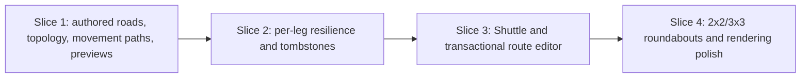

# Route Direction, Resilient Editing, and Roundabouts Implementation Plan

> **For agentic workers:** REQUIRED SUB-SKILL: Use superpowers:subagent-driven-development (recommended) or superpowers:executing-plans to implement this plan task-by-task. Steps use checkbox (`- [ ]`) syntax for tracking.

**Goal:** Make bus routes obey authored lane connectivity and realistic turn movements, keep damaged routes repairable and visibly dotted, support transactional Loop/Shuttle route editing, and add fixed counterclockwise 2x2 and 3x3 roundabouts.

**Architecture:** Rust remains the only gameplay authority. `GameEngine` owns both the serialized `GameSnapshot` and a non-serialized, heading-aware `RoadTopology` cache; topology-changing mutations build a candidate snapshot/cache, recompute affected service legs, and commit both together. TypeScript owns only draft interaction, preview ordering, selectors, and rendering of Rust-provided geometry.

**Tech Stack:** Rust 2021 (`caelum-core`, `caelum-wasm`, Tauri 2), TypeScript, Svelte 5 runes, Canvas 2D, Bun, Vitest, Playwright, serde/serde-wasm-bindgen.

## Global Constraints

- `crates/caelum-core` is authoritative for road connectivity, route search, travel time, route/node lifecycle, revisions, vehicle/rider transitions, validation, costs, and gameplay rejection codes.
- Browser and Tauri hosts must expose the same Rust contract in every delivery slice; production TypeScript must never infer legal turns, reconstruct road topology, or retain a second gameplay pathfinder.
- `GameEngine` owns `GameSnapshot` plus `RoadTopology`. New/reset build both; a topology-changing dispatch commits both or neither; read-only previews may build temporary candidates but mutate neither.
- Gameplay helpers receive an explicit routing context. They must not read a global cache or reconstruct topology from the snapshot.
- The strict authoritative snapshot schema version is `2`. Upgrade Rust, WASM, Tauri, TypeScript wire types, and test fixtures together; do not infer connectivity from a pre-topology snapshot.
- Road pathfinding applies to buses only. Metro continues to use deterministic track pathfinding, while sharing route-leg, preview, resilience, editor, and Shuttle contracts.
- Ordinary junctions automatically allow legal straight, right, left, and U-turn movements into compatible outbound lanes. U-turns are allowed.
- Fixed extra movement delays are: straight `0 ms`, right `500 ms`, left `1_000 ms`, U-turn `2_000 ms`, roundabout entry `750 ms`, and roundabout circulation/exit `0 ms` beyond base travel.
- Weighted search and topology identity are deterministic. Compare integer milliseconds, then movement count, canonical `North, East, South, West` order, then stable structure/entity identity; never rely on hash iteration, wall clock, or randomness.
- The same transition duration drives preview estimates, passenger routing, `seconds_until_next_vehicle_stop`, and actual vehicle advancement.
- Straight road/track/remove strokes keep their current partial-stroke semantics: apply valid affordable tiles in order and report skipped tiles. `UpdateRoute`, direction changes, and roundabout placement/removal are atomic.
- Missing referenced transit nodes are logical tombstones: no occupation, coverage, boarding, queueing, or inspection; exact same-kind/same-anchor rebuilding restores them. Unreferenced demolition deletes normally.
- A broken leg keeps `lastValidPath`; a legal reroute replaces both `currentPath` and `lastValidPath`. Route `active` remains the player's choice.
- Route structural revisions increment for waypoint/pattern, path/status, node-status, and platform-assignment changes, but not rename, recolor, active toggles, or vehicle assignment.
- New route creation stages the line, platforms, first vehicle, and budget charge atomically. A saved route edit rebases vehicles immediately and disembarks/replans riders.
- Roundabouts are fixed counterclockwise/right-hand traffic structures. Compact is exactly `2x2` and costs `$1,000`; Standard is exactly `3x3` and costs `$2,000`. Prices are Rust-authoritative and replaced roads receive no refund.
- Structure ownership is independent of `Tile.kind` so the protected `3x3` center island cannot be zoned, painted, tracked, or built on.
- All serialized names use serde/TypeScript camelCase. `GameplayRejection` is `{ code, context }`; user-facing prose is mapped in the shell, never stored as simulation authority.
- State remains immutable and deterministic. Do not mutate a `GameSnapshot` in place.
- Use Bun only. Every shell command in this plan is prefixed with `rtk`; never use npm or yarn.
- Svelte uses runes (`$state`, `$props`, `$derived`, `$effect`); never use legacy `export let` or stores.
- Keep existing unrelated gameplay semantics and avoid broad refactors outside the files listed below.

---

## Dependency and delivery map



Each slice ends with a browser/Tauri-compatible Rust wire contract and focused tests. Do not leave legacy `segments` or production `tilePath.ts` active beside the new contract.

## File structure

### Create

- `crates/caelum-core/src/rejection.rs` — stable `RejectionCode`, structured `RejectionContext`, `GameplayRejection`, and `GameplayResult<T>`.
- `crates/caelum-core/src/road.rs` — authored road connections, linear road mutations, automatic junction generation/dissolution, and canonical structure identity.
- `crates/caelum-core/src/road_topology.rs` — compiled heading-state graph, movement classification, geometry, fixed costs, and deterministic Dijkstra.
- `crates/caelum-core/src/preview.rs` — route/road-mutation preview request/response types and read-only candidate comparison.
- `crates/caelum-core/src/service_itinerary.rs` — Loop/Shuttle directional itinerary construction and visit helpers.
- `crates/caelum-core/src/route_lifecycle.rs` — per-leg rebuild, last-valid retention, reroute projection, broken/restored transitions, parking, and trip invalidation.
- `crates/caelum-core/src/transit_nodes.rs` — transit-node tombstone, exact-anchor restoration, compatibility, reference, and garbage-collection rules.
- `crates/caelum-core/src/route_editor.rs` — atomic `CreateRoute`/`UpdateRoute` validation, revision checks, platform delta, and vehicle/rider rebase.
- `crates/caelum-core/src/roundabouts.rs` — 2x2/3x3 templates, ports, fixed circulation, validation, placement, and whole-structure removal.
- `src/runtime/previewCoordinator.ts` — independent route/road generation counters and stale-response suppression outside the gameplay queue.
- `src/runtime/rejectionMessages.ts` — exhaustive structured-rejection-to-copy mapping.
- `src/components/hud/panels/RouteEditor.svelte` — shared creation/committed-edit controls.
- `src/components/RoadMutationNotice.svelte` — accessible cost and affected-route preview notice.
- `src/render/pathRenderer.ts` — Canvas line/quadratic/arc drawing and deterministic point/tangent interpolation.
- `src/render/roundaboutRenderer.ts` — committed automatic-junction/roundabout road geometry.
- `src/render/routeGeometry.ts` — stable shared-corridor offsets and selected-route arrow sampling.
- `crates/caelum-core/tests/road_authoring.rs` — reciprocal connections, stroke semantics, junction lifecycle, and dual-lane crossing tests.
- `crates/caelum-core/tests/road_topology.rs` — movement classification, lane legality, weighted choice, and tie determinism.
- `crates/caelum-core/tests/engine_topology.rs` — snapshot/cache parity and preview non-mutation tests.
- `crates/caelum-core/tests/route_preview.rs` — preview/commit parity and validation tests.
- `crates/caelum-core/tests/route_resilience.rs` — reroute, last-valid, tombstone, parking, and restoration tests.
- `crates/caelum-core/tests/shuttle_service.rs` — directional itinerary and rider-visit tests.
- `crates/caelum-core/tests/route_editing.rs` — atomic create/update, revisions, platforms, and live rebase tests.
- `crates/caelum-core/tests/roundabouts.rs` — templates, port capture, placement/removal, routing, and cost tests.
- `tests/render/pathRenderer.test.ts`, `tests/render/roundaboutRenderer.test.ts`, `tests/render/routeGeometry.test.ts` — geometry-level rendering tests.
- `tests/e2e/roundabouts.spec.ts` — both stamps, routing/U-turn, and atomic removal browser flow.

### Modify

- Rust model/wire: `crates/caelum-core/src/model.rs`, `intent.rs`, `lib.rs`, `state.rs`, `scenario.rs`.
- Rust mutation/simulation: `engine.rs`, `network.rs`, `transit.rs`, `router.rs`, `trips.rs`, `commute.rs`, `platforms.rs`, `buildings.rs`, `areas.rs`.
- Host surfaces: `crates/caelum-wasm/src/lib.rs`, `src-tauri/src/lib.rs`.
- Frontend domain/backend: `src/domain/types.ts`, `src/runtime/backend/types.ts`, `shared.ts`, `wasmBackend.ts`, `tauriBackend.ts`.
- Frontend runtime/UI: `src/ui/uiState.ts`, `routeDraft.ts`, `actions.ts`, `roadDrag.ts`, `src/runtime/createGameRuntime.ts`, `types.ts`, `runtimeSelectors.ts`, `snapshotView.ts`, `src/App.svelte`.
- HUD: `src/domain/catalog/buildMenu.ts`, `BuildPanel.svelte`, `RoutesPanel.svelte`, `ManagePanel.svelte`, `HudDrawer.svelte`, `src/styles.css`.
- Rendering: `src/render/canvas.ts`, `mapRenderer.ts`, `transitRenderer.ts`, `overlayRenderer.ts`.
- Fixtures/tests: `tests/helpers/gameState.ts`, `tests/fixtures/rustSnapshot.ts` and the existing Rust/runtime/UI/render/e2e files named in the tasks.
- Documentation: `docs/architecture.md` and `CLAUDE.md`.
- Delete after cutover: `src/ui/tilePath.ts` and `tests/ui/tilePathParity.test.ts`.

## Slice 1 — Authored road topology, movement paths, and Rust previews

### Task 1: Versioned snapshots and structured gameplay rejections

**Files:**
- Create: `crates/caelum-core/src/rejection.rs`
- Create: `src/runtime/rejectionMessages.ts`
- Modify: `crates/caelum-core/src/model.rs`
- Modify: `crates/caelum-core/src/intent.rs`
- Modify: `crates/caelum-core/src/lib.rs`
- Modify: `crates/caelum-core/src/engine.rs`
- Modify: `crates/caelum-core/src/areas.rs`, `buildings.rs`, `platforms.rs`, `transit.rs`
- Modify: `src/domain/types.ts`
- Modify: `src/runtime/backend/types.ts`
- Modify: `src/runtime/runtimeSelectors.ts`
- Modify: `src/runtime/snapshotView.ts`
- Modify: `src/App.svelte`
- Modify: `tests/helpers/gameState.ts`
- Modify: `tests/fixtures/rustSnapshot.ts`
- Test: `crates/caelum-core/tests/model_wire_format.rs`
- Test: `tests/runtime/backendContract.test.ts`
- Modify: `tests/runtime/gameRuntime.test.ts`
- Modify: `tests/runtime/tauriBackend.test.ts`
- Modify: `tests/runtime/wasmBackend.test.ts`
- Test: `tests/ui/appShell.test.ts`
- Modify: `tests/ui/pointerEvents.test.ts`

**Interfaces:**
- Consumes: existing `DispatchResult`, gameplay mutation `Result<GameSnapshot, String>` values, and the shell rejection banner.
- Produces: `SNAPSHOT_SCHEMA_VERSION: u16 = 2`, `GameplayResult<T>`, `GameplayRejection { code, context }`, and `rejectionMessage(rejection): string`. Every later preview and dispatch uses these exact names.

- [ ] **Step 1: Write the failing Rust wire tests**

Append exact camelCase assertions to `crates/caelum-core/tests/model_wire_format.rs`:

```rust
use caelum_core::model::SNAPSHOT_SCHEMA_VERSION;
use caelum_core::rejection::{
    GameplayRejection, RejectionCode, RejectionContext,
};
use caelum_core::state::create_initial_snapshot;
use serde_json::json;

#[test]
fn snapshot_carries_the_authoritative_schema_version() {
    let snapshot = create_initial_snapshot();
    assert_eq!(snapshot.schema_version, SNAPSHOT_SCHEMA_VERSION);
    assert_eq!(
        serde_json::to_value(snapshot).unwrap()["schemaVersion"],
        json!(2)
    );
}

#[test]
fn gameplay_rejection_uses_stable_camel_case_wire_names() {
    let rejection = GameplayRejection {
        code: RejectionCode::InsufficientBudget,
        context: RejectionContext {
            required_budget: Some(8_000),
            available_budget: Some(7_999),
            ..RejectionContext::default()
        },
    };

    assert_eq!(
        serde_json::to_value(rejection).unwrap(),
        json!({
            "code": "insufficientBudget",
            "context": {
                "requiredBudget": 8000,
                "availableBudget": 7999,
                "affectedRouteIds": []
            }
        })
    );
}
```

- [ ] **Step 2: Write failing TypeScript contract and copy tests**

Add to `tests/runtime/backendContract.test.ts` and `tests/ui/appShell.test.ts`:

```ts
const insufficientBudget: GameplayRejection = {
  code: "insufficientBudget",
  context: {
    requiredBudget: 8_000,
    availableBudget: 7_999,
    affectedRouteIds: [],
  },
};

expectTypeOf<DispatchResult["rejection"]>().toEqualTypeOf<
  GameplayRejection | null
>();
expectTypeOf<DispatchResult["context"]>().toEqualTypeOf<DispatchContext>();
expect(rejectionMessage(insufficientBudget)).toBe(
  "Needs $8,000; only $7,999 is available.",
);
```

- [ ] **Step 3: Run the focused tests and confirm the contract is absent**

Run:

```bash
rtk cargo test -p caelum-core --test model_wire_format snapshot_carries_the_authoritative_schema_version
rtk bunx vitest run --project runtime tests/runtime/backendContract.test.ts
```

Expected: FAIL because `schema_version`, `GameplayRejection`, and `rejectionMessage` do not exist and `DispatchResult.rejection` is still a string.

- [ ] **Step 4: Add the Rust rejection model and snapshot version**

Create `crates/caelum-core/src/rejection.rs` with this public contract:

```rust
use serde::{Deserialize, Serialize};

use crate::model::Point;

pub type GameplayResult<T> = Result<T, GameplayRejection>;

#[derive(Clone, Debug, PartialEq, Eq, Serialize, Deserialize)]
#[serde(rename_all = "camelCase")]
pub enum RejectionCode {
    InsufficientBudget,
    InvalidSpeed,
    BlockedTile,
    OutOfBounds,
    RoadRequired,
    TrackRequired,
    InvalidRoadStroke,
    InvalidTrackStroke,
    InvalidDirectionChange,
    NodeAlreadyExists,
    AmbiguousTransitNode,
    MissingRouteNode,
    IncompatibleRouteNode,
    TooFewRouteNodes,
    DuplicateRouteNodes,
    DisconnectedLeg,
    RouteChangedWhileEditing,
    RouteNotFound,
    StructureNotFound,
    InvalidPlatform,
    InvalidBuildingPlacement,
    BlockedFootprint,
    UnsafeRoundaboutPortMapping,
}

#[derive(Clone, Debug, Default, PartialEq, Eq, Serialize, Deserialize)]
#[serde(rename_all = "camelCase")]
pub struct RejectionContext {
    #[serde(skip_serializing_if = "Option::is_none")]
    pub route_id: Option<String>,
    #[serde(skip_serializing_if = "Option::is_none")]
    pub node_id: Option<String>,
    #[serde(skip_serializing_if = "Option::is_none")]
    pub structure_id: Option<String>,
    #[serde(skip_serializing_if = "Option::is_none")]
    pub from_waypoint_id: Option<String>,
    #[serde(skip_serializing_if = "Option::is_none")]
    pub to_waypoint_id: Option<String>,
    #[serde(skip_serializing_if = "Option::is_none")]
    pub point: Option<Point>,
    #[serde(skip_serializing_if = "Vec::is_empty", default)]
    pub footprint: Vec<Point>,
    #[serde(skip_serializing_if = "Option::is_none")]
    pub expected_revision: Option<u32>,
    #[serde(skip_serializing_if = "Option::is_none")]
    pub actual_revision: Option<u32>,
    #[serde(skip_serializing_if = "Option::is_none")]
    pub required_budget: Option<i32>,
    #[serde(skip_serializing_if = "Option::is_none")]
    pub available_budget: Option<i32>,
    #[serde(default)]
    pub affected_route_ids: Vec<String>,
}

#[derive(Clone, Debug, PartialEq, Eq, Serialize, Deserialize)]
#[serde(rename_all = "camelCase")]
pub struct GameplayRejection {
    pub code: RejectionCode,
    pub context: RejectionContext,
}

impl GameplayRejection {
    pub fn new(code: RejectionCode) -> Self {
        Self {
            code,
            context: RejectionContext::default(),
        }
    }

    pub fn at(code: RejectionCode, point: Point) -> Self {
        Self {
            code,
            context: RejectionContext {
                point: Some(point),
                ..RejectionContext::default()
            },
        }
    }

    pub fn budget(required: i32, available: i32) -> Self {
        Self {
            code: RejectionCode::InsufficientBudget,
            context: RejectionContext {
                required_budget: Some(required),
                available_budget: Some(available),
                ..RejectionContext::default()
            },
        }
    }
}
```

In `model.rs` add `pub const SNAPSHOT_SCHEMA_VERSION: u16 = 2;`, add `schema_version: u16` as the first `GameSnapshot` field, and initialize it in every constructor/builder. Extend `Point`'s derives to `Clone, Copy, Debug, PartialEq, Eq, PartialOrd, Ord, Hash, Serialize, Deserialize` so rejection context and later topology keys share one stable value type. Change `DispatchResult.rejection` to `Option<GameplayRejection>`, export the rejection types from `lib.rs`, and change gameplay mutation return aliases to `GameplayResult<GameSnapshot>`. Replace each free-form `Err(String)` with the matching stable code and the structured fields available at that callsite; do not add a catch-all string code.

Add a success context so partial strokes report their applied/skipped subset:

```rust
#[derive(Clone, Debug, Default, PartialEq, Eq, Serialize, Deserialize)]
#[serde(rename_all = "camelCase")]
pub struct DispatchContext {
    pub changed_tiles: Vec<Point>,
    pub skipped_tiles: Vec<Point>,
    pub affected_route_ids: Vec<String>,
    pub cost: i32,
}
```

`DispatchResult` gains `pub context: DispatchContext`. Mirror it as required `context: DispatchContext` in TypeScript and update all backend test doubles to return `context: { changedTiles: [], skippedTiles: [], affectedRouteIds: [], cost: 0 }`.

Add these constructors beside `DispatchResult`; later engine tasks use only them:

```rust
impl DispatchResult {
    pub fn applied(snapshot: GameSnapshot) -> Self {
        Self {
            snapshot,
            applied: true,
            rejection: None,
            context: DispatchContext::default(),
        }
    }

    pub fn applied_with_context(
        snapshot: GameSnapshot,
        context: DispatchContext,
    ) -> Self {
        Self {
            snapshot,
            applied: true,
            rejection: None,
            context,
        }
    }

    pub fn unchanged(snapshot: GameSnapshot) -> Self {
        Self {
            snapshot,
            applied: false,
            rejection: None,
            context: DispatchContext::default(),
        }
    }

    pub fn rejected(
        snapshot: GameSnapshot,
        rejection: GameplayRejection,
    ) -> Self {
        Self {
            snapshot,
            applied: false,
            rejection: Some(rejection),
            context: DispatchContext::default(),
        }
    }
}
```

- [ ] **Step 5: Add the TypeScript wire type and exhaustive message mapper**

Add to `src/domain/types.ts`:

```ts
export const SNAPSHOT_SCHEMA_VERSION = 2 as const;

export type RejectionCode =
  | "insufficientBudget"
  | "invalidSpeed"
  | "blockedTile"
  | "outOfBounds"
  | "roadRequired"
  | "trackRequired"
  | "invalidRoadStroke"
  | "invalidTrackStroke"
  | "invalidDirectionChange"
  | "nodeAlreadyExists"
  | "ambiguousTransitNode"
  | "missingRouteNode"
  | "incompatibleRouteNode"
  | "tooFewRouteNodes"
  | "duplicateRouteNodes"
  | "disconnectedLeg"
  | "routeChangedWhileEditing"
  | "routeNotFound"
  | "structureNotFound"
  | "invalidPlatform"
  | "invalidBuildingPlacement"
  | "blockedFootprint"
  | "unsafeRoundaboutPortMapping";

export interface RejectionContext {
  routeId?: string;
  nodeId?: string;
  structureId?: string;
  fromWaypointId?: string;
  toWaypointId?: string;
  point?: Point;
  footprint?: Point[];
  expectedRevision?: number;
  actualRevision?: number;
  requiredBudget?: number;
  availableBudget?: number;
  affectedRouteIds: string[];
}

export interface GameplayRejection {
  code: RejectionCode;
  context: RejectionContext;
}
```

Create `src/runtime/rejectionMessages.ts` as this exhaustive mapper:

```ts
const numberFormat = new Intl.NumberFormat("en-US");
const money = (value: number): string => numberFormat.format(value);

function assertNever(value: never): never {
  throw new Error("Unhandled rejection code: " + String(value));
}

export function rejectionMessage(rejection: GameplayRejection): string {
  const { code, context } = rejection;
  switch (code) {
    case "insufficientBudget":
      return (
        "Needs $" +
        money(context.requiredBudget ?? 0) +
        "; only $" +
        money(context.availableBudget ?? 0) +
        " is available."
      );
    case "routeChangedWhileEditing":
      return "This route changed while you were editing it. Reload the saved route.";
    case "disconnectedLeg":
      return `No legal path connects ${
        context.fromWaypointId ?? "the selected node"
      } to ${context.toWaypointId ?? "the next node"}.`;
    case "unsafeRoundaboutPortMapping":
      return "The roads crossing this footprint cannot map safely to roundabout ports.";
    case "invalidSpeed":
      return "That simulation speed is not supported.";
    case "blockedTile":
      return "That tile is blocked.";
    case "outOfBounds":
      return "That location is outside the map.";
    case "roadRequired":
      return "Build a road here first.";
    case "trackRequired":
      return "Build track here first.";
    case "invalidRoadStroke":
      return "That road stroke has no valid tiles.";
    case "invalidTrackStroke":
      return "That track stroke has no valid tiles.";
    case "invalidDirectionChange":
      return "Change the approach lane; structure directions are automatic.";
    case "nodeAlreadyExists":
      return "A compatible transit node already occupies that anchor.";
    case "ambiguousTransitNode":
      return "More than one missing node matches this anchor; edit the route first.";
    case "missingRouteNode":
      return `${context.nodeId ?? "A route node"} is missing.`;
    case "incompatibleRouteNode":
      return `${context.nodeId ?? "That node"} is not compatible with this route mode.`;
    case "tooFewRouteNodes":
      return "A route needs at least two distinct live nodes.";
    case "duplicateRouteNodes":
      return "Each route waypoint must be distinct.";
    case "routeNotFound":
      return `${context.routeId ?? "That route"} no longer exists.`;
    case "structureNotFound":
      return `${context.structureId ?? "That road structure"} no longer exists.`;
    case "invalidPlatform":
      return "That platform cannot serve this route.";
    case "invalidBuildingPlacement":
      return "That building cannot be placed on this footprint.";
    case "blockedFootprint":
      return "The full footprint must contain only empty or replaceable road tiles.";
    default:
      return assertNever(code);
  }
}
```

`default` is compile-time exhaustiveness, not fallback gameplay copy. Assert `snapshot.schemaVersion === SNAPSHOT_SCHEMA_VERSION` in `snapshotView.ts` before exposing a snapshot.

- [ ] **Step 6: Run the focused contract tests**

Run:

```bash
rtk cargo test -p caelum-core --test model_wire_format
rtk bunx vitest run --project runtime tests/runtime/backendContract.test.ts
rtk bunx vitest run --project ui tests/ui/appShell.test.ts
rtk bun run check
```

Expected: PASS. Recoverable typed rejections render without setting the fatal backend error state.

- [ ] **Step 7: Commit**

```bash
rtk git add crates/caelum-core/src/rejection.rs crates/caelum-core/src/model.rs crates/caelum-core/src/intent.rs crates/caelum-core/src/lib.rs crates/caelum-core/src/engine.rs crates/caelum-core/src/areas.rs crates/caelum-core/src/buildings.rs crates/caelum-core/src/platforms.rs crates/caelum-core/src/transit.rs src/domain/types.ts src/runtime/backend/types.ts src/runtime/rejectionMessages.ts src/runtime/runtimeSelectors.ts src/runtime/snapshotView.ts src/App.svelte tests/helpers/gameState.ts tests/fixtures/rustSnapshot.ts crates/caelum-core/tests/model_wire_format.rs tests/runtime/backendContract.test.ts tests/runtime/gameRuntime.test.ts tests/runtime/tauriBackend.test.ts tests/runtime/wasmBackend.test.ts tests/ui/appShell.test.ts tests/ui/pointerEvents.test.ts
rtk git commit -m "refactor(core): version snapshots and type gameplay rejections"
```

### Task 2: Authored road connections and automatic junctions

**Files:**
- Create: `crates/caelum-core/src/road.rs`
- Modify: `crates/caelum-core/src/model.rs`
- Modify: `crates/caelum-core/src/lib.rs`
- Modify: `crates/caelum-core/src/scenario.rs`
- Modify: `crates/caelum-core/src/transit.rs`
- Modify: `crates/caelum-core/src/intent.rs`
- Modify: `crates/caelum-core/src/buildings.rs`
- Modify: `crates/caelum-core/src/areas.rs`
- Modify: `src/domain/types.ts`
- Modify: `tests/helpers/gameState.ts`
- Modify: `tests/helpers/mapFixtures.ts`
- Modify: `tests/fixtures/rustSnapshot.ts`
- Create: `crates/caelum-core/tests/road_authoring.rs`
- Modify: `crates/caelum-core/tests/transit_build.rs`
- Modify: `crates/caelum-core/tests/model_wire_format.rs`

**Interfaces:**
- Consumes: `GameplayResult<T>` and the existing `RoadPreset`/road-stroke costs.
- Produces: `Heading`, authored `Tile.road_connections`, structure ownership, `RoadStructure`/`RoadPort`, `RoadMutation`, `RoadMutationResult`, and `road::apply_road_mutation`. Task 3 compiles these into gameplay transitions.

- [ ] **Step 1: Write the authored-road failure tests**

Create `crates/caelum-core/tests/road_authoring.rs` with fixtures that use public intents and these assertions:

```rust
#[test]
fn dual_bidirectional_crossing_preserves_both_corridors_and_lane_directions() {
    let mut engine = GameEngine::new();
    lay_dual_horizontal(&mut engine, 8);
    lay_dual_vertical(&mut engine, 14);

    let map = &engine.snapshot().map;
    let junction = map
        .road_structures
        .iter()
        .find(|structure| structure.is_automatic_junction())
        .expect("crossing must generate a junction");

    assert_eq!(
        junction.footprint(),
        &[point(14, 8), point(15, 8), point(14, 9), point(15, 9)]
    );
    assert_eq!(junction.ports().len(), 8);
    assert_eq!(map.tile(point(13, 8)).unwrap().one_way, Some(Heading::West));
    assert_eq!(map.tile(point(16, 8)).unwrap().one_way, Some(Heading::West));
    assert_eq!(map.tile(point(14, 7)).unwrap().one_way, Some(Heading::South));
    assert_eq!(map.tile(point(14, 10)).unwrap().one_way, Some(Heading::South));
}

#[test]
fn adjacent_opposing_lanes_do_not_connect_mid_block() {
    let mut engine = GameEngine::new();
    lay_dual_horizontal(&mut engine, 4);
    let map = &engine.snapshot().map;

    assert!(!map
        .tile(point(9, 4))
        .unwrap()
        .road_connections
        .contains(&Heading::South));
    assert!(!map
        .tile(point(9, 5))
        .unwrap()
        .road_connections
        .contains(&Heading::North));
}

#[test]
fn removing_one_crossing_arm_regenerates_or_dissolves_the_junction() {
    let (mut engine, original_id) = crossing_engine();
    remove_points(&mut engine, &[point(14, 7), point(15, 7)]);

    let remaining = &engine.snapshot().map.road_structures;
    assert!(remaining.iter().all(|structure| structure.id() != original_id));
    assert_reciprocal_connections(&engine.snapshot().map);
}

#[test]
fn cycling_a_structure_tile_is_rejected_atomically() {
    let (mut engine, _) = crossing_engine();
    let before = engine.snapshot();
    let result = engine.dispatch(GameIntent::CycleRoadDirection {
        point: point(14, 8),
    });

    assert!(!result.applied);
    assert_eq!(
        result.rejection.unwrap().code,
        RejectionCode::InvalidDirectionChange
    );
    assert_eq!(result.snapshot, before);
}
```

Add these compatibility tests to the same file:

```rust
#[test]
fn partial_stroke_skips_invalid_tiles_in_input_order() {
    let state = stroke_fixture_with_budget(ROAD_COST * 2);
    let result = apply_road_mutation(
        &state,
        &RoadMutation::LayRoadLine {
            points: vec![point(2, 2), point(3, 2), point(4, 2), point(5, 2)],
            preset: RoadPreset::TwoWay,
        },
    )
    .unwrap();
    assert_eq!(result.changed_tiles, vec![point(2, 2), point(4, 2)]);
    assert_eq!(result.skipped_tiles, vec![point(3, 2), point(5, 2)]);
    assert_eq!(result.snapshot.budget, state.budget - ROAD_COST * 2);
}

#[test]
fn single_point_road_connects_only_neighbor_endpoints() {
    let state = isolated_parallel_lane_fixture();
    let result = apply_road_mutation(
        &state,
        &RoadMutation::LayRoad { point: point(5, 5) },
    )
    .unwrap();
    assert_eq!(
        tile(&result.snapshot, point(5, 5)).road_connections,
        vec![Heading::West, Heading::East]
    );
    assert!(tile(&result.snapshot, point(5, 6))
        .road_connections
        .iter()
        .all(|edge| *edge != Heading::North));
    assert_reciprocal_connections(&result.snapshot.map);
}
```

- [ ] **Step 2: Run the new tests and confirm current occupancy adjacency is insufficient**

Run:

```bash
rtk cargo test -p caelum-core --test road_authoring
```

Expected: FAIL because `road_connections`, `road_structures`, automatic junction ownership, and stable ports do not exist; the existing crossing also overwrites the earlier corridor.

- [ ] **Step 3: Add the final authored-road wire types**

Add these serde types to `model.rs` and mirror them exactly in `src/domain/types.ts`:

```rust
#[derive(Clone, Copy, Debug, PartialEq, Eq, PartialOrd, Ord, Hash, Serialize, Deserialize)]
#[serde(rename_all = "camelCase")]
pub enum Heading {
    North,
    East,
    South,
    West,
}

#[derive(Clone, Copy, Debug, PartialEq, Eq, Serialize, Deserialize)]
#[serde(rename_all = "camelCase")]
pub enum RoundaboutSize {
    Compact2x2,
    Standard3x3,
}

#[derive(Clone, Debug, PartialEq, Eq, Serialize, Deserialize)]
#[serde(rename_all = "camelCase")]
pub struct RoadPort {
    pub id: String,
    pub point: Point,
    pub edge: Heading,
}

#[derive(Clone, Debug, PartialEq, Eq, Serialize, Deserialize)]
#[serde(tag = "kind", rename_all = "camelCase")]
pub enum RoadStructure {
    AutomaticJunction {
        id: String,
        footprint: Vec<Point>,
        ports: Vec<RoadPort>,
    },
    Roundabout {
        id: String,
        origin: Point,
        size: RoundaboutSize,
        footprint: Vec<Point>,
        ports: Vec<RoadPort>,
    },
}
```

Reuse `Point`'s stable ordering from Task 1. Add `road_structures: Vec<RoadStructure>` to `GameMap`. Change `Tile.one_way` to `Option<Heading>`, add `road_connections: Vec<Heading>` in canonical N/E/S/W order, and add `road_structure_id: Option<String>` independently of `Tile.kind`.

In TypeScript make the wire name canonical without breaking road-tool helpers:

```ts
export type Heading = "north" | "east" | "south" | "west";
export type RoadDirection = Heading;
```

- [ ] **Step 4: Implement authored mutations and deterministic junction regeneration**

Create `road.rs` around this exact public boundary:

```rust
#[derive(Clone, Debug, PartialEq, Serialize, Deserialize)]
#[serde(tag = "type", rename_all = "camelCase", rename_all_fields = "camelCase")]
pub enum RoadMutation {
    LayRoad { point: Point },
    LayRoadLine { points: Vec<Point>, preset: RoadPreset },
    CycleRoadDirection { point: Point },
    RemoveAtTile { point: Point },
    RemoveAtTiles { points: Vec<Point> },
}

pub struct RoadMutationResult {
    pub snapshot: GameSnapshot,
    pub changed_tiles: Vec<Point>,
    pub skipped_tiles: Vec<Point>,
    pub cost: i32,
}

impl RoadMutationResult {
    pub fn dispatch_context(&self) -> DispatchContext {
        DispatchContext {
            changed_tiles: self.changed_tiles.clone(),
            skipped_tiles: self.skipped_tiles.clone(),
            affected_route_ids: Vec::new(),
            cost: self.cost,
        }
    }
}

pub fn apply_road_mutation(
    state: &GameSnapshot,
    mutation: &RoadMutation,
) -> GameplayResult<RoadMutationResult> {
    let mut candidate = state.clone();
    let mut changed_tiles = Vec::new();
    let mut skipped_tiles = Vec::new();
    let cost = apply_linear_tiles_in_order(
        &mut candidate,
        mutation,
        &mut changed_tiles,
        &mut skipped_tiles,
    )?;
    refresh_automatic_junctions(&mut candidate.map, &changed_tiles)?;
    canonicalize_authored_roads(&mut candidate.map);
    Ok(RoadMutationResult {
        snapshot: candidate,
        changed_tiles,
        skipped_tiles,
        cost,
    })
}
```

Implement `refresh_automatic_junctions` as a deterministic fixed-point pass:

1. Remove automatic structures touching the changed region and restore their external authored approach edges.
2. Discover intersecting approach components using only reciprocal authored endpoints.
3. Sort footprint points and boundary port keys `(point, edge)`.
4. Create the ID by joining `junction`, sorted footprint coordinate keys, and sorted port keys; no allocated ID or discovery index may participate.
5. Set `road_structure_id` on every footprint tile without overwriting the approach `one_way` outside the footprint.
6. Never add lateral connections between parallel lane sides.

Add exact `RoadStructure::id()`, `footprint()`, `ports()`, and `is_automatic_junction()` accessors so tests and later modules do not duplicate enum matching. Add `port_keys() -> Vec<(Point, Heading)>` by cloning/sorting `(port.point, port.edge)`. Move `LayRoad`, `LayRoadLine`, `CycleRoadDirection`, and road portions of removal in `transit.rs` behind this function. Preserve current per-tile cost/skip ordering, and reject direction cycling when `road_structure_id.is_some()`.

- [ ] **Step 5: Author the starter map through the same road API**

Replace direct starter-road tile stamping in `scenario.rs` with:

```rust
road::author_scenario_road_line(
    &mut snapshot.map,
    &horizontal_westbound_points(),
    RoadPreset::OneWay,
);
road::author_scenario_road_line(
    &mut snapshot.map,
    &horizontal_eastbound_points(),
    RoadPreset::OneWay,
);
road::author_scenario_road_line(
    &mut snapshot.map,
    &vertical_southbound_points(),
    RoadPreset::OneWay,
);
road::author_scenario_road_line(
    &mut snapshot.map,
    &vertical_northbound_points(),
    RoadPreset::OneWay,
);
road::refresh_all_automatic_junctions(&mut snapshot.map)
    .expect("authored starter roads must form valid junctions");
```

Keep the existing exact lane directions: `y=8 West`, `y=9 East`, `x=14 South`, `x=15 North`. Do not infer them from occupancy after creation.

- [ ] **Step 6: Run authored-road and regression tests**

Run:

```bash
rtk cargo test -p caelum-core --test road_authoring
rtk cargo test -p caelum-core --test transit_build
rtk cargo test -p caelum-core --test scenario_clock
rtk cargo test -p caelum-core --test model_wire_format
rtk bun run check
```

Expected: PASS. Existing partial-stroke and budget tests remain green, and scenario reset yields the same authored crossing every time.

- [ ] **Step 7: Commit**

```bash
rtk git add crates/caelum-core/src/road.rs crates/caelum-core/src/model.rs crates/caelum-core/src/lib.rs crates/caelum-core/src/scenario.rs crates/caelum-core/src/transit.rs crates/caelum-core/src/intent.rs crates/caelum-core/src/buildings.rs crates/caelum-core/src/areas.rs src/domain/types.ts tests/helpers/gameState.ts tests/helpers/mapFixtures.ts tests/fixtures/rustSnapshot.ts crates/caelum-core/tests/road_authoring.rs crates/caelum-core/tests/transit_build.rs crates/caelum-core/tests/model_wire_format.rs
rtk git commit -m "feat(core): author lane connections and junction structures"
```

### Task 3: Heading-aware deterministic weighted road topology

**Files:**
- Create: `crates/caelum-core/src/road_topology.rs`
- Modify: `crates/caelum-core/src/model.rs`
- Modify: `crates/caelum-core/src/network.rs`
- Modify: `crates/caelum-core/src/lib.rs`
- Create: `crates/caelum-core/tests/road_topology.rs`
- Modify: `crates/caelum-core/tests/network_paths.rs`

**Interfaces:**
- Consumes: authored `Heading`/`RoadStructure`/`RoadPort` state from Task 2.
- Produces: `MovementKind`, `PathGeometry`, `RoadPathStep`, `TransitPath::Road`, `RoadState`, `RoadTransition`, `RoadTopology::compile`, and `RoadTopology::find_path`. Task 4 caches this type; Tasks 5–20 consume its paths and geometry.

- [ ] **Step 1: Write movement and lane-legality tests**

Create `crates/caelum-core/tests/road_topology.rs` with table-driven assertions:

```rust
#[test]
fn classifies_all_ordinary_junction_movements() {
    let topology = four_way_topology();
    let cases = [
        (Heading::North, Heading::North, MovementKind::Straight),
        (Heading::North, Heading::East, MovementKind::RightTurn),
        (Heading::North, Heading::West, MovementKind::LeftTurn),
        (Heading::North, Heading::South, MovementKind::UTurn),
    ];

    for (incoming, outgoing, expected) in cases {
        assert_eq!(
            topology
                .transition_for(junction_state(incoming), outgoing)
                .unwrap()
                .movement,
            expected
        );
    }
}

#[test]
fn turns_between_dual_bidirectional_corridors_choose_the_compatible_outbound_lane() {
    let fixture = dual_cross_fixture();
    let path = fixture
        .topology
        .find_path(&fixture.map, &point(6, 8), &point(15, 3))
        .expect("west approach must turn north");

    assert!(path
        .road_steps()
        .iter()
        .any(|step| step.movement == MovementKind::LeftTurn));
    assert!(path
        .road_steps()
        .iter()
        .all(|step| !fixture.enters_lane_wrong_way(step)));
    assert_eq!(
        path.road_steps().last().unwrap().leaving_heading,
        Heading::North
    );
}

#[test]
fn weighted_search_can_prefer_more_steps_with_a_cheaper_turn_sequence() {
    let fixture = turn_penalty_fixture();
    let path = fixture
        .topology
        .find_path(&fixture.map, &fixture.from, &fixture.to)
        .unwrap();

    assert_eq!(
        (path.total_travel_seconds() * 1_000.0).round() as u64,
        fixture.expected_cheaper_millis
    );
    assert_ne!(
        path.road_steps()
            .iter()
            .map(|step| step.position)
            .collect::<Vec<_>>(),
        fixture.fewer_tiles_with_uturn
    );
}

#[test]
fn equal_cost_paths_use_canonical_direction_and_stable_structure_ties() {
    let first = equal_cost_fixture(false).path_key();
    let rebuilt = equal_cost_fixture(true).path_key();
    assert_eq!(first, rebuilt);
}
```

Add these compact path-sequence checks to the same file:

```rust
#[test]
fn rejects_mid_block_lane_change_and_wrong_way_entry() {
    let fixture = paired_lane_fixture();
    assert!(fixture
        .topology
        .find_path(&fixture.map, &fixture.midblock_left, &fixture.midblock_right)
        .is_none());
    assert!(fixture
        .topology
        .find_path(&fixture.map, &fixture.legal_start, &fixture.wrong_way_end)
        .is_none());
}

#[test]
fn l_t_cross_and_uturn_paths_report_their_actual_movement_steps() {
    for (fixture, expected) in [
        (l_junction_fixture(), MovementKind::RightTurn),
        (t_junction_fixture(), MovementKind::LeftTurn),
        (cross_junction_fixture(), MovementKind::Straight),
        (uturn_fixture(), MovementKind::UTurn),
    ] {
        let path = fixture
            .topology
            .find_path(&fixture.map, &fixture.from, &fixture.to)
            .unwrap();
        assert!(path.road_steps().iter().any(|step| step.movement == expected));
        if expected == MovementKind::UTurn {
            let step = path
                .road_steps()
                .iter()
                .find(|step| step.movement == MovementKind::UTurn)
                .unwrap();
            assert!(matches!(
                &step.geometry,
                PathGeometry::QuadraticBezier { .. } | PathGeometry::Arc { .. }
            ));
        }
    }
}

#[test]
fn off_road_stop_access_is_allowed_only_as_a_path_endpoint() {
    let fixture = off_road_stop_fixture();
    assert!(fixture
        .topology
        .find_path(&fixture.map, &fixture.stop, &fixture.road_destination)
        .is_some());
    assert!(fixture
        .topology
        .find_path(&fixture.map, &fixture.road_start, &fixture.stop)
        .is_some());
    assert!(!fixture.topology.contains_ordinary_state(fixture.stop));
}
```

- [ ] **Step 2: Run the topology tests and observe coordinate BFS failures**

Run:

```bash
rtk cargo test -p caelum-core --test road_topology
```

Expected: FAIL because the graph state lacks incoming heading, transition classes, weighted costs, and geometry.

- [ ] **Step 3: Add movement-aware geometry wire types**

Add to `model.rs`:

```rust
#[derive(Clone, Copy, Debug, PartialEq, Eq, Serialize, Deserialize)]
#[serde(rename_all = "camelCase")]
pub enum MovementKind {
    Straight,
    RightTurn,
    LeftTurn,
    UTurn,
    RoundaboutEntry,
    RoundaboutCirculation,
    RoundaboutExit,
}

#[derive(Clone, Debug, PartialEq, Serialize, Deserialize)]
#[serde(tag = "kind", rename_all = "camelCase")]
pub enum PathGeometry {
    Line {
        from: TripPosition,
        to: TripPosition,
    },
    QuadraticBezier {
        from: TripPosition,
        control: TripPosition,
        to: TripPosition,
    },
    Arc {
        center: TripPosition,
        radius: f64,
        start_radians: f64,
        sweep_radians: f64,
    },
}

#[derive(Clone, Debug, PartialEq, Serialize, Deserialize)]
#[serde(rename_all = "camelCase")]
pub struct RoadPathStep {
    pub position: Point,
    pub entering_heading: Heading,
    pub leaving_heading: Heading,
    pub movement: MovementKind,
    pub geometry: PathGeometry,
    pub travel_seconds: f64,
}

#[derive(Clone, Debug, PartialEq, Serialize, Deserialize)]
#[serde(rename_all = "camelCase")]
pub struct TrackPathStep {
    pub position: Point,
    pub heading: Heading,
    pub geometry: PathGeometry,
    pub travel_seconds: f64,
}

#[derive(Clone, Debug, PartialEq, Serialize, Deserialize)]
#[serde(tag = "kind", rename_all = "camelCase")]
pub enum TransitPath {
    Road {
        steps: Vec<RoadPathStep>,
        total_travel_seconds: f64,
    },
    Track {
        steps: Vec<TrackPathStep>,
        total_travel_seconds: f64,
    },
}

pub enum TransitPathStepRef<'a> {
    Road(&'a RoadPathStep),
    Track(&'a TrackPathStep),
}

impl TransitPathStepRef<'_> {
    pub fn travel_seconds(&self) -> f64 {
        match self {
            Self::Road(step) => step.travel_seconds,
            Self::Track(step) => step.travel_seconds,
        }
    }

    pub fn accepts_heading(&self, heading: Heading) -> bool {
        match self {
            Self::Road(step) => {
                step.entering_heading == heading || step.leaving_heading == heading
            }
            Self::Track(step) => step.heading == heading,
        }
    }
}

impl TransitPath {
    pub fn total_travel_seconds(&self) -> f64 {
        match self {
            Self::Road { total_travel_seconds, .. }
            | Self::Track { total_travel_seconds, .. } => *total_travel_seconds,
        }
    }

    pub fn step_count(&self) -> usize {
        match self {
            Self::Road { steps, .. } => steps.len(),
            Self::Track { steps, .. } => steps.len(),
        }
    }

    pub fn step(&self, index: usize) -> Option<TransitPathStepRef<'_>> {
        match self {
            Self::Road { steps, .. } => steps.get(index).map(TransitPathStepRef::Road),
            Self::Track { steps, .. } => steps.get(index).map(TransitPathStepRef::Track),
        }
    }

    pub fn step_refs(&self) -> Vec<TransitPathStepRef<'_>> {
        (0..self.step_count())
            .filter_map(|index| self.step(index))
            .collect()
    }

    pub fn road_steps(&self) -> &[RoadPathStep] {
        match self {
            Self::Road { steps, .. } => steps,
            Self::Track { .. } => &[],
        }
    }
}
```

Use `f64` only at this serialized boundary; the compiled graph stores integer milliseconds.

- [ ] **Step 4: Implement topology compilation and stable Dijkstra**

Create `road_topology.rs` with this public API and ordering:

```rust
pub const BUS_TILE_MILLIS: u32 = 1_250;
pub const RIGHT_TURN_MILLIS: u32 = 500;
pub const LEFT_TURN_MILLIS: u32 = 1_000;
pub const U_TURN_MILLIS: u32 = 2_000;
pub const ROUNDABOUT_ENTRY_MILLIS: u32 = 750;

#[derive(Clone, Copy, Debug, PartialEq, Eq, PartialOrd, Ord)]
pub struct RoadState {
    pub position: Point,
    pub incoming_heading: Heading,
}

#[derive(Clone, Debug, PartialEq)]
pub struct RoadTransition {
    pub to: RoadState,
    pub movement: MovementKind,
    pub geometry: PathGeometry,
    pub travel_millis: u32,
    pub stable_key: String,
}

#[derive(Clone, Debug, PartialEq)]
pub struct RoadTopology {
    transitions: BTreeMap<RoadState, Vec<RoadTransition>>,
}

impl RoadTopology {
    pub fn compile(map: &GameMap) -> GameplayResult<Self> {
        let ordinary = compile_reciprocal_lane_transitions(map)?;
        let structures = compile_structure_transitions(map)?;
        Ok(Self {
            transitions: merge_and_canonicalize(ordinary, structures),
        })
    }

    pub fn find_path(
        &self,
        map: &GameMap,
        from: &Point,
        to: &Point,
    ) -> Option<TransitPath> {
        deterministic_dijkstra(self, map, from, to)
    }

    #[doc(hidden)]
    pub fn transition_for(
        &self,
        from: RoadState,
        outgoing: Heading,
    ) -> Option<&RoadTransition> {
        self.transitions
            .get(&from)?
            .iter()
            .find(|transition| transition.to.incoming_heading == outgoing)
    }

    #[doc(hidden)]
    pub fn contains_ordinary_state(&self, point: Point) -> bool {
        self.transitions
            .keys()
            .any(|state| state.position == point)
    }
}

impl RoadTransition {
    pub fn base_travel_millis(&self) -> u32 {
        self.travel_millis - movement_extra_millis(self.movement)
    }
}

pub fn movement_extra_millis(movement: MovementKind) -> u32 {
    match movement {
        MovementKind::Straight
        | MovementKind::RoundaboutCirculation
        | MovementKind::RoundaboutExit => 0,
        MovementKind::RightTurn => RIGHT_TURN_MILLIS,
        MovementKind::LeftTurn => LEFT_TURN_MILLIS,
        MovementKind::UTurn => U_TURN_MILLIS,
        MovementKind::RoundaboutEntry => ROUNDABOUT_ENTRY_MILLIS,
    }
}
```

Represent each search label as:

```rust
#[derive(Clone, Debug, PartialEq, Eq, PartialOrd, Ord)]
struct PathRank {
    total_millis: u64,
    movement_count: u32,
    direction_key: Vec<u8>,
    stable_keys: Vec<String>,
}
```

The heap uses `Reverse<(PathRank, RoadState)>`. Expand transitions only in canonical order; `Heading::North/East/South/West` map to `0/1/2/3`. Classify a turn from incoming/outgoing headings, and reject a transition unless both tile edges are reciprocal and the destination lane accepts the outgoing heading.

For bus stops/terminals placed beside or on empty tiles, seed/finalize search through deterministic zero-geometry endpoint access hops to compatible adjacent authored road ports; do not make off-road endpoint tiles general graph nodes.

- [ ] **Step 5: Retain deterministic track pathfinding separately**

Replace the ambiguous `find_tile_path` entry point in `network.rs` with:

```rust
pub fn find_track_path(
    map: &GameMap,
    from: &Point,
    to: &Point,
) -> Option<TransitPath> {
    let points = deterministic_track_bfs(map, from, to)?;
    Some(track_path_from_points(points, METRO_TILES_PER_SECOND))
}
```

Do not send metro through `RoadTopology` and do not reuse road turn penalties for track.

- [ ] **Step 6: Run focused and legacy path tests**

Run:

```bash
rtk cargo test -p caelum-core --test road_topology
rtk cargo test -p caelum-core --test network_paths
```

Expected: PASS. Rebuilding the same authored map produces identical transition/path keys.

- [ ] **Step 7: Commit**

```bash
rtk git add crates/caelum-core/src/road_topology.rs crates/caelum-core/src/model.rs crates/caelum-core/src/network.rs crates/caelum-core/src/lib.rs crates/caelum-core/tests/road_topology.rs crates/caelum-core/tests/network_paths.rs
rtk git commit -m "feat(core): route buses through heading-aware road topology"
```

### Task 4: Cache topology and commit network candidates atomically

**Files:**
- Create: `crates/caelum-core/src/route_lifecycle.rs`
- Modify: `crates/caelum-core/src/engine.rs`
- Modify: `crates/caelum-core/src/transit.rs`
- Modify: `crates/caelum-core/src/trips.rs`
- Modify: `crates/caelum-core/src/router.rs`
- Modify: `crates/caelum-core/src/commute.rs`
- Create: `crates/caelum-core/tests/engine_topology.rs`
- Modify: `crates/caelum-core/tests/engine_smoke.rs`

**Interfaces:**
- Consumes: `RoadTopology::compile` and `road::apply_road_mutation`.
- Produces: `GameEngine { snapshot, road_topology }`, explicit `RoutingContext<'a>`, `commit_snapshot_and_topology`, and a candidate-commit discipline used by every later mutation/preview.

- [ ] **Step 1: Write cache-parity and atomicity tests**

Create `crates/caelum-core/tests/engine_topology.rs`:

```rust
#[test]
fn new_and_reset_cache_match_the_serialized_authored_map() {
    let mut engine = GameEngine::new();
    assert_eq!(
        engine.road_topology_for_test(),
        &RoadTopology::compile(&engine.snapshot().map).unwrap()
    );

    lay_an_extra_road(&mut engine);
    let reset = engine.reset();
    assert_eq!(
        engine.road_topology_for_test(),
        &RoadTopology::compile(&reset.map).unwrap()
    );
}

#[test]
fn accepted_network_dispatch_commits_snapshot_and_cache_together() {
    let mut engine = GameEngine::new();
    let result = engine.dispatch(valid_crossing_intent());
    assert!(result.applied);
    assert_eq!(
        engine.road_topology_for_test(),
        &RoadTopology::compile(&result.snapshot.map).unwrap()
    );
}

#[test]
fn rejected_direction_change_mutates_neither_snapshot_nor_cache() {
    let mut engine = crossing_engine();
    let before_snapshot = engine.snapshot();
    let before_topology = engine.road_topology_for_test().clone();
    let result = engine.dispatch(direction_change_on_junction());

    assert!(!result.applied);
    assert_eq!(engine.snapshot(), before_snapshot);
    assert_eq!(engine.road_topology_for_test(), &before_topology);
}

#[test]
fn partial_stroke_commits_one_topology_for_the_applied_subset() {
    let mut engine = budget_limited_engine();
    let result = engine.dispatch(partially_affordable_stroke());
    assert!(result.applied);
    assert_eq!(result.context.changed_tiles, vec![point(2, 2), point(3, 2)]);
    assert_eq!(result.context.skipped_tiles, vec![point(4, 2)]);
    assert_eq!(
        engine.road_topology_for_test(),
        &RoadTopology::compile(&result.snapshot.map).unwrap()
    );
}
```

- [ ] **Step 2: Run the cache tests and confirm `GameEngine` is cacheless**

Run:

```bash
rtk cargo test -p caelum-core --test engine_topology
```

Expected: FAIL because `GameEngine` has no cached topology or parity test accessor.

- [ ] **Step 3: Add explicit routing context and atomic commit helpers**

Refactor `engine.rs` around these exact boundaries:

```rust
#[derive(Clone, Copy)]
pub struct RoutingContext<'a> {
    pub road_topology: &'a RoadTopology,
}

#[derive(Clone, Debug)]
pub struct GameEngine {
    snapshot: GameSnapshot,
    road_topology: RoadTopology,
}

impl GameEngine {
    pub fn new() -> Self {
        let snapshot = create_initial_snapshot();
        let road_topology =
            RoadTopology::compile(&snapshot.map).expect("initial road topology must compile");
        Self {
            snapshot,
            road_topology,
        }
    }

    pub fn reset(&mut self) -> GameSnapshot {
        let snapshot = create_initial_snapshot();
        let road_topology =
            RoadTopology::compile(&snapshot.map).expect("reset road topology must compile");
        self.snapshot = snapshot;
        self.road_topology = road_topology;
        self.snapshot()
    }

    pub(crate) fn routing_context(&self) -> RoutingContext<'_> {
        RoutingContext {
            road_topology: &self.road_topology,
        }
    }

    fn commit_snapshot_and_topology(
        &mut self,
        snapshot: GameSnapshot,
        road_topology: RoadTopology,
        context: DispatchContext,
    ) -> DispatchResult {
        if snapshot == self.snapshot {
            return DispatchResult::unchanged(self.snapshot());
        }
        self.snapshot = snapshot;
        self.road_topology = road_topology;
        DispatchResult::applied_with_context(self.snapshot(), context)
    }
}
```

Add to `engine.rs`:

```rust
#[doc(hidden)]
pub fn road_topology_for_test(&self) -> &RoadTopology {
    &self.road_topology
}
```

This read-only test oracle is always compiled so `cargo test --workspace` runs integration tests without a special feature; do not serialize the cache.

- [ ] **Step 4: Route every topology-changing intent through one candidate pipeline**

Add this helper to `engine.rs`:

```rust
pub struct NetworkCandidate {
    pub snapshot: GameSnapshot,
    pub context: DispatchContext,
}

impl NetworkCandidate {
    pub fn plain(snapshot: GameSnapshot) -> Self {
        Self {
            snapshot,
            context: DispatchContext::default(),
        }
    }

    pub fn from_road(result: RoadMutationResult) -> Self {
        let context = result.dispatch_context();
        Self {
            snapshot: result.snapshot,
            context,
        }
    }
}

fn commit_network_mutation(
    &mut self,
    candidate: GameplayResult<NetworkCandidate>,
) -> DispatchResult {
    let mut candidate = match candidate {
        Ok(candidate) => candidate,
        Err(rejection) => return DispatchResult::rejected(self.snapshot(), rejection),
    };
    let topology = match RoadTopology::compile(&candidate.snapshot.map) {
        Ok(topology) => topology,
        Err(rejection) => return DispatchResult::rejected(self.snapshot(), rejection),
    };
    let snapshot = route_lifecycle::recompute_affected_routes(
        &self.snapshot,
        candidate.snapshot,
        RoutingContext {
            road_topology: &topology,
        },
    );
    candidate.context.affected_route_ids =
        route_lifecycle::structurally_changed_route_ids(
            &self.snapshot,
            &snapshot,
        );
    self.commit_snapshot_and_topology(
        snapshot,
        topology,
        candidate.context,
    )
}
```

Create `route_lifecycle::recompute_affected_routes(previous, candidate, context) -> GameSnapshot` and `structurally_changed_route_ids(previous, candidate) -> Vec<String>` by moving the current route-recompute/compare body without changing its route-level semantics; the latter sorts and deduplicates IDs. Task 9 replaces the recompute body with per-leg history/projection. Road mutations use `NetworkCandidate::from_road`; track strokes/removals create the same context from their applied/skipped results; node/building changes use `NetworkCandidate::plain`. Use this pipeline for road, track, direction, node, building, and removal intents. Non-network metadata intents reuse the current cache. Change `trips::tick_trips_with_objectives`, `transit::tick_vehicles`, `router::plan_route`, and `commute` entry points to accept `RoutingContext`; none may compile a topology.

- [ ] **Step 5: Run cache, engine, and mutation tests**

Run:

```bash
rtk cargo test -p caelum-core --test engine_topology
rtk cargo test -p caelum-core --test engine_smoke
rtk cargo test -p caelum-core --test transit_build
```

Expected: PASS. A rejected mutation returns the previous snapshot and leaves the exact previous topology in place.

- [ ] **Step 6: Commit**

```bash
rtk git add crates/caelum-core/src/route_lifecycle.rs crates/caelum-core/src/engine.rs crates/caelum-core/src/transit.rs crates/caelum-core/src/trips.rs crates/caelum-core/src/router.rs crates/caelum-core/src/commute.rs crates/caelum-core/tests/engine_topology.rs crates/caelum-core/tests/engine_smoke.rs
rtk git commit -m "refactor(core): commit road topology with snapshots"
```

### Task 5: Cut routes over to directional service legs and tagged paths

**Files:**
- Create: `crates/caelum-core/src/service_itinerary.rs`
- Create: `src/render/pathRenderer.ts`
- Modify: `crates/caelum-core/src/model.rs`
- Modify: `crates/caelum-core/src/network.rs`
- Modify: `crates/caelum-core/src/transit.rs`
- Modify: `crates/caelum-core/src/router.rs`
- Modify: `crates/caelum-core/src/lib.rs`
- Modify: `src/domain/types.ts`
- Modify: `src/runtime/backend/types.ts`
- Modify: `src/runtime/snapshotView.ts`
- Modify: `src/render/transitRenderer.ts`
- Modify: `tests/helpers/gameState.ts`
- Modify: `tests/fixtures/rustSnapshot.ts`
- Modify: `tests/runtime/gameRuntime.test.ts`
- Modify: `crates/caelum-core/tests/model_wire_format.rs`
- Modify: `crates/caelum-core/tests/transit_build.rs`
- Modify: `crates/caelum-core/tests/transit_router.rs`
- Create: `tests/render/pathRenderer.test.ts`
- Modify: `tests/render/transitRenderer.test.ts`

**Interfaces:**
- Consumes: `TransitPath` and cached `RoutingContext` from Tasks 3–4.
- Produces: final `ServicePattern`, `ServiceDirection`, `RouteLegKind`, `RouteLegStatus`, `RouteLegPath`, explicit service itinerary specs, and final route/vehicle wire fields. Later resilience/editor work extends behavior without another schema migration.

- [ ] **Step 1: Write the strict-cutover and itinerary wire tests**

Add to `model_wire_format.rs` and `transit_build.rs`:

```rust
#[test]
fn route_wire_uses_directional_legs_without_legacy_segments() {
    let route = bus_route_fixture();
    let value = serde_json::to_value(route).unwrap();

    assert_eq!(value["pattern"], json!("loop"));
    assert_eq!(value["revision"], json!(0));
    assert!(value.get("legs").is_some());
    assert!(value.get("segments").is_none());
    assert_eq!(value["legs"][0]["direction"], json!("loop"));
    assert_eq!(value["legs"][0]["kind"], json!("service"));
    assert_eq!(value["legs"][0]["status"], json!("connected"));
    assert_eq!(value["legs"][0]["currentPath"]["kind"], json!("road"));
}

#[test]
fn shuttle_builds_outbound_reversal_return_reversal_in_order() {
    let specs = build_service_itinerary(
        TransitMode::Bus,
        ServicePattern::Shuttle,
        &ids(&["A", "B", "C"]),
    );

    assert_eq!(
        specs.iter().map(ServiceLegSpec::key).collect::<Vec<_>>(),
        vec![
            ("A", "B", ServiceDirection::Outbound, RouteLegKind::Service),
            ("B", "C", ServiceDirection::Outbound, RouteLegKind::Service),
            ("C", "C", ServiceDirection::Return, RouteLegKind::TerminalReversal),
            ("C", "B", ServiceDirection::Return, RouteLegKind::Service),
            ("B", "A", ServiceDirection::Return, RouteLegKind::Service),
            ("A", "A", ServiceDirection::Outbound, RouteLegKind::TerminalReversal),
        ]
    );
}
```

Add:

```rust
#[test]
fn mode_specific_terminal_reversals_are_explicit() {
    let metro = resolve_fixture(ServicePattern::Shuttle, TransitMode::Metro);
    let metro_reversals: Vec<_> = metro
        .iter()
        .filter(|leg| leg.kind == RouteLegKind::TerminalReversal)
        .collect();
    assert_eq!(metro_reversals.len(), 2);
    assert!(metro_reversals.iter().all(|leg| {
        leg.status == RouteLegStatus::Connected
            && matches!(
                leg.current_path.as_ref(),
                Some(TransitPath::Track {
                    total_travel_seconds: 0.0,
                    ..
                })
            )
    }));

    let bus = resolve_fixture(ServicePattern::Shuttle, TransitMode::Bus);
    let bus_reversal = bus
        .iter()
        .find(|leg| leg.kind == RouteLegKind::TerminalReversal)
        .unwrap();
    assert!(bus_reversal
        .current_path
        .as_ref()
        .unwrap()
        .road_steps()
        .iter()
        .any(|step| step.movement == MovementKind::UTurn));
}
```

Create `tests/render/pathRenderer.test.ts` with the static cutover assertion:

```ts
it("draws every tagged geometry and samples its point", () => {
  const ctx = recordingContext();
  for (const geometry of [
    lineGeometry(),
    quadraticGeometry(),
    arcGeometry(),
  ] satisfies PathGeometry[]) {
    ctx.beginPath();
    drawPathGeometry(ctx, geometry, identityTileToPixel);
    ctx.stroke();
    expect(pointAt(geometry, 0)).toEqual(geometryStart(geometry));
    expect(pointAt(geometry, 1)).toEqual(geometryEnd(geometry));
  }
  expect(ctx.commandKinds()).toEqual([
    "moveTo", "lineTo", "stroke",
    "moveTo", "quadraticCurveTo", "stroke",
    "moveTo", "arc", "stroke",
  ]);
});
```

- [ ] **Step 2: Run the cutover tests**

Run:

```bash
rtk cargo test -p caelum-core --test model_wire_format route_wire_uses_directional_legs_without_legacy_segments
rtk cargo test -p caelum-core --test transit_build shuttle_builds_outbound_reversal_return_reversal_in_order
rtk bunx vitest run --project ui tests/render/pathRenderer.test.ts
```

Expected: FAIL because routes still serialize `segments`, service patterns/directional legs do not exist, and `pathRenderer.ts` is absent.

- [ ] **Step 3: Add the final route-leg and vehicle cursor model**

Add to `model.rs` and mirror in `src/domain/types.ts`:

```rust
#[derive(Clone, Copy, Debug, PartialEq, Eq, Serialize, Deserialize)]
#[serde(rename_all = "camelCase")]
pub enum ServicePattern {
    Loop,
    Shuttle,
}

#[derive(Clone, Copy, Debug, PartialEq, Eq, Serialize, Deserialize)]
#[serde(rename_all = "camelCase")]
pub enum ServiceDirection {
    Loop,
    Outbound,
    Return,
}

#[derive(Clone, Copy, Debug, PartialEq, Eq, Serialize, Deserialize)]
#[serde(rename_all = "camelCase")]
pub enum RouteLegKind {
    Service,
    TerminalReversal,
}

#[derive(Clone, Copy, Debug, PartialEq, Eq, Serialize, Deserialize)]
#[serde(rename_all = "camelCase")]
pub enum RouteLegStatus {
    Connected,
    NetworkDisconnected,
    MissingNode,
}

#[derive(Clone, Debug, PartialEq, Serialize, Deserialize)]
#[serde(rename_all = "camelCase")]
pub struct RouteLegPath {
    pub from_waypoint_id: String,
    pub to_waypoint_id: String,
    pub direction: ServiceDirection,
    pub kind: RouteLegKind,
    pub status: RouteLegStatus,
    pub current_path: Option<TransitPath>,
    pub last_valid_path: Option<TransitPath>,
    pub estimated_seconds: Option<f64>,
}

impl RouteLegPath {
    pub fn key(
        &self,
    ) -> (&str, &str, ServiceDirection, RouteLegKind) {
        (
            &self.from_waypoint_id,
            &self.to_waypoint_id,
            self.direction,
            self.kind,
        )
    }
}
```

Replace `Route.segments` and `MetroLine.segments` with:

```rust
pub pattern: ServicePattern,
pub revision: u32,
pub legs: Vec<RouteLegPath>,
pub path_broken: bool,
```

Replace `Vehicle.segment_index/progress` with:

```rust
pub itinerary_index: usize,
pub path_step_index: usize,
pub step_progress: f64,
pub parked_position: Option<TripPosition>,
```

`path_broken` is always derived as `legs.iter().any(|leg| leg.status != RouteLegStatus::Connected)`. Remove all production reads and writes of legacy `segments` in the same commit; fixture builders default to `Loop` and revision `0`.

For fixture conversion only, add this helper to `tests/helpers/gameState.ts` and use it while rewriting old segment-based fixtures:

```ts
function legFromLegacyFixture(
  mode: TransitMode,
  fromWaypointId: string,
  toWaypointId: string,
  points: Point[],
): RouteLegPath {
  const path =
    points.length === 0
      ? null
      : mode === "bus"
        ? roadFixturePath(points)
        : trackFixturePath(points);
  return {
    fromWaypointId,
    toWaypointId,
    direction: "loop",
    kind: "service",
    status: path ? "connected" : "networkDisconnected",
    currentPath: path,
    lastValidPath: path,
    estimatedSeconds: path?.totalTravelSeconds ?? null,
  };
}
```

This is test-data migration only. Production schema `2` never accepts or infers legacy `segments`.

- [ ] **Step 4: Build explicit Loop and Shuttle itinerary specs**

Create `service_itinerary.rs`:

```rust
#[derive(Clone, Debug, PartialEq, Eq)]
pub struct ServiceLegSpec {
    pub from_waypoint_id: String,
    pub to_waypoint_id: String,
    pub direction: ServiceDirection,
    pub kind: RouteLegKind,
}

impl ServiceLegSpec {
    pub fn key(
        &self,
    ) -> (&str, &str, ServiceDirection, RouteLegKind) {
        (
            &self.from_waypoint_id,
            &self.to_waypoint_id,
            self.direction,
            self.kind,
        )
    }
}

pub fn build_service_itinerary(
    mode: TransitMode,
    pattern: ServicePattern,
    waypoint_ids: &[String],
) -> Vec<ServiceLegSpec> {
    match pattern {
        ServicePattern::Loop => loop_specs(waypoint_ids),
        ServicePattern::Shuttle => shuttle_specs(mode, waypoint_ids),
    }
}

fn loop_specs(ids: &[String]) -> Vec<ServiceLegSpec> {
    (0..ids.len())
        .map(|index| ServiceLegSpec {
            from_waypoint_id: ids[index].clone(),
            to_waypoint_id: ids[(index + 1) % ids.len()].clone(),
            direction: ServiceDirection::Loop,
            kind: RouteLegKind::Service,
        })
        .collect()
}

fn shuttle_specs(_mode: TransitMode, ids: &[String]) -> Vec<ServiceLegSpec> {
    let mut result = Vec::with_capacity(ids.len().saturating_mul(2));
    for pair in ids.windows(2) {
        result.push(service_spec(&pair[0], &pair[1], ServiceDirection::Outbound));
    }
    result.push(reversal_spec(ids.last().unwrap(), ServiceDirection::Return));
    for pair in ids.windows(2).rev() {
        result.push(service_spec(&pair[1], &pair[0], ServiceDirection::Return));
    }
    result.push(reversal_spec(&ids[0], ServiceDirection::Outbound));
    result
}
```

`service_spec` always returns `RouteLegKind::Service` and `reversal_spec` repeats the terminal ID with `RouteLegKind::TerminalReversal`. Call this function only after the at-least-two-distinct-waypoints validation.

- [ ] **Step 5: Resolve mode-specific legs from one Rust entry point**

Replace `compute_route_segments` with:

```rust
pub fn resolve_route_legs(
    snapshot: &GameSnapshot,
    context: RoutingContext<'_>,
    mode: TransitMode,
    waypoint_ids: &[String],
    pattern: ServicePattern,
) -> Vec<RouteLegPath> {
    let specs = build_service_itinerary(mode, pattern, waypoint_ids);
    specs
        .iter()
        .enumerate()
        .map(|(index, spec)| {
            resolve_leg(snapshot, context, mode, &specs, index, spec)
        })
        .collect()
}
```

`resolve_leg(snapshot, context, mode, specs, index, spec)` returns `MissingNode` when either ID cannot resolve to a present compatible node. Bus service legs call `RoadTopology::find_path`; metro service legs call `find_track_path`. Bus terminal reversals inspect `specs[(index + specs.len() - 1) % specs.len()]` and `specs[(index + 1) % specs.len()]`, then call `RoadTopology::find_terminal_reversal` with the previous exit heading and next required entry heading; metro reversal returns a zero-delay same-position `Track` path. A connected result sets identical `current_path` and `last_valid_path`; a disconnected initial result sets both to `None`.

- [ ] **Step 6: Cut static rendering and the legacy movement cursor over without a second path**

Create `pathRenderer.ts` with static geometry drawing:

```ts
export function pointAt(
  geometry: PathGeometry,
  progress: number,
): TripPosition {
  const t = Math.max(0, Math.min(1, progress));
  if (geometry.kind === "line") {
    return lerpPoint(geometry.from, geometry.to, t);
  }
  if (geometry.kind === "quadraticBezier") {
    const a = (1 - t) * (1 - t);
    const b = 2 * (1 - t) * t;
    const c = t * t;
    return {
      x: a * geometry.from.x + b * geometry.control.x + c * geometry.to.x,
      y: a * geometry.from.y + b * geometry.control.y + c * geometry.to.y,
    };
  }
  const angle =
    geometry.startRadians + geometry.sweepRadians * t;
  return {
    x: geometry.center.x + Math.cos(angle) * geometry.radius,
    y: geometry.center.y + Math.sin(angle) * geometry.radius,
  };
}

export function drawPathGeometry(
  ctx: CanvasRenderingContext2D,
  geometry: PathGeometry,
  tileToPixel: (point: TripPosition) => TripPosition,
): void {
  const from = tileToPixel(pointAt(geometry, 0));
  ctx.moveTo(from.x, from.y);
  if (geometry.kind === "line") {
    const to = tileToPixel(geometry.to);
    ctx.lineTo(to.x, to.y);
  } else if (geometry.kind === "quadraticBezier") {
    const control = tileToPixel(geometry.control);
    const to = tileToPixel(geometry.to);
    ctx.quadraticCurveTo(control.x, control.y, to.x, to.y);
  } else {
    const center = tileToPixel(geometry.center);
    const radiusPoint = tileToPixel({
      x: geometry.center.x + geometry.radius,
      y: geometry.center.y,
    });
    const radius = Math.hypot(
      radiusPoint.x - center.x,
      radiusPoint.y - center.y,
    );
    ctx.arc(
      center.x,
      center.y,
      radius,
      geometry.startRadians,
      geometry.startRadians + geometry.sweepRadians,
      geometry.sweepRadians < 0,
    );
  }
}
```

Update `transitRenderer.ts` to draw committed `legs.currentPath` and position each vehicle from `itineraryIndex/pathStepIndex/stepProgress` through `pointAt`. In Rust, replace old `segment_index/progress` reads with the new cursor immediately and use this one-step adapter:

```rust
fn advance_vehicle_one_step_compat(
    vehicle: &mut Vehicle,
    itinerary: &[RouteLegPath],
    delta_seconds: f64,
) {
    let path = itinerary[vehicle.itinerary_index]
        .current_path
        .as_ref()
        .expect("operational leg has a path");
    let step = path
        .step(vehicle.path_step_index)
        .expect("cursor points at a path step");
    let seconds = step.travel_seconds();
    if seconds <= f64::EPSILON {
        advance_vehicle_cursor(vehicle, itinerary);
        return;
    }
    vehicle.step_progress += delta_seconds / seconds;
    if vehicle.step_progress >= 1.0 {
        advance_vehicle_cursor(vehicle, itinerary);
    }
}

fn advance_vehicle_cursor(
    vehicle: &mut Vehicle,
    itinerary: &[RouteLegPath],
) {
    let path = itinerary[vehicle.itinerary_index]
        .current_path
        .as_ref()
        .expect("operational leg has a path");
    vehicle.step_progress = 0.0;
    vehicle.path_step_index += 1;
    if vehicle.path_step_index >= path.step_count() {
        vehicle.path_step_index = 0;
        vehicle.itinerary_index =
            (vehicle.itinerary_index + 1) % itinerary.len();
    }
}
```

This makes per-step duration/cursor fields live without any legacy `segments` authority. It intentionally consumes at most one step per tick; Task 6 replaces it with the remainder-preserving loop and adds exact large-tick boundary tests.

- [ ] **Step 7: Run the schema, route, and static-render regression tests**

Run:

```bash
rtk cargo test -p caelum-core --test model_wire_format
rtk cargo test -p caelum-core --test transit_build
rtk cargo test -p caelum-core --test transit_router
rtk bunx vitest run --project runtime tests/runtime/backendContract.test.ts
rtk bunx vitest run --project runtime tests/runtime/gameRuntime.test.ts
rtk bunx vitest run --project ui tests/render/pathRenderer.test.ts tests/render/transitRenderer.test.ts
rtk bun run check
```

Expected: PASS. Serialized snapshots contain only `legs`/tagged paths/final cursor fields, and both bus and metro still create valid Loop service.

- [ ] **Step 8: Commit**

```bash
rtk git add crates/caelum-core/src/service_itinerary.rs crates/caelum-core/src/model.rs crates/caelum-core/src/network.rs crates/caelum-core/src/transit.rs crates/caelum-core/src/router.rs crates/caelum-core/src/lib.rs src/domain/types.ts src/runtime/backend/types.ts src/runtime/snapshotView.ts src/render/pathRenderer.ts src/render/transitRenderer.ts tests/helpers/gameState.ts tests/fixtures/rustSnapshot.ts tests/runtime/gameRuntime.test.ts crates/caelum-core/tests/model_wire_format.rs crates/caelum-core/tests/transit_build.rs crates/caelum-core/tests/transit_router.rs tests/render/pathRenderer.test.ts tests/render/transitRenderer.test.ts
rtk git commit -m "refactor(transit): store directional service leg paths"
```

### Task 6: Advance vehicles and trip estimates by movement duration

**Files:**
- Modify: `src/render/pathRenderer.ts`
- Modify: `crates/caelum-core/src/transit.rs`
- Modify: `crates/caelum-core/src/router.rs`
- Modify: `crates/caelum-core/src/trips.rs`
- Modify: `src/render/transitRenderer.ts`
- Modify: `src/render/canvas.ts`
- Test: `crates/caelum-core/tests/transit_build.rs`
- Test: `crates/caelum-core/tests/router_planning.rs`
- Test: `crates/caelum-core/tests/trip_lifecycle.rs`
- Test: `crates/caelum-core/tests/golden_sequences.rs`
- Modify: `tests/render/pathRenderer.test.ts`
- Modify: `tests/render/transitRenderer.test.ts`

**Interfaces:**
- Consumes: final vehicle cursor and `PathGeometry`/`travel_seconds` from Task 5.
- Produces: `advance_vehicle_by_seconds`, duration-based `seconds_until_next_vehicle_stop`/`ride_seconds`, and `pointAndTangentAt(geometry, progress)` used for route curves, bus position, and orientation.

- [ ] **Step 1: Write failing turn-timing and multi-step tests**

Add to `transit_build.rs` and `router_planning.rs`:

```rust
#[test]
fn actual_bus_time_includes_the_same_turn_delay_as_its_path() {
    for fixture in [
        straight_route_fixture(),
        right_turn_route_fixture(),
        left_turn_route_fixture(),
        uturn_route_fixture(),
    ] {
        let leg = route(&fixture.state, &fixture.route_id).legs[0].clone();
        let expected = leg
            .current_path
            .as_ref()
            .unwrap()
            .total_travel_seconds();
        let almost = advance_until_itinerary_changes(
            fixture.state,
            &fixture.vehicle_id,
            expected - 0.001,
        );
        assert_eq!(
            vehicle(&almost, &fixture.vehicle_id).itinerary_index,
            0
        );
        let arrived = transit::tick_vehicles(
            &almost,
            routing_context(&almost),
            0.001,
        );
        assert_eq!(
            vehicle(&arrived, &fixture.vehicle_id).itinerary_index,
            1
        );
    }
}

#[test]
fn one_tick_consumes_multiple_short_steps_without_losing_remainder() {
    let (state, vehicle_id) = three_step_vehicle_fixture([0.25, 0.50, 1.00]);
    let next = transit::tick_vehicles(&state, routing_context(&state), 1.10);
    let vehicle = vehicle(&next, &vehicle_id);

    assert_eq!(vehicle.path_step_index, 2);
    assert!((vehicle.step_progress - 0.35).abs() < 1e-9);
}

#[test]
fn transit_plan_estimate_equals_the_authoritative_leg_duration() {
    let fixture = left_turn_trip_fixture();
    let plan = router::plan_route(&fixture.state, fixture.context(), &fixture.request).unwrap();
    assert_eq!(
        plan.transit_seconds(),
        fixture.route.legs[0].estimated_seconds.unwrap()
    );
}
```

- [ ] **Step 2: Write failing geometry interpolation tests**

Create `tests/render/pathRenderer.test.ts`:

```ts
it("returns position and tangent on a quadratic turn", () => {
  const geometry: PathGeometry = {
    kind: "quadraticBezier",
    from: { x: 0, y: 0 },
    control: { x: 1, y: 0 },
    to: { x: 1, y: 1 },
  };

  expect(pointAndTangentAt(geometry, 0.5)).toEqual({
    point: { x: 0.75, y: 0.25 },
    tangent: { x: 1, y: 1 },
  });
});

it("follows an arc in its signed sweep direction", () => {
  const sample = pointAndTangentAt(
    {
      kind: "arc",
      center: { x: 2, y: 2 },
      radius: 1,
      startRadians: 0,
      sweepRadians: Math.PI / 2,
    },
    1,
  );
  expect(sample.point.x).toBeCloseTo(2);
  expect(sample.point.y).toBeCloseTo(3);
  expect(sample.tangent.x).toBeCloseTo(-1);
  expect(sample.tangent.y).toBeCloseTo(0);
});
```

- [ ] **Step 3: Run tests and confirm remainder/estimate/tangent gaps**

Run:

```bash
rtk cargo test -p caelum-core --test transit_build actual_bus_time_includes_the_same_turn_delay_as_its_path
rtk cargo test -p caelum-core --test router_planning transit_plan_estimate_equals_the_authoritative_leg_duration
rtk bunx vitest run --project ui tests/render/pathRenderer.test.ts
```

Expected: FAIL because Task 5's one-step adapter discards multi-step remainder, router estimates still use point counts, and Canvas has no tangent sampler.

- [ ] **Step 4: Implement duration-based vehicle advancement**

Use one remainder-consuming loop in `transit.rs`:

```rust
fn advance_vehicle_by_seconds(
    vehicle: &mut Vehicle,
    itinerary: &[RouteLegPath],
    mut remaining_seconds: f64,
) {
    let zero_step_limit = itinerary
        .iter()
        .filter_map(|leg| leg.current_path.as_ref())
        .map(TransitPath::step_count)
        .sum::<usize>()
        .max(1);
    let mut consecutive_zero_steps = 0;
    while remaining_seconds > 0.0 {
        let leg = &itinerary[vehicle.itinerary_index];
        let path = leg.current_path.as_ref().expect("operational leg has a path");
        let step = path
            .step(vehicle.path_step_index)
            .expect("operational cursor points at a path step");
        let step_seconds = step.travel_seconds();
        if step_seconds <= f64::EPSILON {
            advance_vehicle_cursor(vehicle, itinerary);
            consecutive_zero_steps += 1;
            if consecutive_zero_steps > zero_step_limit {
                return;
            }
            continue;
        }
        consecutive_zero_steps = 0;
        let remaining_step = step_seconds * (1.0 - vehicle.step_progress);

        if remaining_seconds < remaining_step {
            vehicle.step_progress += remaining_seconds / step_seconds;
            return;
        }

        remaining_seconds -= remaining_step;
        advance_vehicle_cursor(vehicle, itinerary);
    }
}
```

Delete `advance_vehicle_one_step_compat` and call `advance_vehicle_by_seconds` from `tick_vehicles`. Keep Task 5's `advance_vehicle_cursor` unchanged. Zero-duration metro reversal steps therefore advance without division and a malformed all-zero itinerary cannot spin. `seconds_until_next_vehicle_stop` sums remaining time in the current step and every later step of the current service leg. `router::ride_seconds` sums the exact selected itinerary leg durations.

- [ ] **Step 5: Implement shared Canvas path sampling**

Extend `pathRenderer.ts` with:

```ts
export interface GeometrySample {
  point: TripPosition;
  tangent: TripPosition;
}

export function pointAndTangentAt(
  geometry: PathGeometry,
  progress: number,
): GeometrySample {
  const t = Math.max(0, Math.min(1, progress));
  if (geometry.kind === "line") {
    return {
      point: lerpPoint(geometry.from, geometry.to, t),
      tangent: subtract(geometry.to, geometry.from),
    };
  }
  if (geometry.kind === "quadraticBezier") {
    const a = (1 - t) * (1 - t);
    const b = 2 * (1 - t) * t;
    const c = t * t;
    return {
      point: {
        x: a * geometry.from.x + b * geometry.control.x + c * geometry.to.x,
        y: a * geometry.from.y + b * geometry.control.y + c * geometry.to.y,
      },
      tangent: {
        x:
          2 * (1 - t) * (geometry.control.x - geometry.from.x) +
          2 * t * (geometry.to.x - geometry.control.x),
        y:
          2 * (1 - t) * (geometry.control.y - geometry.from.y) +
          2 * t * (geometry.to.y - geometry.control.y),
      },
    };
  }
  const angle =
    geometry.startRadians + geometry.sweepRadians * t;
  const sign = Math.sign(geometry.sweepRadians) || 1;
  return {
    point: {
      x: geometry.center.x + Math.cos(angle) * geometry.radius,
      y: geometry.center.y + Math.sin(angle) * geometry.radius,
    },
    tangent: {
      x: -Math.sin(angle) * sign,
      y: Math.cos(angle) * sign,
    },
  };
}
```

Keep Task 5's `drawPathGeometry` and `pointAt` exports; update `transitRenderer.ts` to place/rotate buses with `Math.atan2(tangent.y, tangent.x)` from `stepProgress`.

- [ ] **Step 6: Run timing, router, trip, render, and golden tests**

Run:

```bash
rtk cargo test -p caelum-core --test transit_build vehicle
rtk cargo test -p caelum-core --test router_planning
rtk cargo test -p caelum-core --test trip_lifecycle
rtk cargo test -p caelum-core --test golden_sequences
rtk bunx vitest run --project ui tests/render/pathRenderer.test.ts tests/render/transitRenderer.test.ts
```

Expected: PASS. If deterministic golden commute times change, update only the asserted numbers explained by fixed turn delays after the focused timing tests pass.

- [ ] **Step 7: Commit**

```bash
rtk git add src/render/pathRenderer.ts crates/caelum-core/src/transit.rs crates/caelum-core/src/router.rs crates/caelum-core/src/trips.rs src/render/transitRenderer.ts src/render/canvas.ts crates/caelum-core/tests/transit_build.rs crates/caelum-core/tests/router_planning.rs crates/caelum-core/tests/trip_lifecycle.rs crates/caelum-core/tests/golden_sequences.rs tests/render/pathRenderer.test.ts tests/render/transitRenderer.test.ts
rtk git commit -m "feat(transit): advance vehicles through timed movement steps"
```

### Task 7: Expose read-only route and road-mutation previews through both hosts

**Files:**
- Create: `crates/caelum-core/src/preview.rs`
- Modify: `crates/caelum-core/src/engine.rs`
- Modify: `crates/caelum-core/src/lib.rs`
- Modify: `crates/caelum-wasm/src/lib.rs`
- Modify: `src-tauri/src/lib.rs`
- Modify: `src/runtime/backend/types.ts`
- Modify: `src/runtime/backend/wasmBackend.ts`
- Modify: `src/runtime/backend/tauriBackend.ts`
- Create: `crates/caelum-core/tests/route_preview.rs`
- Modify: `crates/caelum-core/tests/engine_topology.rs`
- Modify: `crates/caelum-core/tests/model_wire_format.rs`
- Modify: `tests/runtime/backendContract.test.ts`
- Modify: `tests/runtime/wasmBackend.test.ts`
- Modify: `tests/runtime/tauriBackend.test.ts`
- Modify: `tests/runtime/gameRuntime.test.ts`
- Modify: `tests/ui/pointerEvents.test.ts`
- Modify: `tests/fixtures/rustSnapshot.ts`

**Interfaces:**
- Consumes: cached `RoutingContext`, `resolve_route_legs`, `RoadMutation`, candidate topology compilation, fixed vehicle costs (`BUS_COST = 8_000`, `METRO_COST = 50_000`), and typed rejections.
- Produces: `RoutePreviewRequest/Response`, `RoadMutationPreviewRequest/Response`, `GameEngine::preview_route`, `GameEngine::preview_road_mutation`, and matching asynchronous `GameBackend` methods.

- [ ] **Step 1: Write failing Rust preview parity/non-mutation tests**

Create `crates/caelum-core/tests/route_preview.rs`:

```rust
#[test]
fn preview_and_committed_route_use_identical_leg_paths() {
    let mut engine = editable_network_engine();
    let request = RoutePreviewRequest {
        mode: TransitMode::Bus,
        pattern: ServicePattern::Loop,
        waypoint_ids: stop_ids(&engine.snapshot()),
        route_id: None,
        expected_revision: None,
        generation: 9,
    };
    let preview = engine.preview_route(request.clone());
    assert_eq!(preview.generation, 9);
    assert!(preview.rejection.is_none());

    let committed = engine.dispatch(GameIntent::AddBusRoute {
        stop_ids: request.waypoint_ids,
    });
    assert_eq!(
        newest_route(&committed.snapshot).legs,
        preview.legs
    );
}

#[test]
fn both_preview_methods_leave_snapshot_and_cache_unchanged() {
    let engine = editable_network_engine();
    let snapshot = engine.snapshot();
    let topology = engine.road_topology_for_test().clone();

    let _ = engine.preview_route(valid_route_preview(4));
    let _ = engine.preview_road_mutation(valid_road_preview(12));

    assert_eq!(engine.snapshot(), snapshot);
    assert_eq!(engine.road_topology_for_test(), &topology);
}

#[test]
fn mutation_preview_reports_applied_subset_cost_and_route_impacts() {
    let engine = route_on_budget_limited_street();
    let response = engine.preview_road_mutation(remove_street_preview(17));

    assert_eq!(response.generation, 17);
    assert_eq!(response.changed_tiles, vec![point(10, 8), point(11, 8)]);
    assert_eq!(response.skipped_tiles, vec![point(12, 8)]);
    assert_eq!(
        response.authored_tiles[0].road_connections,
        vec![Heading::West, Heading::East]
    );
    assert_eq!(
        response.route_impacts,
        vec![RouteImpact {
            route_id: "route-0001".into(),
            kind: RouteImpactKind::Broken,
        }]
    );
}
```

Add this validation/impact matrix:

```rust
#[test]
fn route_preview_returns_typed_validation_with_generation() {
    for (request, code) in [
        (too_few_preview(21), RejectionCode::TooFewRouteNodes),
        (duplicate_preview(22), RejectionCode::DuplicateRouteNodes),
        (missing_node_preview(23), RejectionCode::MissingRouteNode),
        (incompatible_node_preview(24), RejectionCode::IncompatibleRouteNode),
        (disconnected_preview(25), RejectionCode::DisconnectedLeg),
    ] {
        let generation = request.generation;
        let response = editable_network_engine().preview_route(request);
        assert_eq!(response.generation, generation);
        assert_eq!(response.rejection.unwrap().code, code);
    }
}

#[test]
fn route_preview_reports_cost_affordability_and_revision_context() {
    let mut engine = existing_route_engine();
    engine.set_budget_for_test(BUS_COST - 1);
    let response = engine.preview_route(edit_preview_with_revision(31, 4));
    assert_eq!(response.initial_vehicle_cost, BUS_COST);
    assert!(!response.affordable);
    assert_eq!(
        response.rejection.unwrap().context.expected_revision,
        Some(4)
    );
}

#[test]
fn road_preview_reports_generated_junction_and_stable_reroute_impact() {
    let engine = alternate_path_engine();
    let response = engine.preview_road_mutation(crossing_mutation_preview(32));
    assert!(response
        .generated_structures
        .iter()
        .any(RoadStructure::is_automatic_junction));
    assert_eq!(
        response.route_impacts,
        vec![RouteImpact {
            route_id: "route-0001".into(),
            kind: RouteImpactKind::Rerouted,
        }]
    );
}
```

- [ ] **Step 2: Write failing host contract tests**

Add this contract to `backendContract.test.ts` and adapter-specific invocation assertions:

```ts
expectTypeOf<GameBackend["previewRoute"]>().toEqualTypeOf<
  (request: RoutePreviewRequest) => Promise<RoutePreviewResponse>
>();
expectTypeOf<GameBackend["previewRoadMutation"]>().toEqualTypeOf<
  (request: RoadMutationPreviewRequest) => Promise<RoadMutationPreviewResponse>
>();

await expect(backend.previewRoute(routeRequest)).resolves.toMatchObject({
  generation: routeRequest.generation,
  rejection: null,
});
await expect(backend.previewRoadMutation(roadRequest)).resolves.toMatchObject({
  generation: roadRequest.generation,
  rejection: null,
});
```

- [ ] **Step 3: Run the core and adapter tests**

Run:

```bash
rtk cargo test -p caelum-core --test route_preview
rtk bunx vitest run --project runtime tests/runtime/backendContract.test.ts tests/runtime/wasmBackend.test.ts tests/runtime/tauriBackend.test.ts
```

Expected: FAIL because neither preview method nor its wire types exist.

- [ ] **Step 4: Add final preview and impact types**

Create `preview.rs` with:

```rust
#[derive(Clone, Debug, PartialEq, Serialize, Deserialize)]
#[serde(rename_all = "camelCase")]
pub struct RoutePreviewRequest {
    pub mode: TransitMode,
    pub pattern: ServicePattern,
    pub waypoint_ids: Vec<String>,
    pub route_id: Option<String>,
    pub expected_revision: Option<u32>,
    pub generation: u64,
}

#[derive(Clone, Debug, Default, PartialEq, Eq, Serialize, Deserialize)]
#[serde(rename_all = "camelCase")]
pub struct TurnSummary {
    pub straight: u32,
    pub right_turn: u32,
    pub left_turn: u32,
    pub u_turn: u32,
    pub roundabout_entry: u32,
}

#[derive(Clone, Debug, PartialEq, Serialize, Deserialize)]
#[serde(rename_all = "camelCase")]
pub struct RoutePreviewResponse {
    pub generation: u64,
    pub legs: Vec<RouteLegPath>,
    pub total_travel_seconds: f64,
    pub initial_vehicle_cost: i32,
    pub affordable: bool,
    pub turn_summary: TurnSummary,
    pub missing_waypoint_ids: Vec<String>,
    pub warnings: Vec<GameplayWarning>,
    pub rejection: Option<GameplayRejection>,
}

#[derive(Clone, Debug, PartialEq, Serialize, Deserialize)]
#[serde(rename_all = "camelCase")]
pub struct RoadMutationPreviewRequest {
    pub mutation: RoadMutation,
    pub generation: u64,
}

#[derive(Clone, Copy, Debug, PartialEq, Eq, Serialize, Deserialize)]
#[serde(rename_all = "camelCase")]
pub enum RouteImpactKind {
    Rerouted,
    Broken,
}

#[derive(Clone, Debug, PartialEq, Eq, Serialize, Deserialize)]
#[serde(rename_all = "camelCase")]
pub struct RouteImpact {
    pub route_id: String,
    pub kind: RouteImpactKind,
}

#[derive(Clone, Debug, PartialEq, Serialize, Deserialize)]
#[serde(rename_all = "camelCase")]
pub struct AuthoredRoadTilePreview {
    pub point: Point,
    pub one_way: Option<Heading>,
    pub road_connections: Vec<Heading>,
    pub road_structure_id: Option<String>,
}

#[derive(Clone, Debug, PartialEq, Serialize, Deserialize)]
#[serde(rename_all = "camelCase")]
pub struct RoadMutationPreviewResponse {
    pub generation: u64,
    pub changed_tiles: Vec<Point>,
    pub authored_tiles: Vec<AuthoredRoadTilePreview>,
    pub generated_structures: Vec<RoadStructure>,
    pub cost: i32,
    pub skipped_tiles: Vec<Point>,
    pub route_impacts: Vec<RouteImpact>,
    pub warnings: Vec<GameplayWarning>,
    pub rejection: Option<GameplayRejection>,
}
```

Add:

```rust
#[derive(Clone, Copy, Debug, PartialEq, Eq, Serialize, Deserialize)]
#[serde(rename_all = "camelCase")]
pub enum WarningCode {
    SkippedTiles,
    ExistingBrokenLeg,
    RouteWillReroute,
    RouteWillBreak,
}

#[derive(Clone, Debug, PartialEq, Eq, Serialize, Deserialize)]
#[serde(rename_all = "camelCase")]
pub struct GameplayWarning {
    pub code: WarningCode,
    pub context: RejectionContext,
}
```

- [ ] **Step 5: Implement read-only engine previews**

Add:

```rust
impl GameEngine {
    pub fn preview_route(
        &self,
        request: RoutePreviewRequest,
    ) -> RoutePreviewResponse {
        preview::preview_route(&self.snapshot, self.routing_context(), request)
    }

    pub fn preview_road_mutation(
        &self,
        request: RoadMutationPreviewRequest,
    ) -> RoadMutationPreviewResponse {
        preview::preview_road_mutation(
            &self.snapshot,
            &self.road_topology,
            request,
        )
    }
}
```

`preview_route` resolves and validates nodes, computes every Loop/Shuttle directional leg, counts movements, sums authoritative time, uses `BUS_COST`/`METRO_COST`, and compares the optional route revision without mutating. `preview_road_mutation` applies the prospective `RoadMutation` to a clone, returns each changed tile's candidate authored connections in `authored_tiles`, compiles a temporary topology, recomputes routes, and compares old/new leg status/path keys to report only `Rerouted` or `Broken` IDs in stable route-ID order.

For creation (`route_id == None`), `initial_vehicle_cost` is the mode cost and `affordable` compares it with current budget. For committed edits, `initial_vehicle_cost = 0` and `affordable = true` because `UpdateRoute` neither buys nor removes vehicles.

For committed-edit previews, preserve repair context before returning:

```rust
fn seed_edit_preview_history(
    old_legs: &[RouteLegPath],
    preview_legs: &mut [RouteLegPath],
) {
    for leg in preview_legs {
        if leg.status == RouteLegStatus::Connected {
            leg.last_valid_path = leg.current_path.clone();
            continue;
        }
        leg.last_valid_path = old_legs
            .iter()
            .find(|old| {
                old.from_waypoint_id == leg.from_waypoint_id
                    && old.to_waypoint_id == leg.to_waypoint_id
                    && old.direction == leg.direction
            })
            .and_then(|old| old.last_valid_path.clone());
    }
}
```

Creation never inherits history. An edit copies history only across the identical directional leg key, matching the save carry-forward rule.

Emit `existingBrokenLeg` for each copied broken leg, with the route ID and waypoint pair in context; newly broken legs return `DisconnectedLeg` instead of a warning.

Resolve preview candidates through the same mutation owners as commit:

```rust
fn preview_network_candidate(
    snapshot: &GameSnapshot,
    mutation: &RoadMutation,
) -> GameplayResult<RoadMutationResult> {
    match mutation {
        RoadMutation::RemoveAtTile { point } => {
            transit::remove_at_tiles_candidate(snapshot, &[*point])
        }
        RoadMutation::RemoveAtTiles { points } => {
            transit::remove_at_tiles_candidate(snapshot, points)
        }
        RoadMutation::LayRoad { .. }
        | RoadMutation::LayRoadLine { .. }
        | RoadMutation::CycleRoadDirection { .. } => {
            road::apply_road_mutation(snapshot, mutation)
        }
    }
}
```

The removal branches use the full current Remove priority (building/transit node, structure, track, then road), so station/stop demolition previews and route impacts match committed removal; they do not call a road-only shortcut.

- [ ] **Step 6: Wire the exact methods through WASM, Tauri, and TypeScript**

Add to `WasmGameEngine`:

```rust
pub fn preview_route(&self, request: JsValue) -> Result<JsValue, JsValue> {
    let request = serde_wasm_bindgen::from_value(request).map_err(to_js_error)?;
    serde_wasm_bindgen::to_value(&self.inner.preview_route(request))
        .map_err(to_js_error)
}

pub fn preview_road_mutation(&self, request: JsValue) -> Result<JsValue, JsValue> {
    let request = serde_wasm_bindgen::from_value(request).map_err(to_js_error)?;
    serde_wasm_bindgen::to_value(&self.inner.preview_road_mutation(request))
        .map_err(to_js_error)
}
```

Add `game_preview_route` and `game_preview_road_mutation` Tauri commands that lock `EngineState` immutably and return the typed response. Add both to `tauri::generate_handler!`. Mirror the structs/unions in `backend/types.ts` and add:

```ts
export interface GameBackend {
  snapshot(): Promise<RustGameSnapshot>;
  dispatch(intent: GameIntent): Promise<DispatchResult>;
  tick(deltaSeconds: number): Promise<DispatchResult>;
  reset(): Promise<RustGameSnapshot>;
  previewRoute(request: RoutePreviewRequest): Promise<RoutePreviewResponse>;
  previewRoadMutation(
    request: RoadMutationPreviewRequest,
  ): Promise<RoadMutationPreviewResponse>;
}
```

Add reusable test doubles in `tests/fixtures/rustSnapshot.ts`:

```ts
export function previewBackendStubs(): Pick<
  GameBackend,
  "previewRoute" | "previewRoadMutation"
> {
  return {
    async previewRoute(request) {
      return {
        generation: request.generation,
        legs: [],
        totalTravelSeconds: 0,
        initialVehicleCost: 0,
        affordable: true,
        turnSummary: {
          straight: 0,
          rightTurn: 0,
          leftTurn: 0,
          uTurn: 0,
          roundaboutEntry: 0,
        },
        missingWaypointIds: [],
        warnings: [],
        rejection: null,
      };
    },
    async previewRoadMutation(request) {
      return {
        generation: request.generation,
        changedTiles: [],
        authoredTiles: [],
        generatedStructures: [],
        cost: 0,
        skippedTiles: [],
        routeImpacts: [],
        warnings: [],
        rejection: null,
      };
    },
  };
}
```

Spread `...previewBackendStubs()` into every concrete `GameBackend` double in `gameRuntime.test.ts`, `pointerEvents.test.ts`, and `backendContract.test.ts`. Cast-only backend-selection sentinels need no change.

- [ ] **Step 7: Build WASM and run preview parity tests**

Run:

```bash
rtk cargo test -p caelum-core --test route_preview
rtk cargo test -p caelum-core --test engine_topology
rtk cargo test -p caelum-core --test model_wire_format
rtk bun run wasm:build
rtk bunx vitest run --project runtime tests/runtime/backendContract.test.ts tests/runtime/wasmBackend.test.ts tests/runtime/tauriBackend.test.ts
rtk bunx vitest run --project runtime tests/runtime/gameRuntime.test.ts
rtk bunx vitest run --project ui tests/ui/pointerEvents.test.ts
rtk bun run check
```

Expected: PASS. Preview generation is echoed for successes and typed rejections, and both methods leave engine state/cache byte-for-byte unchanged.

- [ ] **Step 8: Commit**

```bash
rtk git add crates/caelum-core/src/preview.rs crates/caelum-core/src/engine.rs crates/caelum-core/src/lib.rs crates/caelum-wasm/src/lib.rs src-tauri/src/lib.rs src/runtime/backend/types.ts src/runtime/backend/wasmBackend.ts src/runtime/backend/tauriBackend.ts crates/caelum-core/tests/route_preview.rs crates/caelum-core/tests/engine_topology.rs crates/caelum-core/tests/model_wire_format.rs tests/fixtures/rustSnapshot.ts tests/runtime/backendContract.test.ts tests/runtime/wasmBackend.test.ts tests/runtime/tauriBackend.test.ts tests/runtime/gameRuntime.test.ts tests/ui/pointerEvents.test.ts
rtk git commit -m "feat(runtime): expose Rust route and road previews"
```

### Task 8: Make the runtime own asynchronous previews and retire TypeScript pathfinding

**Files:**
- Create: `src/runtime/previewCoordinator.ts`
- Rewrite: `src/ui/routeDraft.ts`
- Modify: `src/ui/uiState.ts`
- Modify: `src/ui/actions.ts`
- Modify: `src/ui/roadDrag.ts`
- Modify: `src/runtime/types.ts`
- Modify: `src/runtime/createGameRuntime.ts`
- Modify: `src/runtime/runtimeSelectors.ts`
- Modify: `src/render/transitRenderer.ts`
- Modify: `src/render/overlayRenderer.ts`
- Modify: `tests/helpers/gameState.ts`
- Delete: `src/ui/tilePath.ts`
- Delete: `tests/ui/tilePathParity.test.ts`
- Test: `tests/ui/routeDraft.test.ts`
- Test: `tests/ui/actions.test.ts`
- Test: `tests/runtime/gameRuntime.test.ts`
- Test: `tests/runtime/runtimeSelectors.test.ts`
- Test: `tests/runtime/roadDrag.test.ts`
- Test: `tests/render/transitRenderer.test.ts`
- Test: `tests/render/overlayRenderer.test.ts`

**Interfaces:**
- Consumes: asynchronous `GameBackend.previewRoute`/`previewRoadMutation`.
- Produces: final `RouteDraft` shape, independent preview generations, `createPreviewCoordinator`, Rust-owned draft readiness/geometry, and Rust-owned exact road preview/cost/impact. Later editor tasks add committed edit actions to the same draft without restoring TS pathfinding.

- [ ] **Step 1: Write failing generation and stale-response tests**

Add to `gameRuntime.test.ts`:

```ts
it("ignores an older route preview that resolves after the current generation", async () => {
  const routePreviews = deferredPreviewBackend();
  const runtime = await createRuntime({ backend: routePreviews.backend });

  runtime.startBusRoute();
  runtime.handleTileClick(stopTile("stop-0001"));
  runtime.handleTileClick(stopTile("stop-0002"));
  runtime.handleTileClick(stopTile("stop-0003"));

  routePreviews.resolveRoute(3, connectedRoutePreview(3, ["stop-0001", "stop-0002", "stop-0003"]));
  routePreviews.resolveRoute(2, disconnectedRoutePreview(2, ["stop-0001", "stop-0002"]));
  await flushPromises();

  expect(runtime.getSnapshot().ui.routeDraft?.generation).toBe(3);
  expect(runtime.getSnapshot().ui.routeDraft?.preview?.generation).toBe(3);
  expect(runtime.getSnapshot().shell.routes.draft?.canSave).toBe(true);
});

it("runs route and road previews outside the gameplay dispatch queue", async () => {
  const backend = blockingPreviewBackend();
  const runtime = await createRuntime({ backend });
  runtime.startBusRoute();
  runtime.handleTileClick(stopTile("stop-0001"));

  const pause = runtime.togglePause();
  await expect(pause).resolves.toMatchObject({ state: { paused: true } });
  expect(backend.dispatch).toHaveBeenCalledBefore(backend.resolveRoutePreview);
});
```

Add:

```ts
it("ignores road generation 5 after generation 6 is current", async () => {
  const previews = deferredPreviewBackend();
  const runtime = await createRuntime({ backend: previews.backend });
  runtime.previewRoadMutation(roadMutationAt({ x: 5, y: 5 }));
  runtime.previewRoadMutation(roadMutationAt({ x: 6, y: 5 }));
  previews.resolveRoad(6, validRoadPreview(6));
  previews.resolveRoad(5, brokenRoadPreview(5));
  await flushPromises();
  expect(runtime.getSnapshot().ui.roadMutationPreview?.generation).toBe(6);
});

it("appends before Rust reports a disconnected preview", () => {
  const draft = createDraft("bus", 1);
  const appended = appendWaypoint(draft, "stop-0002");
  expect(appended.waypointIds).toEqual(["stop-0002"]);
  expect(appended.previewPending).toBe(true);
  expect(appended.preview).toBeNull();
});
```

- [ ] **Step 2: Run the runtime/draft tests**

Run:

```bash
rtk bunx vitest run --project runtime tests/runtime/gameRuntime.test.ts tests/runtime/runtimeSelectors.test.ts
rtk bunx vitest run --project ui tests/ui/routeDraft.test.ts tests/ui/actions.test.ts
```

Expected: FAIL because drafts synchronously call `tilePath.ts`, store parallel path arrays, and have no preview generation.

- [ ] **Step 3: Introduce the final unified draft and pure reducers**

Replace the parallel draft fields with:

```ts
export interface RouteDraft {
  instanceId: number;
  source:
    | { kind: "create" }
    | { kind: "edit"; routeId: string; expectedRevision: number };
  mode: TransitMode;
  pattern: ServicePattern;
  waypointIds: string[];
  selectedIndex: number | null;
  interaction: "append" | "insertAfter" | "replace";
  generation: number;
  previewPending: boolean;
  preview: RoutePreviewResponse | null;
}

```

Keep every unrelated `UiState` member and replace its route/road-preview members with these exact fields:

```ts
routeDraft: RouteDraft | null;
routePreviewError: GameplayRejection | null;
roadPreviewGeneration: number;
roadMutationPreview: RoadMutationPreviewResponse | null;
```

Rewrite `routeDraft.ts` as pure ID/order reducers. Every meaningful change uses:

```ts
function changed(
  draft: RouteDraft,
  waypointIds: string[],
  patch: Partial<Pick<RouteDraft, "pattern" | "selectedIndex" | "interaction">> = {},
): RouteDraft {
  return {
    ...draft,
    ...patch,
    waypointIds,
    generation: draft.generation + 1,
    previewPending: true,
    preview: null,
  };
}
```

`createGameRuntime` owns `let nextRouteDraftInstanceId = 1;`; starting or reloading any draft consumes then increments it. It never resets during the runtime lifetime. Preview/save result handlers compare both `instanceId` and `generation`.

At this slice, creation uses `appendWaypoint` and `removeWaypoint`; Task 15 adds replace/insert/reorder/reverse on the same shape. `applyUiTileClick` checks only node kind/status and appends optimistically; it never checks street/track connectivity.

Return actionable local click feedback instead of silently ignoring a node:

```ts
export interface RouteDraftClickResult {
  draft: RouteDraft;
  rejection: GameplayRejection | null;
}

export function applyRouteNodeClick(
  draft: RouteDraft,
  node: Stop | Station,
): RouteDraftClickResult {
  if (!nodeMatchesMode(node, draft.mode)) {
    return {
      draft,
      rejection: {
        code: "incompatibleRouteNode",
        context: { nodeId: node.id, affectedRouteIds: [] },
      },
    };
  }
  return {
    draft: appendWaypoint(draft, node.id),
    rejection: null,
  };
}
```

The runtime writes this rejection to `routePreviewError`; connectedness remains a Rust preview concern. Task 10 adds the missing-status branch when node lifecycle status enters the schema.

- [ ] **Step 4: Add independent generation coordinators**

Create `previewCoordinator.ts`:

```ts
export interface PreviewCoordinator {
  requestRoute(
    request: RoutePreviewRequest,
  ): Promise<RoutePreviewResponse | null>;
  requestRoadMutation(
    request: RoadMutationPreviewRequest,
  ): Promise<RoadMutationPreviewResponse | null>;
  invalidateRoute(): void;
  invalidateRoadMutation(): void;
}

export function createPreviewCoordinator(
  backend: GameBackend,
): PreviewCoordinator {
  let routeEpoch = 0;
  let roadEpoch = 0;
  let latestRouteGeneration: number | null = null;
  let latestRoadGeneration: number | null = null;

  return {
    async requestRoute(request) {
      const epoch = routeEpoch;
      latestRouteGeneration = request.generation;
      const response = await backend.previewRoute(request);
      return epoch === routeEpoch &&
        response.generation === latestRouteGeneration
        ? response
        : null;
    },
    async requestRoadMutation(request) {
      const epoch = roadEpoch;
      latestRoadGeneration = request.generation;
      const response = await backend.previewRoadMutation(request);
      return epoch === roadEpoch &&
        response.generation === latestRoadGeneration
        ? response
        : null;
    },
    invalidateRoute() {
      routeEpoch += 1;
      latestRouteGeneration = null;
    },
    invalidateRoadMutation() {
      roadEpoch += 1;
      latestRoadGeneration = null;
    },
  };
}
```

Instantiate this beside—not inside—the `gameplayQueue` in `createGameRuntime.ts`. After each draft change, pass `generation: draft.generation` in the request and commit the response only when both the coordinator result and current `draft.generation` match. Increment `ui.roadPreviewGeneration` before each road request and pass that exact value. Route and road generations/epochs remain independent.

Call `invalidateRoute()` on draft cancel, reset/resetUi, and mode replacement; call `invalidateRoadMutation()` on road-tool replacement, hover clear, reset/resetUi, and runtime stop. The result handlers must also confirm a draft/hover still exists before committing.

- [ ] **Step 5: Replace exact road preview derivation and selector readiness**

Keep `roadDrag.ts` only for cheap rectangular pointer footprint and drag gesture normalization. Send the exact prospective `RoadMutation` to Rust for strokes, direction changes, and removal. Overlay `changedTiles`/`authoredTiles`/`generatedStructures`, cost, skipped tiles, and `routeImpacts` from the matching response.

Derive route creation readiness exactly as:

```ts
const canSave =
  draft.preview !== null &&
  draft.preview.generation === draft.generation &&
  draft.preview.rejection === null &&
  draft.preview.legs.length > 0 &&
  (draft.source.kind === "edit" ||
    draft.preview.legs.every((leg) => leg.status === "connected")) &&
  draft.preview.affordable;
```

For edits, Rust preview returns a rejection for every newly broken leg and only warnings for identical carried broken legs, so `rejection === null` is the save signal. `finishRoute` still dispatches the existing route creation intent in this slice, but it must recompute in Rust and may reject; preview is never authorization.

- [ ] **Step 6: Render preview legs and remove the TypeScript pathfinder**

Change `transitRenderer.ts` to draw `draft.preview.legs` through `pathRenderer.ts`. Remove `draftStopPaths`, `draftStationPaths`, `closingLoopIsPathable`, and every production/test-helper import of `findTilePath`. Delete:

```bash
rtk git rm src/ui/tilePath.ts tests/ui/tilePathParity.test.ts
```

Update `tests/helpers/gameState.ts` to build explicit authored connections/`RouteLegPath` fixtures rather than deriving paths in TypeScript.

- [ ] **Step 7: Run the Slice 1 frontend gate**

Run:

```bash
rtk bunx vitest run --project ui tests/ui/routeDraft.test.ts tests/ui/actions.test.ts tests/render/transitRenderer.test.ts tests/render/overlayRenderer.test.ts
rtk bunx vitest run --project runtime tests/runtime/gameRuntime.test.ts tests/runtime/runtimeSelectors.test.ts tests/runtime/roadDrag.test.ts
rtk bun run check
rtk bun run test
```

Expected: PASS. `rtk rg -n "findTilePath|closingLoopIsPathable|draftStopPaths|draftStationPaths" src tests/helpers` returns no production/helper matches.

- [ ] **Step 8: Commit**

```bash
rtk git add src/runtime/previewCoordinator.ts src/ui/routeDraft.ts src/ui/uiState.ts src/ui/actions.ts src/ui/roadDrag.ts src/runtime/types.ts src/runtime/createGameRuntime.ts src/runtime/runtimeSelectors.ts src/render/transitRenderer.ts src/render/overlayRenderer.ts tests/helpers/gameState.ts tests/ui/routeDraft.test.ts tests/ui/actions.test.ts tests/runtime/gameRuntime.test.ts tests/runtime/runtimeSelectors.test.ts tests/runtime/roadDrag.test.ts tests/render/transitRenderer.test.ts tests/render/overlayRenderer.test.ts
rtk git add -u src/ui/tilePath.ts tests/ui/tilePathParity.test.ts
rtk git commit -m "refactor(runtime): make Rust previews authoritative"
```

## Slice 2 — Route resilience, missing nodes, and broken-route presentation

### Task 9: Recompute each leg independently and project vehicles onto legal reroutes

**Files:**
- Modify: `crates/caelum-core/src/route_lifecycle.rs`
- Modify: `crates/caelum-core/src/engine.rs`
- Modify: `crates/caelum-core/src/transit.rs`
- Modify: `crates/caelum-core/src/lib.rs`
- Create: `crates/caelum-core/tests/route_resilience.rs`
- Modify: `crates/caelum-core/tests/transit_build.rs`

**Interfaces:**
- Consumes: final `RouteLegPath` and candidate topology pipeline.
- Produces: `recompute_affected_routes(previous, candidate, context)`, per-leg `current_path`/`last_valid_path` rules, `project_position_onto_path`, and one structural revision increment per route transaction.

- [ ] **Step 1: Write failing alternate-reroute and broken-leg tests**

Create `route_resilience.rs`:

```rust
#[test]
fn alternate_road_path_replaces_current_and_last_valid_without_ejecting_riders() {
    let fixture = route_with_alternate_path_and_rider();
    let old_world = vehicle_world_position(&fixture.state, &fixture.vehicle_id);
    let result = fixture.engine.dispatch(remove_primary_path_intent());
    let route = route(&result.snapshot, &fixture.route_id);
    let vehicle = vehicle(&result.snapshot, &fixture.vehicle_id);

    assert!(route.legs.iter().all(|leg| leg.status == RouteLegStatus::Connected));
    assert_eq!(route.legs[0].current_path, route.legs[0].last_valid_path);
    assert_ne!(route.legs[0].current_path, fixture.old_path);
    assert_eq!(vehicle.passenger_ids, vec![fixture.rider_id]);
    assert_eq!(
        vehicle_cursor(vehicle),
        project_position_onto_path(
            route.legs[0].current_path.as_ref().unwrap(),
            old_world,
            fixture.old_heading,
        )
    );
}

#[test]
fn disconnected_leg_clears_only_current_and_retains_its_last_alignment() {
    let fixture = three_leg_route_fixture();
    let before = fixture.route().legs.clone();
    let result = fixture.engine.dispatch(remove_only_middle_connection());
    let legs = &route(&result.snapshot, &fixture.route_id).legs;

    assert_eq!(legs[0], before[0]);
    assert_eq!(legs[1].status, RouteLegStatus::NetworkDisconnected);
    assert!(legs[1].current_path.is_none());
    assert_eq!(legs[1].last_valid_path, before[1].last_valid_path);
    assert_eq!(legs[2], before[2]);
}

#[test]
fn one_topology_transaction_increments_route_revision_once() {
    let fixture = route_with_two_rerouted_legs();
    let before = fixture.route().revision;
    let result = fixture.engine.dispatch(change_shared_junction_direction());
    assert_eq!(route(&result.snapshot, &fixture.route_id).revision, before + 1);
}
```

- [ ] **Step 2: Run resilience tests and confirm route-level recomputation loses history**

Run:

```bash
rtk cargo test -p caelum-core --test route_resilience
```

Expected: FAIL because current recomputation replaces route-level segments wholesale, has no per-leg history, and cannot project a vehicle.

- [ ] **Step 3: Implement per-leg rebuild with stable key matching**

Create `route_lifecycle.rs` around:

```rust
pub fn recompute_affected_routes(
    previous: &GameSnapshot,
    mut candidate: GameSnapshot,
    context: RoutingContext<'_>,
) -> GameSnapshot {
    recompute_bus_routes(previous, &mut candidate, context);
    recompute_metro_lines(previous, &mut candidate, context);
    candidate
}

fn merge_resolved_leg(
    old: Option<&RouteLegPath>,
    mut resolved: RouteLegPath,
) -> RouteLegPath {
    match resolved.status {
        RouteLegStatus::Connected => {
            resolved.last_valid_path = resolved.current_path.clone();
        }
        RouteLegStatus::NetworkDisconnected | RouteLegStatus::MissingNode => {
            resolved.current_path = None;
            resolved.last_valid_path = old.and_then(|leg| leg.last_valid_path.clone());
        }
    }
    resolved
}
```

Match old/new legs only by the full structural key `(from_waypoint_id, to_waypoint_id, direction, kind)`. Never copy history across a different endpoint pair/direction. Compare the complete merged leg vectors; when path, status, node status, or platform assignment changed, increment the route revision exactly once after all legs are processed.

- [ ] **Step 4: Implement deterministic world-position projection**

Add:

```rust
#[derive(Clone, Copy, Debug, PartialEq)]
pub struct PathProjection {
    pub path_step_index: usize,
    pub step_progress: f64,
    pub distance_squared: f64,
}

pub fn project_position_onto_path(
    path: &TransitPath,
    world: TripPosition,
    preferred_heading: Heading,
) -> PathProjection {
    let compatible: Vec<_> = path
        .step_refs()
        .into_iter()
        .enumerate()
        .filter(|(_, step)| step.accepts_heading(preferred_heading))
        .collect();
    let candidates = if compatible.is_empty() {
        path.step_refs().into_iter().enumerate().collect()
    } else {
        compatible
    };
    candidates
        .into_iter()
        .map(|(index, step)| project_onto_step(index, step, world))
        .min_by(compare_projection)
        .expect("connected path has at least one step")
}
```

`project_onto_step` uses analytic clamped projection for lines/arcs and exactly 64 equal parameter samples followed by 8 fixed ternary-refinement iterations for quadratic Béziers. `compare_projection` uses `distance_squared.total_cmp`, then `path_step_index`, then `step_progress.total_cmp`. This is deterministic and supplies the required stable path-order tie break.

On connected→connected path replacement, compute the vehicle's old world point/tangent before replacing the path, then set the projected `path_step_index`/`step_progress` on the new current path. Keep passenger IDs and trip plans intact.

- [ ] **Step 5: Keep the engine candidate hook on the upgraded lifecycle**

Keep Task 4's engine call exactly:

```rust
let candidate = route_lifecycle::recompute_affected_routes(
    &self.snapshot,
    candidate,
    RoutingContext {
        road_topology: &topology,
    },
);
```

Confirm `transit.rs` contains no independent route-recompute entry point; `route_lifecycle.rs` is the sole owner.

- [ ] **Step 6: Run resilience and topology regressions**

Run:

```bash
rtk cargo test -p caelum-core --test route_resilience
rtk cargo test -p caelum-core --test transit_build
rtk cargo test -p caelum-core --test engine_topology
```

Expected: PASS. Alternate rerouting remains operational and onboard riders stay onboard; only a genuinely failed leg loses `currentPath`.

- [ ] **Step 7: Commit**

```bash
rtk git add crates/caelum-core/src/route_lifecycle.rs crates/caelum-core/src/engine.rs crates/caelum-core/src/transit.rs crates/caelum-core/src/lib.rs crates/caelum-core/tests/route_resilience.rs crates/caelum-core/tests/transit_build.rs
rtk git commit -m "feat(transit): preserve legs across deterministic reroutes"
```

### Task 10: Preserve and restore referenced stop/station tombstones

**Files:**
- Create: `crates/caelum-core/src/transit_nodes.rs`
- Modify: `crates/caelum-core/src/model.rs`
- Modify: `crates/caelum-core/src/transit.rs`
- Modify: `crates/caelum-core/src/buildings.rs`
- Modify: `crates/caelum-core/src/platforms.rs`
- Modify: `crates/caelum-core/src/router.rs`
- Modify: `crates/caelum-core/src/trips.rs`
- Modify: `crates/caelum-core/src/route_lifecycle.rs`
- Modify: `src/domain/types.ts`
- Modify: `src/runtime/snapshotView.ts`
- Modify: `src/ui/actions.ts`
- Modify: `tests/helpers/gameState.ts`
- Modify: `tests/fixtures/rustSnapshot.ts`
- Modify: `tests/render/canvas.test.ts`
- Modify: `tests/render/overlayRenderer.test.ts`
- Modify: `tests/runtime/gameRuntime.test.ts`
- Modify: `tests/runtime/platformOccupancy.test.ts`
- Test: `crates/caelum-core/tests/route_resilience.rs`
- Test: `crates/caelum-core/tests/platforms.rs`
- Test: `crates/caelum-core/tests/transit_build.rs`
- Modify: `crates/caelum-core/tests/model_wire_format.rs`
- Test: `tests/ui/actions.test.ts`

**Interfaces:**
- Consumes: per-leg status/history and route candidate transaction from Task 9.
- Produces: `TransitNodeStatus`, typed `BusStopKind`, `LogicalNodeKind`, `canonical_node_anchor`, `remove_or_tombstone_node`, `restore_or_create_node`, and `garbage_collect_missing_nodes`.

- [ ] **Step 1: Write failing lifecycle and compatibility tests**

Add to `route_resilience.rs`:

```rust
#[test]
fn referenced_demolition_keeps_one_shared_missing_node_and_breaks_adjacent_legs() {
    let fixture = two_routes_shared_stop_fixture();
    let node_id = fixture.shared_stop_id.clone();
    let result = fixture.engine.dispatch(remove_shared_stop());
    let stop = stop(&result.snapshot, &node_id);

    assert_eq!(stop.status, TransitNodeStatus::Missing);
    assert_eq!(stop.position, fixture.anchor);
    assert_eq!(stop.platforms, fixture.platforms);
    assert!(tile(&result.snapshot, fixture.anchor).is_buildable());
    assert!(fixture
        .route_ids
        .iter()
        .all(|id| route(&result.snapshot, id).legs.iter().any(
            |leg| leg.status == RouteLegStatus::MissingNode
        )));
}

#[test]
fn same_kind_same_canonical_anchor_restores_all_referring_routes() {
    let fixture = missing_bus_stop_fixture();
    let result = fixture.engine.dispatch(place_bus_stop_at(fixture.anchor));
    let restored = stop(&result.snapshot, &fixture.node_id);

    assert_eq!(restored.status, TransitNodeStatus::Present);
    assert_eq!(restored.id, fixture.node_id);
    assert_eq!(restored.platforms, fixture.platforms);
    assert!(fixture
        .route_ids
        .iter()
        .all(|id| !route(&result.snapshot, id).path_broken));
}

#[test]
fn logical_kind_matching_is_exact_across_both_construction_paths() {
    assert_restores(LogicalNodeKind::BusStop, direct_bus_stop_intent());
    assert_restores(LogicalNodeKind::BusStop, bus_stop_building_intent());
    assert_restores(LogicalNodeKind::BusTerminal, bus_terminal_building_intent());
    assert_restores(LogicalNodeKind::MetroStation, metro_station_building_intent());
    assert_rejects_restore(LogicalNodeKind::BusTerminal, direct_bus_stop_intent());
    assert_rejects_restore(LogicalNodeKind::MetroStation, bus_terminal_building_intent());
}

#[test]
fn ambiguous_same_kind_anchor_is_rejected_without_iteration_order_choice() {
    let mut engine = invalid_duplicate_tombstone_fixture();
    let before = engine.snapshot();
    let result = engine.dispatch(place_bus_stop_at(point(7, 7)));
    assert_eq!(
        result.rejection.unwrap().code,
        RejectionCode::AmbiguousTransitNode
    );
    assert_eq!(result.snapshot, before);
}
```

Add:

```rust
#[test]
fn unreferenced_node_deletes_instead_of_tombstoning() {
    let mut engine = unreferenced_stop_engine();
    let node_id = only_stop_id(&engine.snapshot());
    let result = engine.dispatch(remove_only_stop());
    assert!(find_node(&result.snapshot, &node_id).is_none());
}

#[test]
fn missing_node_is_excluded_from_every_physical_query() {
    let state = missing_node_state();
    let node_id = missing_node_id(&state);
    assert!(!coverage_contains_node(&state, &node_id));
    assert!(!waiting_queue_exists(&state, &node_id));
    assert!(!router_contains_node(&state, &node_id));
    assert!(!map_hit_resolves_node(&state, missing_node_anchor(&state)));
    assert!(tile(&state, missing_node_anchor(&state)).is_buildable());
}

#[test]
fn multi_tile_demolition_and_obstruction_use_the_canonical_anchor() {
    let fixture = bus_terminal_fixture();
    let removed = fixture.engine.dispatch(remove_at(fixture.non_origin_tile));
    assert_eq!(
        missing_node(&removed.snapshot).position,
        fixture.building_origin
    );
    let obstructed = place_obstruction(removed.snapshot, fixture.building_origin);
    let result = restore_bus_terminal(obstructed, fixture.building_origin);
    assert_eq!(result.rejection.unwrap().code, RejectionCode::BlockedFootprint);
}

#[test]
fn removing_the_last_route_reference_garbage_collects_the_tombstone() {
    let mut engine = singly_referenced_tombstone_engine();
    let node_id = missing_node_id(&engine.snapshot());
    engine.dispatch(delete_only_referring_route());
    assert!(find_node(&engine.snapshot(), &node_id).is_none());
}
```

- [ ] **Step 2: Run the lifecycle tests**

Run:

```bash
rtk cargo test -p caelum-core --test route_resilience tombstone
rtk cargo test -p caelum-core --test platforms
```

Expected: FAIL because removal deletes dependent route nodes/routes and placement always allocates a new ID.

- [ ] **Step 3: Add typed node lifecycle fields**

Add to `model.rs` and TypeScript:

```rust
#[derive(Clone, Copy, Debug, PartialEq, Eq, Serialize, Deserialize)]
#[serde(rename_all = "camelCase")]
pub enum TransitNodeStatus {
    Present,
    Missing,
}

#[derive(Clone, Copy, Debug, PartialEq, Eq, Serialize, Deserialize)]
#[serde(rename_all = "camelCase")]
pub enum BusStopKind {
    BusStop,
    BusTerminal,
}

#[derive(Clone, Copy, Debug, PartialEq, Eq)]
pub enum LogicalNodeKind {
    BusStop,
    BusTerminal,
    MetroStation,
}
```

Change `Stop.kind` to `BusStopKind` and add `status: TransitNodeStatus` to `Stop` and `Station`. Keep `position` and `platforms` when missing. `LogicalNodeKind` is internal and maps `Stop.kind` or station identity to the exact compatibility table.

- [ ] **Step 4: Implement one shared restore/tombstone module**

Create `transit_nodes.rs` with:

```rust
pub fn canonical_node_anchor(
    snapshot: &GameSnapshot,
    clicked: Point,
) -> Option<Point> {
    snapshot
        .buildings
        .iter()
        .find(|building| building.occupied_tiles.contains(&clicked))
        .map(|building| building.origin)
        .or(Some(clicked))
}

pub fn remove_or_tombstone_node(
    state: &GameSnapshot,
    node_id: &str,
) -> GameSnapshot {
    if node_reference_count(state, node_id) == 0 {
        delete_node(state, node_id)
    } else {
        set_node_status(state, node_id, TransitNodeStatus::Missing)
    }
}

pub fn restore_or_create_node(
    state: &GameSnapshot,
    kind: LogicalNodeKind,
    anchor: Point,
    allocate: impl FnOnce(&GameSnapshot) -> GameplayResult<GameSnapshot>,
) -> GameplayResult<GameSnapshot> {
    let matches = matching_tombstone_ids(state, kind, anchor);
    match matches.as_slice() {
        [] => allocate(state),
        [id] => Ok(set_node_status(state, id, TransitNodeStatus::Present)),
        _ => Err(GameplayRejection::at(
            RejectionCode::AmbiguousTransitNode,
            anchor,
        )),
    }
}

pub fn garbage_collect_missing_nodes(state: &GameSnapshot) -> GameSnapshot {
    remove_nodes_matching(state, |node| {
        node.status == TransitNodeStatus::Missing
            && node_reference_count(state, &node.id) == 0
    })
}
```

Resolve the canonical anchor before demolition/placement validation. Restoration checks the usual footprint obstruction before flipping status, reuses the original ID/platforms, and triggers route recomputation in the same candidate. Direct `AddBusStop` and bus-stop-building both map to `BusStop`; terminal only to `BusTerminal`; station only to `MetroStation`.

- [ ] **Step 5: Exclude missing nodes from every physical/gameplay query**

Centralize:

```rust
pub fn is_present_node(status: TransitNodeStatus) -> bool {
    status == TransitNodeStatus::Present
}
```

Filter on this predicate in coverage, platform availability, boarding/alighting, waiting queues, router node enumeration, map hit resolution, building occupancy, and inspection. `route_lifecycle::resolve_leg` still resolves the stable ID/position first, then marks adjacent required legs `MissingNode` when status is missing. `remove_or_tombstone_node` removes the building/track/stop footprint before status retention, so latent map space is immediately usable.

Prepend this branch to Task 8's `applyRouteNodeClick`:

```ts
if (node.status !== "present") {
  return {
    draft,
    rejection: {
      code: "missingRouteNode",
      context: { nodeId: node.id, affectedRouteIds: [] },
    },
  };
}
```

- [ ] **Step 6: Run lifecycle, platform, build, and UI tests**

Run:

```bash
rtk cargo test -p caelum-core --test route_resilience
rtk cargo test -p caelum-core --test platforms
rtk cargo test -p caelum-core --test transit_build
rtk cargo test -p caelum-core --test model_wire_format
rtk bunx vitest run --project ui tests/ui/actions.test.ts tests/render/canvas.test.ts tests/render/overlayRenderer.test.ts
rtk bunx vitest run --project runtime tests/runtime/gameRuntime.test.ts tests/runtime/platformOccupancy.test.ts
rtk bun run check
```

Expected: PASS. Same-kind/same-anchor rebuild restores the exact stable node once; incompatible or obstructed rebuild leaves the tombstone and routes broken.

- [ ] **Step 7: Commit**

```bash
rtk git add crates/caelum-core/src/transit_nodes.rs crates/caelum-core/src/model.rs crates/caelum-core/src/transit.rs crates/caelum-core/src/buildings.rs crates/caelum-core/src/platforms.rs crates/caelum-core/src/router.rs crates/caelum-core/src/trips.rs crates/caelum-core/src/route_lifecycle.rs src/domain/types.ts src/runtime/snapshotView.ts src/ui/actions.ts tests/helpers/gameState.ts tests/fixtures/rustSnapshot.ts tests/render/canvas.test.ts tests/render/overlayRenderer.test.ts tests/runtime/gameRuntime.test.ts tests/runtime/platformOccupancy.test.ts crates/caelum-core/tests/route_resilience.rs crates/caelum-core/tests/platforms.rs crates/caelum-core/tests/transit_build.rs crates/caelum-core/tests/model_wire_format.rs tests/ui/actions.test.ts
rtk git commit -m "feat(transit): preserve missing route node tombstones"
```

### Task 11: Park broken service, disembark riders, and resume after repair

**Files:**
- Modify: `crates/caelum-core/src/route_lifecycle.rs`
- Modify: `crates/caelum-core/src/transit.rs`
- Modify: `crates/caelum-core/src/trips.rs`
- Modify: `crates/caelum-core/src/router.rs`
- Modify: `crates/caelum-core/src/commute.rs`
- Modify: `crates/caelum-core/tests/route_resilience.rs`
- Modify: `crates/caelum-core/tests/transit_router.rs`
- Modify: `crates/caelum-core/tests/trip_lifecycle.rs`

**Interfaces:**
- Consumes: operational route summary, tombstone status, per-leg history, and vehicle path projection.
- Produces: `is_route_operational`, `transition_route_service`, deterministic retained-waypoint parking, explicit no-waypoint parking fallback, trip invalidation, and automatic restoration.

- [ ] **Step 1: Write failing broken-transition and restoration tests**

Add to `route_resilience.rs` and `trip_lifecycle.rs`:

```rust
#[test]
fn first_broken_transition_parks_at_nearest_live_waypoint_and_replans_riders() {
    let fixture = moving_vehicle_with_riders_fixture();
    let old_active = fixture.route().active;
    let result = fixture.engine.dispatch(break_required_leg());
    let route = route(&result.snapshot, &fixture.route_id);
    let vehicle = vehicle(&result.snapshot, &fixture.vehicle_id);

    assert!(route.path_broken);
    assert_eq!(route.active, old_active);
    assert_eq!(vehicle.parked_position, Some(fixture.expected_stop_world));
    assert!(vehicle.passenger_ids.is_empty());
    for rider_id in fixture.rider_ids {
        let citizen = citizen(&result.snapshot, &rider_id);
        assert!(citizen.vehicle_id.is_none());
        assert!(citizen.route_plan.is_none());
        assert!(citizen.needs_replan);
    }
}

#[test]
fn no_live_waypoint_keeps_the_current_world_position_as_out_of_service_parking() {
    let fixture = route_with_all_nodes_missing();
    let before = vehicle_world_position(&fixture.state, &fixture.vehicle_id);
    let result = fixture.engine.dispatch(remove_last_live_node());
    assert_eq!(
        vehicle(&result.snapshot, &fixture.vehicle_id).parked_position,
        Some(before)
    );
}

#[test]
fn repaired_active_route_rebases_and_resumes_without_flipping_active() {
    let fixture = broken_active_route_fixture();
    let result = fixture.engine.dispatch(repair_missing_road());
    let route = route(&result.snapshot, &fixture.route_id);
    let vehicle = vehicle(&result.snapshot, &fixture.vehicle_id);

    assert!(!route.path_broken);
    assert!(route.active);
    assert!(vehicle.parked_position.is_none());
    assert_eq!(vehicle.itinerary_index, fixture.nearest_waypoint_itinerary_index);
}

#[test]
fn repaired_paused_route_stays_paused() {
    let fixture = broken_paused_route_fixture();
    let result = fixture.engine.dispatch(repair_missing_road());
    assert!(!route(&result.snapshot, &fixture.route_id).active);
    assert!(vehicle(&result.snapshot, &fixture.vehicle_id)
        .parked_position
        .is_some());
}

#[test]
fn restoring_one_live_waypoint_reparks_a_still_broken_vehicle_there() {
    let fixture = all_nodes_missing_broken_route_fixture();
    let result = fixture.engine.dispatch(restore_one_waypoint_intent());
    assert!(route(&result.snapshot, &fixture.route_id).path_broken);
    assert_eq!(
        vehicle(&result.snapshot, &fixture.vehicle_id).parked_position,
        Some(fixture.restored_waypoint_world)
    );
}
```

Add:

```rust
#[test]
fn mutations_while_already_broken_do_not_repeat_break_side_effects() {
    let mut engine = already_broken_route_engine();
    let before = engine.snapshot();
    let result = engine.dispatch(unrelated_road_mutation());
    assert_eq!(
        trip_invalidation_count(&result.snapshot),
        trip_invalidation_count(&before)
    );
    assert_eq!(
        vehicle(&result.snapshot, "vehicle-0001").parked_position,
        vehicle(&before, "vehicle-0001").parked_position
    );
}
```

- [ ] **Step 2: Run broken-transition tests**

Run:

```bash
rtk cargo test -p caelum-core --test route_resilience broken
rtk cargo test -p caelum-core --test trip_lifecycle
```

Expected: FAIL because route breakage currently lacks a transition boundary and deterministic retained-waypoint parking.

- [ ] **Step 3: Define operational state and transition detection**

Add to `route_lifecycle.rs`:

```rust
pub fn is_route_operational(active: bool, legs: &[RouteLegPath]) -> bool {
    active
        && legs
            .iter()
            .all(|leg| leg.status == RouteLegStatus::Connected)
}

fn transition_route_service(
    previous: &GameSnapshot,
    candidate: &mut GameSnapshot,
    mode: TransitMode,
    route_id: &str,
) {
    let was_broken = route_is_broken(previous, mode, route_id);
    let is_broken = route_is_broken(candidate, mode, route_id);
    match (was_broken, is_broken) {
        (false, true) => break_service(candidate, mode, route_id),
        (true, false) => restore_service(candidate, mode, route_id),
        (true, true) => rebase_broken_parking_to_new_live_waypoint(
            previous,
            candidate,
            mode,
            route_id,
        ),
        _ => {}
    }
}
```

Call this after every route's merged legs are final. Never change `active` during these transitions.

- [ ] **Step 4: Implement deterministic parking and rider invalidation**

Use:

```rust
fn parking_target(
    snapshot: &GameSnapshot,
    mode: TransitMode,
    waypoint_ids: &[String],
    vehicle_world: TripPosition,
) -> Option<(usize, String, TripPosition)> {
    waypoint_ids
        .iter()
        .enumerate()
        .filter_map(|(index, id)| present_node_world(snapshot, mode, id).map(
            |world| (index, id.clone(), world)
        ))
        .min_by(|left, right| {
            squared_distance(left.2, vehicle_world)
                .total_cmp(&squared_distance(right.2, vehicle_world))
                .then_with(|| left.0.cmp(&right.0))
                .then_with(|| left.1.cmp(&right.1))
        })
}
```

`break_service` computes each vehicle's current/last-valid world point before clearing cursors. When a live target exists, park at that waypoint; otherwise park at the explicit world point. Move every passenger to that world location, clear vehicle/passenger links, clear current/future plans using the route, and set the normal replanning flag/state. `restore_service` rebases through the same nearest-waypoint rule and clears `parked_position` only if `active` is true; inactive repaired service stays parked.

`rebase_broken_parking_to_new_live_waypoint` performs only parking relocation when the candidate gains a present waypoint: it chooses the same deterministic target, moves the out-of-service vehicle there, and does not repeat rider/trip invalidation.

- [ ] **Step 5: Enforce operational service in routing/boarding/ticking**

Replace all ad hoc `active && !path_broken` checks with `is_route_operational`. Router enumeration, queue assignment, boarding, and vehicle movement skip broken routes. Passengers whose plan references a newly broken route cannot board from a stale plan.

- [ ] **Step 6: Run lifecycle, router, and trip tests**

Run:

```bash
rtk cargo test -p caelum-core --test route_resilience
rtk cargo test -p caelum-core --test transit_router
rtk cargo test -p caelum-core --test trip_lifecycle
```

Expected: PASS. Alternate connected reroutes keep riders; only the first transition to broken service parks/disembarks, and repair honors the saved active choice.

- [ ] **Step 7: Commit**

```bash
rtk git add crates/caelum-core/src/route_lifecycle.rs crates/caelum-core/src/transit.rs crates/caelum-core/src/trips.rs crates/caelum-core/src/router.rs crates/caelum-core/src/commute.rs crates/caelum-core/tests/route_resilience.rs crates/caelum-core/tests/transit_router.rs crates/caelum-core/tests/trip_lifecycle.rs
rtk git commit -m "feat(transit): suspend and restore broken service safely"
```

### Task 12: Render exact broken legs and expose repair state in Manage

**Files:**
- Create: `src/components/RoadMutationNotice.svelte`
- Modify: `src/runtime/types.ts`
- Modify: `src/runtime/runtimeSelectors.ts`
- Modify: `src/render/transitRenderer.ts`
- Modify: `src/render/overlayRenderer.ts`
- Modify: `src/components/hud/panels/ManagePanel.svelte`
- Modify: `src/App.svelte`
- Modify: `src/styles.css`
- Test: `tests/runtime/runtimeSelectors.test.ts`
- Test: `tests/render/transitRenderer.test.ts`
- Test: `tests/render/overlayRenderer.test.ts`
- Test: `tests/ui/managePanel.test.ts`
- Test: `tests/ui/appShell.test.ts`

**Interfaces:**
- Consumes: per-leg current/last-valid/status, missing node status, and road preview `routeImpacts`.
- Produces: `RouteServiceStatus`, broken-pair rows, exact solid/dotted drawing, missing/disconnected markers, Focus action, and accessible impact notice. Task 16 adds Edit to the same row.

- [ ] **Step 1: Write failing selector and rendering tests**

Add:

```ts
it("prioritizes Broken while preserving paused-after-repair state", () => {
  const row = selectRouteRow(
    routeFixture({
      active: false,
      pathBroken: true,
      legs: [missingLeg("stop-0002", "stop-0003")],
    }),
  );
  expect(row.status).toEqual({
    primary: "broken",
    pausedAfterRepair: true,
  });
  expect(row.failures).toEqual([
    {
      fromWaypointId: "stop-0002",
      toWaypointId: "stop-0003",
      reason: "missingNode",
    },
  ]);
});

it("draws current geometry solid and only the failed last-valid leg dotted", () => {
  const ctx = recordingContext();
  renderTransit(
    ctx,
    stateWithLegs([
      connectedLeg(linePath("a")),
      disconnectedLeg(linePath("b")),
      connectedLeg(linePath("c")),
    ]),
    selectedRouteUi(),
  );

  expect(ctx.strokesFor("a").every((stroke) => stroke.dash.length === 0)).toBe(true);
  expect(ctx.strokesFor("b").some((stroke) => stroke.dash.length > 0)).toBe(true);
  expect(ctx.strokesFor("c").every((stroke) => stroke.dash.length === 0)).toBe(true);
});

it("uses a direct dotted fallback only when no last-valid geometry exists", () => {
  const ctx = recordingContext();
  renderTransit(ctx, neverConnectedLegState(), selectedRouteUi());
  expect(ctx.lastPath()).toEqual([
    { x: 4.5, y: 5.5 },
    { x: 9.5, y: 8.5 },
  ]);
  expect(ctx.lastStroke().dash).toEqual([6, 5]);
});
```

Add:

```ts
it("selected halo repeats each leg dash state", () => {
  const ctx = recordingContext();
  renderTransit(ctx, mixedLegState(), selectedRouteUi());
  expect(ctx.haloStrokeForLeg(0).dash).toEqual([]);
  expect(ctx.haloStrokeForLeg(1).dash).toEqual([6, 5]);
});

it("uses distinct missing-node and disconnected-leg markers", () => {
  const ctx = recordingContext();
  renderOverlays(ctx, brokenMarkerUi());
  expect(ctx.markerForLeg(0).kind).toBe("missingNode");
  expect(ctx.markerForLeg(1).kind).toBe("networkDisconnected");
  expect(ctx.markerForLeg(0).shape).not.toBe(ctx.markerForLeg(1).shape);
});
```

- [ ] **Step 2: Write failing Manage/notice tests**

Add to `managePanel.test.ts` and `appShell.test.ts`:

```ts
expect(screen.getByTestId("route-status-route-0001")).toHaveTextContent("Broken");
expect(screen.getByText("Paused after repair")).toBeVisible();
expect(screen.getByText("Stop B → Stop C: missing stop")).toBeVisible();
await user.click(screen.getByRole("button", { name: "Focus Stop B to Stop C" }));
expect(onFocusRouteFailure).toHaveBeenCalledWith("route-0001", 1);

expect(screen.getByTestId("road-mutation-notice")).toHaveAttribute(
  "role",
  "status",
);
expect(screen.getByTestId("road-mutation-notice")).toHaveTextContent(
  "Route 1 will become broken",
);
```

- [ ] **Step 3: Run the UI/render tests**

Run:

```bash
rtk bunx vitest run --project runtime tests/runtime/runtimeSelectors.test.ts
rtk bunx vitest run --project ui tests/render/transitRenderer.test.ts tests/render/overlayRenderer.test.ts tests/ui/managePanel.test.ts tests/ui/appShell.test.ts
```

Expected: FAIL because `pathBroken` currently discards all stored paths and Manage exposes only active/selected state.

- [ ] **Step 4: Add the selector contract and status precedence**

Add to `runtime/types.ts`:

```ts
export interface RouteServiceStatus {
  primary: "running" | "paused" | "broken";
  pausedAfterRepair: boolean;
}

export interface RouteFailureRow {
  legIndex: number;
  fromWaypointId: string;
  toWaypointId: string;
  fromLabel: string;
  toLabel: string;
  reason: "missingNode" | "networkDisconnected";
}

export interface RoadMutationPreviewView {
  generation: number;
  changedTiles: Point[];
  authoredTiles: AuthoredRoadTilePreview[];
  generatedStructures: RoadStructure[];
  cost: number;
  costLabel: string;
  routeImpacts: Array<{
    routeId: string;
    routeName: string;
    kind: "rerouted" | "broken";
  }>;
  rejection: GameplayRejection | null;
}
```

Derive status exactly:

```ts
const status: RouteServiceStatus = route.pathBroken
  ? { primary: "broken", pausedAfterRepair: !route.active }
  : route.active
    ? { primary: "running", pausedAfterRepair: false }
    : { primary: "paused", pausedAfterRepair: false };
```

Failures come from non-connected legs in itinerary order. Resolve labels from present/missing node identity; never drop a missing waypoint from the row.

- [ ] **Step 5: Draw per-leg state instead of route-level fallback**

Refactor `transitRenderer.ts` around:

```ts
function renderLeg(
  ctx: CanvasRenderingContext2D,
  leg: RouteLegPath,
  endpoints: { from?: TripPosition; to?: TripPosition },
  style: RouteStrokeStyle,
): void {
  const path =
    leg.status === "connected" ? leg.currentPath : leg.lastValidPath;
  const dotted = leg.status !== "connected";
  ctx.setLineDash(dotted ? [6, 5] : []);
  if (path) {
    drawTransitPath(ctx, path, style);
  } else if (dotted && endpoints.from && endpoints.to) {
    drawPathGeometry(
      ctx,
      { kind: "line", from: endpoints.from, to: endpoints.to },
      style.tileToPixel,
    );
    ctx.stroke();
  }
  ctx.setLineDash([]);
}
```

Invoke it once for the selected halo and once for the color stroke, preserving the same dotted flag. Draw missing-node markers at the retained anchor and network-disconnected markers at the failed leg midpoint with distinct shapes/colors and accessible panel text.

- [ ] **Step 6: Add Focus and road-impact notice**

Create `RoadMutationNotice.svelte`:

```svelte
<script lang="ts">
  import type { RoadMutationPreviewView } from "../runtime/types";

  let { preview }: { preview: RoadMutationPreviewView | null } = $props();
</script>

{#if preview && (preview.cost > 0 || preview.routeImpacts.length > 0)}
  <aside
    class="road-mutation-notice"
    data-testid="road-mutation-notice"
    role="status"
  >
    <span>{preview.costLabel}</span>
    {#each preview.routeImpacts as impact (impact.routeId)}
      <span>
        {impact.routeName}
        will {impact.kind === "broken" ? "become broken" : "reroute"}
      </span>
    {/each}
  </aside>
{/if}
```

`runtimeSelectors` maps affected IDs to the latest route names and formats the Rust cost; no cost constant lives in TS. Manage `Focus` sets selected route and a UI focus target for the failed leg's retained geometry/endpoints.

- [ ] **Step 7: Run the Slice 2 frontend gate**

Run:

```bash
rtk bunx vitest run --project runtime tests/runtime/runtimeSelectors.test.ts
rtk bunx vitest run --project ui tests/render/transitRenderer.test.ts tests/render/overlayRenderer.test.ts tests/ui/managePanel.test.ts tests/ui/appShell.test.ts
rtk bun run check
```

Expected: PASS. Damage previews list affected route names; committed damage draws only failed legs dotted along their last alignment.

- [ ] **Step 8: Commit**

```bash
rtk git add src/components/RoadMutationNotice.svelte src/runtime/types.ts src/runtime/runtimeSelectors.ts src/render/transitRenderer.ts src/render/overlayRenderer.ts src/components/hud/panels/ManagePanel.svelte src/App.svelte src/styles.css tests/runtime/runtimeSelectors.test.ts tests/render/transitRenderer.test.ts tests/render/overlayRenderer.test.ts tests/ui/managePanel.test.ts tests/ui/appShell.test.ts
rtk git commit -m "feat(ui): show exact broken route legs and repair state"
```

## Slice 3 — Shuttle service and transactional route editing

### Task 13: Plan and board Shuttle rides by direction-specific itinerary visit

**Files:**
- Modify: `crates/caelum-core/src/model.rs`
- Modify: `crates/caelum-core/src/service_itinerary.rs`
- Modify: `crates/caelum-core/src/router.rs`
- Modify: `crates/caelum-core/src/transit.rs`
- Modify: `crates/caelum-core/src/trips.rs`
- Modify: `src/domain/types.ts`
- Modify: `tests/helpers/gameState.ts`
- Modify: `tests/fixtures/rustSnapshot.ts`
- Modify: `tests/render/overlayRenderer.test.ts`
- Modify: `tests/runtime/gameRuntime.test.ts`
- Modify: `tests/runtime/platformOccupancy.test.ts`
- Modify: `tests/runtime/runtimeSelectors.test.ts`
- Create: `crates/caelum-core/tests/shuttle_service.rs`
- Modify: `crates/caelum-core/tests/router_planning.rs`
- Modify: `crates/caelum-core/tests/trip_lifecycle.rs`
- Modify: `crates/caelum-core/tests/model_wire_format.rs`

**Interfaces:**
- Consumes: explicit Shuttle itinerary and movement-duration estimates.
- Produces: `ServiceVisit`, directional trip-leg visit fields, `enumerate_ride_edges`, visit-aware boarding/alighting, and repeated-interior-stop correctness.

- [ ] **Step 1: Write failing Shuttle direction tests**

Create `shuttle_service.rs`:

```rust
#[test]
fn outbound_and_return_are_independently_routed_on_paired_one_way_roads() {
    let route = create_shuttle_on_paired_corridor();
    let outbound = service_leg(&route, "A", "B", ServiceDirection::Outbound);
    let returning = service_leg(&route, "B", "A", ServiceDirection::Return);

    let outbound_reversed: Vec<_> = outbound
        .current_path
        .as_ref()
        .unwrap()
        .road_steps()
        .iter()
        .rev()
        .map(|step| step.position)
        .collect();
    let return_points: Vec<_> = returning
        .current_path
        .as_ref()
        .unwrap()
        .road_steps()
        .iter()
        .map(|step| step.position)
        .collect();
    assert_ne!(return_points, outbound_reversed);
    assert!(path_obeys_one_way(returning.current_path.as_ref().unwrap()));
}

#[test]
fn interior_stop_has_distinct_outbound_and_return_visits() {
    let route = shuttle_route(&["A", "B", "C"]);
    let visits = service_visits(&route);
    let b: Vec<_> = visits
        .iter()
        .filter(|visit| visit.waypoint_id == "B")
        .collect();

    assert_eq!(b.len(), 2);
    assert_eq!(b[0].direction, ServiceDirection::Outbound);
    assert_eq!(b[1].direction, ServiceDirection::Return);
    assert_ne!(b[0].departing_itinerary_index, b[1].departing_itinerary_index);
}

#[test]
fn rider_boards_only_the_vehicle_visit_matching_the_plan() {
    let fixture = return_direction_rider_fixture();
    let outbound_vehicle = fixture.vehicle_at("B", ServiceDirection::Outbound);
    let return_vehicle = fixture.vehicle_at("B", ServiceDirection::Return);

    assert!(!can_board_planned_visit(
        &fixture.plan,
        outbound_vehicle
    ));
    assert!(can_board_planned_visit(&fixture.plan, return_vehicle));
}

#[test]
fn alighting_matches_the_completed_itinerary_leg_not_only_the_stop_id() {
    let fixture = repeated_stop_alighting_fixture();
    assert!(!should_alight(&fixture.plan, fixture.outbound_completion));
    assert!(should_alight(&fixture.plan, fixture.return_completion));
}
```

Add:

```rust
#[test]
fn terminal_and_loop_rules_are_mode_correct() {
    let bus = legal_bus_terminal_fixture();
    assert!(bus.reversal_path().road_steps().iter().any(
        |step| step.movement == MovementKind::UTurn
    ));

    let one_way = disconnected_one_way_terminal_fixture();
    assert_eq!(
        one_way.reversal_leg().status,
        RouteLegStatus::NetworkDisconnected
    );

    let metro = metro_shuttle_fixture();
    assert_eq!(metro.reversal_leg().estimated_seconds, Some(0.0));

    let loop_route = loop_fixture(&["A", "B", "C"]);
    assert_eq!(
        loop_route.legs.last().map(RouteLegPath::key),
        Some(("C", "A", ServiceDirection::Loop, RouteLegKind::Service))
    );
}

#[test]
fn shuttle_plan_estimate_includes_return_and_terminal_reversal_legs() {
    let fixture = cross_terminal_ride_fixture();
    let plan = router::plan_route(
        &fixture.state,
        fixture.context(),
        &fixture.request,
    )
    .unwrap();
    assert_eq!(
        plan.transit_seconds(),
        fixture.expected_service_leg_seconds
            + fixture.expected_reversal_seconds
            + fixture.expected_return_leg_seconds
    );
}
```

- [ ] **Step 2: Run Shuttle tests**

Run:

```bash
rtk cargo test -p caelum-core --test shuttle_service
```

Expected: FAIL because trip legs identify only line/from/to and boarding matches only line plus position.

- [ ] **Step 3: Add direction-specific trip-leg fields**

Extend only transit trip legs; walk legs serialize these fields as `null`:

```rust
#[derive(Clone, Debug, PartialEq, Serialize, Deserialize)]
#[serde(rename_all = "camelCase")]
pub struct RouteLeg {
    pub mode: TransitMode,
    pub from: Point,
    pub to: Point,
    pub line_id: Option<String>,
    pub service_direction: Option<ServiceDirection>,
    pub board_itinerary_index: Option<usize>,
    pub alight_itinerary_index: Option<usize>,
}

#[derive(Clone, Debug, PartialEq, Eq)]
pub struct ServiceVisit {
    pub waypoint_id: String,
    pub direction: ServiceDirection,
    pub arriving_itinerary_index: Option<usize>,
    pub departing_itinerary_index: usize,
}
```

For a transit leg all three directional fields are `Some`. `board_itinerary_index` is the next service leg departing the visit after any terminal reversal; `alight_itinerary_index` is the service leg whose completion reaches the destination.

- [ ] **Step 4: Enumerate service visits and ride edges**

Add to `service_itinerary.rs`:

```rust
pub fn service_visits(
    waypoint_ids: &[String],
    legs: &[RouteLegPath],
) -> Vec<ServiceVisit> {
    legs.iter()
        .enumerate()
        .filter(|(_, leg)| leg.kind == RouteLegKind::Service)
        .map(|(index, leg)| ServiceVisit {
            waypoint_id: leg.from_waypoint_id.clone(),
            direction: leg.direction,
            arriving_itinerary_index: previous_service_leg_index(legs, index),
            departing_itinerary_index: index,
        })
        .collect()
}

pub fn enumerate_ride_edges(
    visits: &[ServiceVisit],
    legs: &[RouteLegPath],
) -> Vec<RideEdge> {
    visits
        .iter()
        .enumerate()
        .flat_map(|(board_order, board)| {
            downstream_visits_before_repeat(visits, board_order).map(
                move |alight| RideEdge::from_visits(board, alight, legs)
            )
        })
        .collect()
}
```

`downstream_visits_before_repeat` walks the explicit cyclic itinerary in order and stops before returning to the same visit index. It never collapses equal waypoint IDs from different directions.

- [ ] **Step 5: Make planning, boarding, and alighting use visit indexes**

`router.rs` constructs ride edges from `ServiceVisit` and sums every itinerary leg from board through the alighting completion, including terminal reversal when crossed. It writes direction/index fields into the plan. Boarding requires:

```rust
fn can_board_planned_visit(plan: &RouteLeg, vehicle: &Vehicle) -> bool {
    plan.line_id.as_deref() == Some(vehicle.line_id.as_str())
        && plan.board_itinerary_index == Some(vehicle.itinerary_index)
}
```

Alighting requires `plan.alight_itinerary_index == Some(completed_itinerary_index)`. The vehicle may visit the same stop in the other direction without boarding or alighting that rider.

- [ ] **Step 6: Run Shuttle, router, trip, and wire tests**

Run:

```bash
rtk cargo test -p caelum-core --test shuttle_service
rtk cargo test -p caelum-core --test router_planning
rtk cargo test -p caelum-core --test trip_lifecycle
rtk cargo test -p caelum-core --test model_wire_format
rtk bunx vitest run --project runtime tests/runtime/gameRuntime.test.ts tests/runtime/platformOccupancy.test.ts tests/runtime/runtimeSelectors.test.ts
rtk bunx vitest run --project ui tests/render/overlayRenderer.test.ts
rtk bun run check
```

Expected: PASS. Interior Shuttle stops produce two distinct visits, and wrong-direction vehicles cannot satisfy a planned ride.

- [ ] **Step 7: Commit**

```bash
rtk git add crates/caelum-core/src/model.rs crates/caelum-core/src/service_itinerary.rs crates/caelum-core/src/router.rs crates/caelum-core/src/transit.rs crates/caelum-core/src/trips.rs src/domain/types.ts tests/helpers/gameState.ts tests/fixtures/rustSnapshot.ts tests/render/overlayRenderer.test.ts tests/runtime/gameRuntime.test.ts tests/runtime/platformOccupancy.test.ts tests/runtime/runtimeSelectors.test.ts crates/caelum-core/tests/shuttle_service.rs crates/caelum-core/tests/router_planning.rs crates/caelum-core/tests/trip_lifecycle.rs crates/caelum-core/tests/model_wire_format.rs
rtk git commit -m "feat(transit): route Shuttle riders by service direction"
```

### Task 14: Create and update routes as one revision-checked Rust transaction

**Files:**
- Create: `crates/caelum-core/src/route_editor.rs`
- Modify: `crates/caelum-core/src/intent.rs`
- Modify: `crates/caelum-core/src/engine.rs`
- Modify: `crates/caelum-core/src/transit.rs`
- Modify: `crates/caelum-core/src/platforms.rs`
- Modify: `crates/caelum-core/src/route_lifecycle.rs`
- Modify: `crates/caelum-core/src/transit_nodes.rs`
- Modify: `crates/caelum-core/src/lib.rs`
- Modify: `src/runtime/backend/types.ts`
- Modify: `src/runtime/createGameRuntime.ts`
- Modify: `tests/runtime/gameRuntime.test.ts`
- Create: `crates/caelum-core/tests/route_editing.rs`
- Modify: `crates/caelum-core/tests/transit_build.rs`
- Modify: `crates/caelum-core/tests/model_wire_format.rs`
- Modify: `crates/caelum-core/tests/route_preview.rs`

**Interfaces:**
- Consumes: preview-equivalent leg resolution, `revision`, least-loaded platform helpers, deterministic parking/rebase, and typed rejections.
- Produces: final `GameIntent::CreateRoute`/`UpdateRoute`, `route_editor::create_route`/`update_route`, unchanged-broken-leg carry-forward validation, and atomic platform/vehicle/budget handling.

- [ ] **Step 1: Write failing atomic create/update tests**

Create `route_editing.rs`:

```rust
#[test]
fn create_route_atomically_adds_line_platforms_vehicle_and_budget_charge() {
    let mut engine = editable_network_engine_with_budget(8_000);
    let before = engine.snapshot();
    let result = engine.dispatch(GameIntent::CreateRoute {
        mode: TransitMode::Bus,
        pattern: ServicePattern::Loop,
        waypoint_ids: stop_ids(&before),
    });

    assert!(result.applied);
    assert_eq!(result.snapshot.transit.routes.len(), before.transit.routes.len() + 1);
    assert_eq!(result.snapshot.transit.vehicles.len(), before.transit.vehicles.len() + 1);
    assert_eq!(result.snapshot.budget, before.budget - BUS_COST);
    let route = newest_route(&result.snapshot);
    assert_eq!(route.vehicle_ids.len(), 1);
    assert!(all_waypoints_have_route_platform(&result.snapshot, route));
}

#[test]
fn failed_create_commits_none_of_the_staged_entities_or_budget() {
    let mut engine = editable_network_engine_with_budget(BUS_COST - 1);
    let before = engine.snapshot();
    let result = engine.dispatch(valid_bus_create_intent());

    assert!(!result.applied);
    assert_eq!(result.rejection.unwrap().code, RejectionCode::InsufficientBudget);
    assert_eq!(result.snapshot, before);
}

#[test]
fn stale_update_rejects_without_mutating_latest_metadata() {
    let mut engine = route_engine();
    let route_id = first_route_id(&engine.snapshot());
    let expected_revision = route(&engine.snapshot(), &route_id).revision;
    engine.dispatch(topology_change_that_increments(&route_id));
    let before = engine.snapshot();

    let result = engine.dispatch(GameIntent::UpdateRoute {
        route_id,
        expected_revision,
        pattern: ServicePattern::Loop,
        waypoint_ids: different_stop_order(&before),
    });

    assert_eq!(
        result.rejection.unwrap().code,
        RejectionCode::RouteChangedWhileEditing
    );
    assert_eq!(result.snapshot, before);
}

#[test]
fn update_preserves_latest_name_color_active_and_vehicle_set() {
    let mut engine = route_engine();
    let edit = captured_edit(&engine.snapshot());
    engine.dispatch(rename_intent(&edit.route_id, "Latest name"));
    engine.dispatch(recolor_intent(&edit.route_id, "#123456"));
    engine.dispatch(set_active_intent(&edit.route_id, false));

    let result = engine.dispatch(edit.update_intent());
    let route = route(&result.snapshot, &edit.route_id);
    assert_eq!(route.name, "Latest name");
    assert_eq!(route.color, "#123456");
    assert!(!route.active);
    assert_eq!(route.vehicle_ids, edit.vehicle_ids);
}
```

Add these focused transactions:

```rust
#[test]
fn update_applies_platform_delta_and_one_revision_increment() {
    let fixture = platform_delta_fixture();
    let result = fixture.engine.dispatch(fixture.update_intent());
    let route = route(&result.snapshot, &fixture.route_id);
    assert_eq!(route.revision, fixture.old_revision + 1);
    assert_eq!(
        platform_for(&result.snapshot, &fixture.retained_id).route_ids,
        fixture.retained_platform_route_ids
    );
    assert!(!platform_for(&result.snapshot, &fixture.removed_id)
        .route_ids
        .contains(&fixture.route_id));
    assert_eq!(
        assigned_platform_id(&result.snapshot, &fixture.added_id, &fixture.route_id),
        fixture.least_loaded_platform_id
    );
}

#[test]
fn only_structural_mutations_increment_revision() {
    let mut engine = route_engine();
    let route_id = first_route_id(&engine.snapshot());
    let revision = route(&engine.snapshot(), &route_id).revision;
    for intent in [
        rename_intent(&route_id, "Renamed"),
        recolor_intent(&route_id, "#010203"),
        set_active_intent(&route_id, false),
        assign_extra_vehicle_intent(&route_id),
    ] {
        engine.dispatch(intent);
        assert_eq!(route(&engine.snapshot(), &route_id).revision, revision);
    }

    let before_platform = route(&engine.snapshot(), &route_id).revision;
    engine.dispatch(assign_route_to_different_platform_intent(&route_id));
    assert_eq!(
        route(&engine.snapshot(), &route_id).revision,
        before_platform + 1
    );
}

#[test]
fn only_identical_preexisting_broken_directional_legs_may_carry_forward() {
    let fixture = broken_edit_fixture();
    assert!(fixture.engine.clone().dispatch(fixture.unchanged_leg_update()).applied);
    for intent in [
        fixture.changed_from_update(),
        fixture.changed_to_update(),
        fixture.changed_direction_update(),
        fixture.newly_broken_leg_update(),
    ] {
        let result = fixture.engine.clone().dispatch(intent);
        let rejection = result.rejection.unwrap();
        assert_eq!(rejection.code, RejectionCode::DisconnectedLeg);
        assert!(rejection.context.from_waypoint_id.is_some());
    }
}

#[test]
fn live_update_rebases_vehicles_replans_riders_and_collects_last_tombstone() {
    let fixture = live_edit_with_tombstone_fixture();
    let result = fixture.engine.dispatch(fixture.update_intent());
    for vehicle_id in &fixture.vehicle_ids {
        let vehicle = vehicle(&result.snapshot, vehicle_id);
        assert_eq!(vehicle.parked_position, fixture.expected_parking[vehicle_id]);
        assert!(vehicle.passenger_ids.is_empty());
    }
    assert!(fixture.rider_ids.iter().all(|id| {
        let sim = citizen(&result.snapshot, id);
        sim.route_plan.is_none() && sim.needs_replan
    }));
    assert!(find_node(&result.snapshot, &fixture.unreferenced_tombstone_id).is_none());
}

#[test]
fn update_reports_route_not_found_and_uses_world_parking_without_retained_nodes() {
    let missing = dispatch_update_for_missing_route();
    assert_eq!(missing.rejection.unwrap().code, RejectionCode::RouteNotFound);

    let fixture = no_retained_stop_edit_fixture();
    let before = vehicle_world_position(&fixture.state, &fixture.vehicle_id);
    let result = fixture.engine.dispatch(fixture.update_intent());
    assert_eq!(
        vehicle(&result.snapshot, &fixture.vehicle_id).parked_position,
        Some(before)
    );
}
```

Add to `gameRuntime.test.ts`:

```ts
it("legacy Finish UI now sends one atomic createRoute intent", async () => {
  const { runtime, backend } = await connectedCreationRuntime();
  await runtime.finishRoute();
  expect(backend.dispatch).toHaveBeenCalledTimes(1);
  expect(backend.dispatch).toHaveBeenCalledWith({
    type: "createRoute",
    mode: "bus",
    pattern: "loop",
    waypointIds: ["stop-0001", "stop-0002"],
  });
  expect(backend.dispatch).not.toHaveBeenCalledWith(
    expect.objectContaining({ type: "assignVehicle" }),
  );
});
```

- [ ] **Step 2: Run route-editing tests**

Run:

```bash
rtk cargo test -p caelum-core --test route_editing
rtk bunx vitest run --project runtime tests/runtime/gameRuntime.test.ts
```

Expected: FAIL because creation is two intents and there is no `UpdateRoute`/revision transaction.

- [ ] **Step 3: Replace old create intents with final wire variants**

Change `GameIntent`:

```rust
CreateRoute {
    mode: TransitMode,
    pattern: ServicePattern,
    waypoint_ids: Vec<String>,
},
UpdateRoute {
    route_id: String,
    expected_revision: u32,
    pattern: ServicePattern,
    waypoint_ids: Vec<String>,
},
```

Remove `AddBusRoute` and `AddMetroLine` from the authoritative wire union and exhaustive tests. Keep `AssignVehicle` for adding later vehicles, but route creation always creates the first vehicle. Mirror the strict union change in `backend/types.ts`.

In this same step, keep the existing `finishRoute()` UI method temporarily but replace its body with one `enqueueDispatch({ type: "createRoute", mode, pattern: "loop", waypointIds })`. Delete its route-ID diff and `assignVehicle` follow-up. Task 16 removes the legacy method name after the shared editor is wired; no task may dispatch the removed add-route intents.

In `route_preview.rs`, replace Task 7's temporary Loop commit with the final intent:

```rust
let committed = engine.dispatch(GameIntent::CreateRoute {
    mode: request.mode,
    pattern: request.pattern,
    waypoint_ids: request.waypoint_ids,
});
assert_eq!(newest_route(&committed.snapshot).legs, preview.legs);
```

- [ ] **Step 4: Implement shared validation and broken-leg carry-forward**

Create `route_editor.rs`:

```rust
fn validate_waypoints(
    snapshot: &GameSnapshot,
    mode: TransitMode,
    waypoint_ids: &[String],
) -> GameplayResult<()> {
    if waypoint_ids.len() < 2 {
        return Err(GameplayRejection::new(RejectionCode::TooFewRouteNodes));
    }
    let unique: BTreeSet<_> = waypoint_ids.iter().collect();
    if unique.len() != waypoint_ids.len() {
        return Err(GameplayRejection::new(RejectionCode::DuplicateRouteNodes));
    }
    for id in waypoint_ids {
        validate_present_compatible_node(snapshot, mode, id)?;
    }
    Ok(())
}

fn validate_edit_legs(
    old_legs: &[RouteLegPath],
    new_legs: &[RouteLegPath],
) -> GameplayResult<()> {
    for leg in new_legs {
        if leg.status == RouteLegStatus::Connected {
            continue;
        }
        let carried = old_legs.iter().any(|old| {
            old.status != RouteLegStatus::Connected
                && old.from_waypoint_id == leg.from_waypoint_id
                && old.to_waypoint_id == leg.to_waypoint_id
                && old.direction == leg.direction
        });
        if !carried {
            return Err(disconnected_leg_rejection(leg));
        }
    }
    Ok(())
}
```

Creation requires every leg connected. Update uses `validate_edit_legs` and permits no warning override. A missing or incompatible waypoint rejects before platform changes.

- [ ] **Step 5: Implement atomic creation**

Add:

```rust
pub fn create_route(
    state: &GameSnapshot,
    context: RoutingContext<'_>,
    mode: TransitMode,
    pattern: ServicePattern,
    waypoint_ids: Vec<String>,
) -> GameplayResult<GameSnapshot> {
    validate_waypoints(state, mode, &waypoint_ids)?;
    let legs = resolve_route_legs(state, context, mode, &waypoint_ids, pattern);
    require_all_connected(&legs)?;
    let cost = vehicle_cost(mode);
    if state.budget < cost {
        return Err(GameplayRejection::budget(cost, state.budget));
    }

    let mut candidate = state.clone();
    let route_id = next_entity_id(&candidate, route_prefix(mode));
    assign_added_waypoint_platforms(&mut candidate, mode, &route_id, &waypoint_ids)?;
    insert_route(&mut candidate, mode, &route_id, pattern, waypoint_ids, legs);
    let vehicle_id = insert_initial_vehicle(&mut candidate, mode, &route_id);
    attach_vehicle_to_route(&mut candidate, mode, &route_id, &vehicle_id);
    candidate.budget -= cost;
    Ok(candidate)
}
```

All validation/staging happens on `candidate`; `GameEngine` commits only the final `Ok`. Stable IDs follow existing `nextEntityId` order: route first, vehicle second.

- [ ] **Step 6: Implement structural-only update and live-service rebase**

Add:

```rust
pub fn update_route(
    state: &GameSnapshot,
    context: RoutingContext<'_>,
    route_id: &str,
    expected_revision: u32,
    pattern: ServicePattern,
    waypoint_ids: Vec<String>,
) -> GameplayResult<GameSnapshot> {
    let current = route_view(state, route_id)
        .ok_or_else(|| route_not_found(route_id))?;
    if current.revision != expected_revision {
        return Err(stale_revision(
            route_id,
            expected_revision,
            current.revision,
        ));
    }
    validate_waypoints(state, current.mode, &waypoint_ids)?;
    let legs = resolve_route_legs(
        state,
        context,
        current.mode,
        &waypoint_ids,
        pattern,
    );
    validate_edit_legs(&current.legs, &legs)?;

    let mut candidate = state.clone();
    apply_platform_delta(
        &mut candidate,
        current.mode,
        route_id,
        &current.waypoint_ids,
        &waypoint_ids,
    )?;
    write_structural_route_fields(
        &mut candidate,
        route_id,
        pattern,
        waypoint_ids,
        legs,
        current.revision + 1,
    );
    rebase_edited_route_vehicles_and_riders(&mut candidate, route_id);
    Ok(garbage_collect_missing_nodes(&candidate))
}
```

`write_structural_route_fields` reads name, color, active, and vehicle IDs from the candidate at write time and replaces only pattern, waypoint IDs, legs, derived `path_broken`, platform references, and revision. Rebase uses squared distance → retained waypoint order → stable node ID. All riders disembark/replan even when the updated route remains connected.

Update the existing `AssignRouteToPlatform` mutation so an actual platform change increments the affected route revision once in that transaction; assigning the already-selected platform remains unapplied and does not increment.

- [ ] **Step 7: Run core route-editor and wire tests**

Run:

```bash
rtk cargo test -p caelum-core --test route_editing
rtk cargo test -p caelum-core --test transit_build
rtk cargo test -p caelum-core --test model_wire_format
rtk cargo test -p caelum-core --test route_preview
rtk bunx vitest run --project runtime tests/runtime/gameRuntime.test.ts
rtk bun run check
```

Expected: PASS. Creation can never leave a route without its first vehicle; stale or invalid updates leave the whole snapshot unchanged.

- [ ] **Step 8: Commit**

```bash
rtk git add crates/caelum-core/src/route_editor.rs crates/caelum-core/src/intent.rs crates/caelum-core/src/engine.rs crates/caelum-core/src/transit.rs crates/caelum-core/src/platforms.rs crates/caelum-core/src/route_lifecycle.rs crates/caelum-core/src/transit_nodes.rs crates/caelum-core/src/lib.rs src/runtime/backend/types.ts src/runtime/createGameRuntime.ts tests/runtime/gameRuntime.test.ts crates/caelum-core/tests/route_editing.rs crates/caelum-core/tests/transit_build.rs crates/caelum-core/tests/model_wire_format.rs crates/caelum-core/tests/route_preview.rs
rtk git commit -m "feat(transit): create and edit routes atomically"
```

### Task 15: Add the complete route-draft reducer and safe Save/Cancel/Reload runtime flow

**Files:**
- Modify: `src/ui/routeDraft.ts`
- Modify: `src/ui/uiState.ts`
- Modify: `src/ui/actions.ts`
- Modify: `src/runtime/types.ts`
- Modify: `src/runtime/createGameRuntime.ts`
- Modify: `src/runtime/runtimeSelectors.ts`
- Modify: `src/runtime/backend/types.ts`
- Modify: `tests/ui/routeDraft.test.ts`
- Modify: `tests/ui/actions.test.ts`
- Modify: `tests/runtime/gameRuntime.test.ts`
- Modify: `tests/runtime/runtimeSelectors.test.ts`

**Interfaces:**
- Consumes: unified `RouteDraft`, preview coordinator, and atomic `CreateRoute`/`UpdateRoute` intents.
- Produces: pure append/insert/replace/remove/move/reverse/pattern reducers and runtime `startRouteEdit`, `saveRouteDraft`, `cancelRouteDraft`, `reloadRouteDraft`. Task 16 binds these to the shared Svelte editor.

- [ ] **Step 1: Write the complete reducer matrix**

Add to `routeDraft.test.ts`:

```ts
describe("route edit reducers", () => {
  const loop = editDraft({
    routeId: "route-0001",
    expectedRevision: 7,
    mode: "bus",
    pattern: "loop",
    waypointIds: ["A", "B", "C"],
  }, 1);

  it("inserts after the selected handle", () => {
    const selected = selectWaypoint(loop, 1, "insertAfter");
    expect(applyNodeClick(selected, "X").waypointIds).toEqual([
      "A", "B", "X", "C",
    ]);
  });

  it("replaces exactly the selected handle", () => {
    const selected = selectWaypoint(loop, 1, "replace");
    expect(applyNodeClick(selected, "X").waypointIds).toEqual(["A", "X", "C"]);
  });

  it("removes and selects the nearest retained index", () => {
    expect(removeWaypoint(selectWaypoint(loop, 2, "replace")).selectedIndex).toBe(1);
  });

  it("moves the selected waypoint without losing selection", () => {
    const moved = moveWaypoint(selectWaypoint(loop, 1, "replace"), -1);
    expect(moved.waypointIds).toEqual(["B", "A", "C"]);
    expect(moved.selectedIndex).toBe(0);
  });

  it("keeps the first Loop waypoint fixed while reversing the rest", () => {
    expect(reverseRoute(loop).waypointIds).toEqual(["A", "C", "B"]);
  });

  it("reverses the complete Shuttle list", () => {
    expect(
      reverseRoute({ ...loop, pattern: "shuttle" }).waypointIds,
    ).toEqual(["C", "B", "A"]);
  });

  it("increments generation and clears preview for every meaningful change", () => {
    const changed = setPattern(loop, "shuttle");
    expect(changed.generation).toBe(loop.generation + 1);
    expect(changed.preview).toBeNull();
    expect(changed.previewPending).toBe(true);
  });
});
```

- [ ] **Step 2: Write failing runtime transaction tests**

Add to `gameRuntime.test.ts`:

```ts
it("editing leaves committed service unchanged until Save succeeds", async () => {
  const runtime = await routeRuntime();
  const committed = runtime.getSnapshot().state.transit.routes[0];
  runtime.startRouteEdit(committed.id);
  runtime.selectRouteWaypoint(1, "replace");
  runtime.handleTileClick(stopTile("stop-0004"));

  expect(runtime.getSnapshot().state.transit.routes[0]).toEqual(committed);
  await resolveCurrentPreview(runtime, connectedPreview());
  await runtime.saveRouteDraft();
  expect(runtime.getSnapshot().state.transit.routes[0].stopIds).toEqual([
    committed.stopIds[0],
    "stop-0004",
    ...committed.stopIds.slice(2),
  ]);
});

it("keeps the draft after typed rejection, host failure, or stale revision", async () => {
  for (const outcome of [
    rejectedDispatch("disconnectedLeg"),
    rejectedDispatch("routeChangedWhileEditing"),
    failedDispatch(new Error("host unavailable")),
  ]) {
    const runtime = await routeRuntime({ saveOutcome: outcome });
    runtime.startRouteEdit("route-0001");
    const before = runtime.getSnapshot().ui.routeDraft;
    await runtime.saveRouteDraft();
    expect(runtime.getSnapshot().ui.routeDraft).toMatchObject({
      source: before?.source,
      waypointIds: before?.waypointIds,
    });
  }
});

it("does not clear a newer draft when an older Save resolves", async () => {
  const saves = deferredDispatchBackend();
  const runtime = await routeRuntime({ backend: saves.backend });
  runtime.startRouteEdit("route-0001");
  const save = runtime.saveRouteDraft();
  runtime.selectRouteWaypoint(0, "replace");
  runtime.handleTileClick(stopTile("stop-0004"));
  saves.resolveApplied();
  await save;
  expect(runtime.getSnapshot().ui.routeDraft?.waypointIds[0]).toBe("stop-0004");
});

it("does not clear a replacement draft with the same source and generation", async () => {
  const saves = deferredDispatchBackend();
  const runtime = await routeRuntime({ backend: saves.backend });
  runtime.startRouteEdit("route-0001");
  const oldInstance = runtime.getSnapshot().ui.routeDraft!.instanceId;
  const save = runtime.saveRouteDraft();
  runtime.cancelRouteDraft();
  runtime.startRouteEdit("route-0001");
  const replacement = runtime.getSnapshot().ui.routeDraft!;
  expect(replacement.generation).toBe(0);
  expect(replacement.instanceId).not.toBe(oldInstance);
  saves.resolveApplied();
  await save;
  expect(runtime.getSnapshot().ui.routeDraft?.instanceId).toBe(
    replacement.instanceId,
  );
});
```

Add:

```ts
it("Cancel and Escape discard only the draft", async () => {
  for (const cancel of [
    (runtime: RuntimeController) => runtime.cancelRouteDraft(),
    (runtime: RuntimeController) => runtime.handleEscape(),
  ]) {
    const runtime = await routeRuntime();
    const committed = structuredClone(runtime.getSnapshot().state.transit.routes);
    runtime.startRouteEdit("route-0001");
    cancel(runtime);
    expect(runtime.getSnapshot().ui.routeDraft).toBeNull();
    expect(runtime.getSnapshot().state.transit.routes).toEqual(committed);
  }
});

it("Reload captures the latest saved revision after a stale rejection", async () => {
  const runtime = await staleRouteRuntime({ latestRevision: 9 });
  runtime.startRouteEdit("route-0001");
  await runtime.saveRouteDraft();
  runtime.reloadRouteDraft();
  expect(runtime.getSnapshot().ui.routeDraft?.source).toEqual({
    kind: "edit",
    routeId: "route-0001",
    expectedRevision: 9,
  });
});

it("successful creation dispatches one atomic intent", async () => {
  const { runtime, backend } = await connectedCreationRuntime();
  await runtime.saveRouteDraft();
  expect(backend.dispatch).toHaveBeenCalledTimes(1);
  expect(backend.dispatch).toHaveBeenCalledWith(
    expect.objectContaining({ type: "createRoute" }),
  );
  expect(backend.dispatch).not.toHaveBeenCalledWith(
    expect.objectContaining({ type: "assignVehicle" }),
  );
});
```

- [ ] **Step 3: Run reducer/runtime tests**

Run:

```bash
rtk bunx vitest run --project ui tests/ui/routeDraft.test.ts tests/ui/actions.test.ts
rtk bunx vitest run --project runtime tests/runtime/gameRuntime.test.ts tests/runtime/runtimeSelectors.test.ts
```

Expected: FAIL because only creation append/remove exists and the runtime still uses the old two-dispatch finish choreography.

- [ ] **Step 4: Implement all pure draft transforms**

Export these exact implementations from `routeDraft.ts`:

```ts
export function createDraft(
  mode: TransitMode,
  instanceId: number,
): RouteDraft {
  return {
    instanceId,
    source: { kind: "create" },
    mode,
    pattern: "loop",
    waypointIds: [],
    selectedIndex: null,
    interaction: "append",
    generation: 0,
    previewPending: false,
    preview: null,
  };
}

export function editDraft(input: {
  routeId: string;
  expectedRevision: number;
  mode: TransitMode;
  pattern: ServicePattern;
  waypointIds: string[];
}, instanceId: number): RouteDraft {
  return {
    instanceId,
    source: {
      kind: "edit",
      routeId: input.routeId,
      expectedRevision: input.expectedRevision,
    },
    mode: input.mode,
    pattern: input.pattern,
    waypointIds: [...input.waypointIds],
    selectedIndex: null,
    interaction: "append",
    generation: 0,
    previewPending: true,
    preview: null,
  };
}

export function selectWaypoint(
  draft: RouteDraft,
  index: number | null,
  interaction: RouteDraft["interaction"],
): RouteDraft {
  if (
    index !== null &&
    (index < 0 || index >= draft.waypointIds.length)
  ) {
    return draft;
  }
  return { ...draft, selectedIndex: index, interaction };
}

export function applyNodeClick(
  draft: RouteDraft,
  nodeId: string,
): RouteDraft {
  const index = draft.selectedIndex;
  if (index === null || draft.interaction === "append") {
    return changed(draft, [...draft.waypointIds, nodeId]);
  }
  if (index < 0 || index >= draft.waypointIds.length) {
    return draft;
  }
  if (draft.interaction === "insertAfter") {
    const waypointIds = [...draft.waypointIds];
    waypointIds.splice(index + 1, 0, nodeId);
    return changed(draft, waypointIds, {
      selectedIndex: index + 1,
    });
  }
  const waypointIds = [...draft.waypointIds];
  waypointIds[index] = nodeId;
  return changed(draft, waypointIds, { selectedIndex: index });
}

export function removeWaypoint(draft: RouteDraft): RouteDraft {
  const index = draft.selectedIndex;
  if (index === null || index < 0 || index >= draft.waypointIds.length) {
    return draft;
  }
  const waypointIds = draft.waypointIds.filter(
    (_, candidate) => candidate !== index,
  );
  return changed(draft, waypointIds, {
    selectedIndex:
      waypointIds.length === 0
        ? null
        : Math.min(index, waypointIds.length - 1),
  });
}

export function moveWaypoint(
  draft: RouteDraft,
  delta: -1 | 1,
): RouteDraft {
  const index = draft.selectedIndex;
  const target = index === null ? -1 : index + delta;
  if (
    index === null ||
    index < 0 ||
    target < 0 ||
    target >= draft.waypointIds.length
  ) {
    return draft;
  }
  const waypointIds = [...draft.waypointIds];
  [waypointIds[index], waypointIds[target]] = [
    waypointIds[target],
    waypointIds[index],
  ];
  return changed(draft, waypointIds, { selectedIndex: target });
}

export function reverseRoute(draft: RouteDraft): RouteDraft {
  if (draft.waypointIds.length < 2) return draft;
  const waypointIds =
    draft.pattern === "loop"
      ? [
          draft.waypointIds[0],
          ...draft.waypointIds.slice(1).reverse(),
        ]
      : [...draft.waypointIds].reverse();
  return changed(draft, waypointIds, { selectedIndex: null });
}

export function setPattern(
  draft: RouteDraft,
  pattern: ServicePattern,
): RouteDraft {
  return pattern === draft.pattern
    ? draft
    : changed(draft, draft.waypointIds, { pattern });
}
```

Invalid indexes return the original object and expose a typed local interaction error through the caller; they do not silently clamp.

Update Task 8's successful `applyRouteNodeClick` branch to `draft: applyNodeClick(draft, node.id)` so the same compatibility/error gate honors append, insert-after, and replace modes.

Import and re-export the canonical type from `runtime/types.ts` so Svelte panels have one public runtime type surface:

```ts
import type { RouteDraft } from "../ui/routeDraft";
export type { RouteDraft } from "../ui/routeDraft";
export type {
  ServicePattern,
  TransitMode,
} from "../domain/types";
```

- [ ] **Step 5: Add route-edit runtime methods and request scheduling**

Extend `RuntimeController`:

```ts
startRouteEdit(routeId: string): RuntimeSnapshot;
selectRouteWaypoint(
  index: number | null,
  interaction: RouteDraft["interaction"],
): RuntimeSnapshot;
removeRouteWaypoint(): RuntimeSnapshot;
moveRouteWaypoint(delta: -1 | 1): RuntimeSnapshot;
reverseRouteDraft(): RuntimeSnapshot;
setRoutePattern(pattern: ServicePattern): RuntimeSnapshot;
saveRouteDraft(): Promise<RuntimeSnapshot>;
cancelRouteDraft(): RuntimeSnapshot;
reloadRouteDraft(): RuntimeSnapshot;
handleEscape(): RuntimeSnapshot;
```

`startRouteEdit` selects the route and captures its current revision/pattern/IDs. Every reducer result commits immediately to UI and calls `requestRoutePreview` with optional route ID/revision. `Escape` calls `cancelRouteDraft` before drawer/tool handling and never changes committed service.

- [ ] **Step 6: Replace finish choreography with one guarded dispatch**

Use:

```ts
async function saveRouteDraft(): Promise<RuntimeSnapshot> {
  const draft = ui.routeDraft;
  if (!draft || !draft.preview || !draftCanSave(draft)) {
    return snapshot();
  }
  const token = {
    instanceId: draft.instanceId,
    generation: draft.generation,
    source:
      draft.source.kind === "create"
        ? "create"
        : `edit:${draft.source.routeId}:${draft.source.expectedRevision}`,
  };
  const intent: GameIntent =
    draft.source.kind === "create"
      ? {
          type: "createRoute",
          mode: draft.mode,
          pattern: draft.pattern,
          waypointIds: draft.waypointIds,
        }
      : {
          type: "updateRoute",
          routeId: draft.source.routeId,
          expectedRevision: draft.source.expectedRevision,
          pattern: draft.pattern,
          waypointIds: draft.waypointIds,
        };
  return enqueueDispatch(intent, (applied, currentUi) => {
    const current = currentUi.routeDraft;
    const source =
      current?.source.kind === "create"
        ? "create"
        : current
          ? `edit:${current.source.routeId}:${
              current.source.expectedRevision
            }`
          : "none";
    if (
      applied &&
      current &&
      current.instanceId === token.instanceId &&
      current.generation === token.generation &&
      source === token.source
    ) {
      return {
        ...currentUi,
        routeDraft: null,
        routePreviewError: null,
      };
    }
    return currentUi;
  });
}
```

Do not clear on `rejection` or thrown host error. When rejection code is `routeChangedWhileEditing`, selectors show Reload. `reloadRouteDraft` reads the latest committed route and creates a fresh edit draft/revision before previewing.

- [ ] **Step 7: Run route-draft and runtime tests**

Run:

```bash
rtk bunx vitest run --project ui tests/ui/routeDraft.test.ts tests/ui/actions.test.ts
rtk bunx vitest run --project runtime tests/runtime/gameRuntime.test.ts tests/runtime/runtimeSelectors.test.ts
rtk bun run check
```

Expected: PASS. Creation sends exactly one gameplay intent; rejected/stale/late saves never destroy the user's current draft.

- [ ] **Step 8: Commit**

```bash
rtk git add src/ui/routeDraft.ts src/ui/uiState.ts src/ui/actions.ts src/runtime/types.ts src/runtime/createGameRuntime.ts src/runtime/runtimeSelectors.ts src/runtime/backend/types.ts tests/ui/routeDraft.test.ts tests/ui/actions.test.ts tests/runtime/gameRuntime.test.ts tests/runtime/runtimeSelectors.test.ts
rtk git commit -m "feat(runtime): support transactional route drafts"
```

### Task 16: Ship the shared create/edit route UI and map handles

**Files:**
- Create: `src/components/hud/panels/RouteEditor.svelte`
- Modify: `src/components/hud/panels/RoutesPanel.svelte`
- Modify: `src/components/hud/panels/ManagePanel.svelte`
- Modify: `src/components/hud/HudDrawer.svelte`
- Modify: `src/ui/actions.ts`
- Modify: `src/runtime/createGameRuntime.ts`
- Modify: `src/render/overlayRenderer.ts`
- Modify: `src/runtime/types.ts`
- Modify: `src/runtime/runtimeSelectors.ts`
- Modify: `src/App.svelte`
- Modify: `src/styles.css`
- Modify: `tests/ui/hudPanels.test.ts`
- Modify: `tests/ui/managePanel.test.ts`
- Modify: `tests/ui/appShell.test.ts`
- Modify: `tests/ui/actions.test.ts`
- Modify: `tests/render/overlayRenderer.test.ts`
- Modify: `tests/runtime/gameRuntime.test.ts`
- Modify: `tests/e2e/helpers.ts`
- Modify: `tests/e2e/routes.spec.ts`

**Interfaces:**
- Consumes: Task 15 controller methods and selector-ready draft/preview state.
- Produces: shared `RouteEditorView`/`RouteEditor.svelte`, Manage Edit/Focus, map/list selection, explicit Replace/Insert-after modes, Loop/Shuttle controls, actionable errors, Save/Cancel/Reload, and numbered/missing handles.

- [ ] **Step 1: Write failing shared-editor component tests**

Add to `hudPanels.test.ts` and `managePanel.test.ts`:

```ts
it("renders the same editor controls for creation and committed edits", async () => {
  const { rerender } = render(RouteEditor, {
    props: editorProps(createDraftView()),
  });
  for (const name of [
    "Loop",
    "Shuttle",
    "Replace",
    "Insert after",
    "Move up",
    "Move down",
    "Reverse",
    "Remove",
    "Save route",
    "Cancel",
  ]) {
    expect(screen.getByRole(name === "Loop" || name === "Shuttle" ? "radio" : "button", {
      name,
    })).toBeVisible();
  }

  await rerender(editorProps(editDraftView()));
  expect(screen.getByText("Editing Route 1")).toBeVisible();
  expect(screen.getByText("Saved service stays live until Save.")).toBeVisible();
});

it("launches Edit from a broken route without losing missing waypoints", async () => {
  render(ManagePanel, manageProps(brokenRouteWithMissingNode()));
  await user.click(screen.getByRole("button", { name: "Edit Route 1" }));
  expect(onEditRoute).toHaveBeenCalledWith("route-0001");
  expect(editView().waypoints[1]).toMatchObject({
    id: "stop-0002",
    status: "missing",
    label: "Missing Bus Stop",
  });
});

it("offers Reload after a stale revision and keeps Cancel available", () => {
  render(RouteEditor, {
    props: editorProps(staleDraftView()),
  });
  expect(screen.getByRole("button", { name: "Reload saved route" })).toBeVisible();
  expect(screen.getByRole("button", { name: "Cancel" })).toBeVisible();
});
```

- [ ] **Step 2: Write failing map-handle and browser-flow tests**

Add an overlay assertion:

```ts
expect(recordedLabels(renderRouteDraftHandles(editDraftView()))).toEqual([
  { text: "1", status: "present" },
  { text: "2", status: "missing" },
  { text: "3", status: "present" },
]);

expect(
  draftHandleIndexAtPoint(
    missingWaypointDraft(),
    stateWithMissingWaypointAt({ x: 6, y: 4 }),
    { x: 6, y: 4 },
  ),
).toBe(1);
```

Extend `routes.spec.ts`:

```ts
const TURN_ROUTE_STOPS = [
  { x: 4, y: 10 },
  { x: 7, y: 14 },
] as const;
const EXTRA_TURN_STOP = { x: 11, y: 10 } as const;

function roadMovements(leg: RouteLegPath): MovementKind[] {
  return leg.currentPath?.kind === "road"
    ? leg.currentPath.steps.map((step) => step.movement)
    : [];
}

test("turns between paired roads and edits the committed route", async ({ page }) => {
  await page.goto("/");
  const canvas = page.locator("canvas[data-runtime-canvas='true']");
  await buildItem(page, "Road", "2-Lane");
  await dragMapTiles(page, canvas, { x: 3, y: 11 }, { x: 13, y: 11 });
  await buildItem(page, "Road", "2-Lane");
  await dragMapTiles(page, canvas, { x: 8, y: 6 }, { x: 8, y: 15 });
  await buildItem(page, "Bus", "Bus Stop");
  for (const stop of [...TURN_ROUTE_STOPS, EXTRA_TURN_STOP]) {
    await clickMapTile(canvas, stop);
  }
  await openHudCategory(page, "routes");
  await page.getByRole("button", { name: "Bus Route" }).click();
  for (const stop of TURN_ROUTE_STOPS) {
    await clickMapTile(canvas, stop);
  }
  await openHudCategory(page, "routes");
  await page.getByRole("radio", { name: "Loop" }).check();
  await page.getByRole("button", { name: "Save route" }).click();

  await openHudCategory(page, "manage");
  await page.getByRole("button", { name: /Edit Route/ }).click();
  await page.getByTestId("route-waypoint-0").click();
  await page.getByRole("button", { name: "Insert after" }).click();
  await clickMapTile(canvas, EXTRA_TURN_STOP);
  await expect(page.getByTestId("route-preview-status")).toHaveText(/connected/i);
  await page.getByRole("button", { name: "Save route" }).click();

  const route = (await runtimeSnapshot(page)).state.transit.routes.at(-1)!;
  expect(route.stopIds).toHaveLength(TURN_ROUTE_STOPS.length + 1);
  expect(
    route
      .legs
      .flatMap(roadMovements)
      .some((movement) =>
        ["leftTurn", "rightTurn"].includes(movement),
      ),
  ).toBe(true);
});

test("rebuilds an exact-anchor missing station and repairs its routes", async ({ page }) => {
  await page.goto("/");
  const canvas = page.locator("canvas[data-runtime-canvas='true']");
  const first = { x: 16, y: 2 };
  const second = { x: 20, y: 2 };
  await buildItem(page, "Rail", "Track");
  await dragMapTiles(page, canvas, first, second);
  await buildItem(page, "Metro", "Metro Station");
  await clickMapTile(canvas, first);
  await clickMapTile(canvas, second);
  await openHudCategory(page, "routes");
  await page.getByRole("button", { name: "Metro Line" }).click();
  await clickMapTile(canvas, first);
  await clickMapTile(canvas, second);
  await openHudCategory(page, "routes");
  await page.getByRole("button", { name: "Save route" }).click();
  const line = (await runtimeSnapshot(page)).state.transit.metroLines.at(-1)!;

  await page.getByTestId("hud-tool-remove").click();
  await clickMapTile(canvas, first);
  await openHudCategory(page, "manage");
  await expect(page.getByText(/Missing Metro Station/)).toBeVisible();
  await expect(page.getByTestId("route-status-" + line.id)).toHaveText("Broken");

  await buildItem(page, "Metro", "Metro Station");
  await clickMapTile(canvas, first);
  await openHudCategory(page, "manage");
  await expect(page.getByTestId("route-status-" + line.id)).toHaveText("Running");
});
```

At the start of this task, import `RuntimeSnapshot` in `tests/e2e/helpers.ts` and append:

```ts
import type { RuntimeSnapshot } from "../../src/runtime/types";

export async function runtimeSnapshot(
  page: Page,
): Promise<RuntimeSnapshot> {
  return page.evaluate(() => {
    const runtime = (
      window as unknown as {
        __caelumRuntime?: { getSnapshot: () => RuntimeSnapshot };
      }
    ).__caelumRuntime;
    if (!runtime) {
      throw new Error("window.__caelumRuntime is unavailable");
    }
    return runtime.getSnapshot();
  });
}
```

Import `runtimeSnapshot` plus `dragMapTiles` in `routes.spec.ts` and import `RouteLegPath`/`MovementKind` types from `src/domain/types.ts`.

- [ ] **Step 3: Run UI/render tests**

Run:

```bash
rtk bunx vitest run --project ui tests/ui/hudPanels.test.ts tests/ui/managePanel.test.ts tests/ui/appShell.test.ts tests/ui/actions.test.ts tests/render/overlayRenderer.test.ts
rtk bunx vitest run --project runtime tests/runtime/gameRuntime.test.ts
```

Expected: FAIL because there is no shared editor, committed Edit entry, or numbered draft-handle renderer.

- [ ] **Step 4: Add the selector view contract**

Add:

```ts
export interface RouteEditorWaypointView {
  id: string;
  index: number;
  label: string;
  status: "present" | "missing";
  selected: boolean;
}

export interface RouteEditorView {
  source: "create" | "edit";
  title: string;
  mode: TransitMode;
  pattern: ServicePattern;
  waypoints: RouteEditorWaypointView[];
  selectedIndex: number | null;
  interaction: RouteDraft["interaction"];
  previewPending: boolean;
  previewStatus: "empty" | "connected" | "broken" | "rejected";
  previewMessage: string | null;
  canSave: boolean;
  canReload: boolean;
}
```

`runtimeSelectors` builds this view from the draft plus the matching preview. Missing-node labels come from retained logical kind, and newly rejected leg messages include both endpoint labels.

- [ ] **Step 5: Build `RouteEditor.svelte` with explicit actions**

Use this prop boundary:

```svelte
<script lang="ts">
  import type {
    RouteDraft,
    RouteEditorView,
    ServicePattern,
  } from "../../../runtime/types";

  let {
    editor,
    onSelectWaypoint,
    onRemove,
    onMove,
    onReverse,
    onPattern,
    onSave,
    onCancel,
    onReload,
  }: {
    editor: RouteEditorView;
    onSelectWaypoint: (
      index: number | null,
      interaction: RouteDraft["interaction"],
    ) => void;
    onRemove: () => void;
    onMove: (delta: -1 | 1) => void;
    onReverse: () => void;
    onPattern: (pattern: ServicePattern) => void;
    onSave: () => void;
    onCancel: () => void;
    onReload: () => void;
  } = $props();
</script>
```

Render Loop/Shuttle as one named radio group, waypoint buttons with `data-testid="route-waypoint-{index}"`, separate Replace/Insert-after buttons, and disabled move/remove states derived from selection/bounds. Save shows pending state and is disabled unless `canSave`; Cancel is always enabled; Reload appears only when `canReload`.

- [ ] **Step 6: Share it between Routes and Manage and render handles**

`RoutesPanel` starts a creation draft then renders `RouteEditor`. `ManagePanel` keeps status/Focus and adds `Edit {route.name}`. `HudDrawer` renders the shared editor in the active panel. `App.svelte` forwards the Task 15 callbacks.

Once those callers are on the shared editor, delete the legacy `finishRoute`, `cancelRoute`, and `removeDraftStop` controller/callback surface. Update every pre-existing UI/runtime/e2e assertion from “Finish route” and `remove-draft-stop-*` to “Save route” plus select-handle/Remove. No production alias may preserve the old two-dispatch creation path.

In `overlayRenderer.ts`:

```ts
function renderRouteDraftHandles(
  ctx: CanvasRenderingContext2D,
  editor: RouteEditorView,
  nodePositions: ReadonlyMap<string, TripPosition>,
): void {
  for (const waypoint of editor.waypoints) {
    const position = nodePositions.get(waypoint.id);
    if (!position) continue;
    drawNumberedHandle(ctx, position, waypoint.index + 1, {
      selected: waypoint.selected,
      missing: waypoint.status === "missing",
    });
  }
}
```

Missing handles use a dashed ring/cross, stay selectable, and do not become physical click targets in normal (non-edit) map actions.

Before treating an edit-mode map click as a replacement/insertion candidate, resolve retained draft handles:

```ts
export function draftHandleIndexAtPoint(
  draft: RouteDraft,
  state: GameState,
  point: Point,
): number | null {
  const index = draft.waypointIds.findIndex((id) => {
    const node = transitNodeById(state, id);
    return node?.position.x === point.x && node.position.y === point.y;
  });
  return index >= 0 ? index : null;
}
```

`createGameRuntime.handleTileClick` uses this first while editing; clicking a present or missing numbered handle selects that index without changing the draft or requesting a preview. Only a different present compatible node flows to `applyNodeClick`. Outside edit mode, existing physical-node resolution continues to exclude missing nodes.

- [ ] **Step 7: Run UI and browser flows**

Run:

```bash
rtk bunx vitest run --project ui tests/ui/hudPanels.test.ts tests/ui/managePanel.test.ts tests/ui/appShell.test.ts tests/ui/actions.test.ts tests/render/overlayRenderer.test.ts
rtk bunx vitest run --project runtime tests/runtime/gameRuntime.test.ts
rtk bunx playwright test tests/e2e/routes.spec.ts --project chromium
```

Expected: PASS. Save changes committed service once; Cancel/Escape leaves it unchanged; missing-node replacement and exact-anchor restoration both work.

Run `rtk rg -n "finishRoute|removeDraftStop|finish route|remove-draft-stop" src tests`; expected: no matches.

- [ ] **Step 8: Commit**

```bash
rtk git add src/components/hud/panels/RouteEditor.svelte src/components/hud/panels/RoutesPanel.svelte src/components/hud/panels/ManagePanel.svelte src/components/hud/HudDrawer.svelte src/ui/actions.ts src/runtime/createGameRuntime.ts src/render/overlayRenderer.ts src/runtime/types.ts src/runtime/runtimeSelectors.ts src/App.svelte src/styles.css tests/ui/hudPanels.test.ts tests/ui/managePanel.test.ts tests/ui/appShell.test.ts tests/ui/actions.test.ts tests/render/overlayRenderer.test.ts tests/runtime/gameRuntime.test.ts tests/e2e/helpers.ts tests/e2e/routes.spec.ts
rtk git commit -m "feat(ui): edit committed Loop and Shuttle routes"
```

## Slice 4 — Roundabouts, direction cues, and shared-corridor polish

### Task 17: Compile fixed 2x2 and 3x3 counterclockwise roundabout templates

**Files:**
- Create: `crates/caelum-core/src/roundabouts.rs`
- Modify: `crates/caelum-core/src/road_topology.rs`
- Modify: `crates/caelum-core/src/model.rs`
- Modify: `crates/caelum-core/src/lib.rs`
- Create: `crates/caelum-core/tests/roundabouts.rs`
- Modify: `crates/caelum-core/tests/road_topology.rs`

**Interfaces:**
- Consumes: `RoundaboutSize`, `RoadStructure::Roundabout`, structure-owned topology transitions, `PathGeometry::Arc`, and fixed movement delays.
- Produces: `RoundaboutTemplate`, canonical ring/port IDs, `roundabout_template`, `compile_roundabout_transitions`, fixed counterclockwise entry/circulation/exit movements, and U-turn-through-circulation.

- [ ] **Step 1: Write failing template and circulation tests**

Start `roundabouts.rs` tests with:

```rust
#[test]
fn compact_and_standard_templates_have_exact_owned_footprints() {
    let compact = roundabout_template(RoundaboutSize::Compact2x2, point(5, 6));
    assert_eq!(
        compact.footprint,
        points(&[(5, 6), (6, 6), (5, 7), (6, 7)])
    );
    assert!(compact.protected_island.is_empty());

    let standard = roundabout_template(RoundaboutSize::Standard3x3, point(5, 6));
    assert_eq!(standard.footprint.len(), 9);
    assert_eq!(standard.protected_island, vec![point(6, 7)]);
    assert_eq!(standard.circulation_tiles.len(), 8);
}

#[test]
fn every_ring_edge_is_counterclockwise_and_no_reverse_edge_exists() {
    for size in [RoundaboutSize::Compact2x2, RoundaboutSize::Standard3x3] {
        let template = roundabout_template(size, point(4, 4));
        let topology = compile_template_topology(&template);
        for pair in template.counterclockwise_ring.windows(2) {
            assert!(topology.has_circulation(pair[0], pair[1]));
            assert!(!topology.has_circulation(pair[1], pair[0]));
        }
        let last = *template.counterclockwise_ring.last().unwrap();
        let first = template.counterclockwise_ring[0];
        assert!(topology.has_circulation(last, first));
        assert!(!topology.has_circulation(first, last));
    }
}

#[test]
fn each_compatible_entry_can_reach_every_exit_including_its_own_arm() {
    for fixture in all_four_approach_fixtures() {
        for entry in &fixture.inbound_ports {
            for exit in &fixture.outbound_ports {
                let path = fixture.path(entry, exit).expect("compatible exit");
                assert_eq!(
                    path.road_steps().first().unwrap().movement,
                    MovementKind::RoundaboutEntry
                );
                assert_eq!(
                    path.road_steps().last().unwrap().movement,
                    MovementKind::RoundaboutExit
                );
                if entry.arm == exit.arm {
                    assert!(path
                        .movements()
                        .filter(|kind| **kind == MovementKind::RoundaboutCirculation)
                        .count()
                        >= fixture.minimum_uturn_circulation_steps);
                }
            }
        }
    }
}
```

Add:

```rust
#[test]
fn paired_lanes_use_separate_ports_and_only_entry_adds_delay() {
    let fixture = dual_lane_roundabout_fixture();
    assert_ne!(fixture.inbound_port.id, fixture.outbound_port.id);
    let transitions = fixture.transitions();
    for transition in transitions {
        let extra = transition.travel_millis - transition.base_travel_millis();
        match transition.movement {
            MovementKind::RoundaboutEntry => assert_eq!(extra, 750),
            MovementKind::RoundaboutCirculation | MovementKind::RoundaboutExit => {
                assert_eq!(extra, 0)
            }
            other => panic!("unexpected roundabout movement: {other:?}"),
        }
    }
}
```

- [ ] **Step 2: Run roundabout tests**

Run:

```bash
rtk cargo test -p caelum-core --test roundabouts
```

Expected: FAIL because roundabout templates and explicit circulation transitions do not exist.

- [ ] **Step 3: Define canonical template records**

Create `roundabouts.rs`:

```rust
pub const COMPACT_ROUNDABOUT_COST: i32 = 1_000;
pub const STANDARD_ROUNDABOUT_COST: i32 = 2_000;

#[derive(Clone, Debug, PartialEq, Eq)]
pub struct RoundaboutTemplate {
    pub size: RoundaboutSize,
    pub origin: Point,
    pub footprint: Vec<Point>,
    pub circulation_tiles: Vec<Point>,
    pub protected_island: Vec<Point>,
    pub counterclockwise_ring: Vec<Point>,
    pub port_slots: Vec<RoadPort>,
}

pub fn roundabout_template(
    size: RoundaboutSize,
    origin: Point,
) -> RoundaboutTemplate {
    match size {
        RoundaboutSize::Compact2x2 => compact_template(origin),
        RoundaboutSize::Standard3x3 => standard_template(origin),
    }
}
```

Use these exact grid-order rings (translated by origin):

```rust
const COMPACT_RING: &[(i32, i32)] = &[
    (1, 1), (1, 0), (0, 0), (0, 1),
];
const STANDARD_RING: &[(i32, i32)] = &[
    (2, 2), (2, 1), (2, 0), (1, 0),
    (0, 0), (0, 1), (0, 2), (1, 2),
];
```

Because map Y grows downward, these sequences are visually counterclockwise. Generate a port slot for every ring tile edge on the footprint boundary. IDs are `roundabout:<size>:<origin-x>,<origin-y>:port:<point-x>,<point-y>:<edge>`; sort by point then N/E/S/W.

The structure ID is `roundabout:<size>:<origin-x>,<origin-y>`; it is derived before port capture and never uses entity allocation/discovery order.

- [ ] **Step 4: Compile entry, circulation, and exit transitions**

Add:

```rust
pub fn compile_roundabout_transitions(
    structure: &RoadStructure,
) -> GameplayResult<Vec<(RoadState, RoadTransition)>> {
    let (id, size, origin, captured_ports) = roundabout_parts(structure)?;
    let template = roundabout_template(size, origin);
    let mut transitions = circulation_edges(id, &template);
    for port in captured_ports {
        if port_accepts_inbound(port) {
            transitions.push(entry_transition(id, &template, port));
        }
        if port_accepts_outbound(port) {
            transitions.push(exit_transition(id, &template, port));
        }
    }
    canonicalize_transitions(&mut transitions);
    Ok(transitions)
}
```

Each circulation edge uses an `Arc` or quadratic curve tangent to adjacent ring positions and `MovementKind::RoundaboutCirculation`. Entry uses `RoundaboutEntry` and exactly `ROUNDABOUT_ENTRY_MILLIS` extra; exit uses `RoundaboutExit` with no extra. Do not emit a reverse ring edge. Update `road_topology::compile_structure_transitions` to dispatch automatic junctions and roundabouts to separate compilers.

- [ ] **Step 5: Run topology and roundabout tests**

Run:

```bash
rtk cargo test -p caelum-core --test roundabouts
rtk cargo test -p caelum-core --test road_topology
```

Expected: PASS. All four approaches, paired lanes, and same-arm U-turn exits use only the fixed counterclockwise ring.

- [ ] **Step 6: Commit**

```bash
rtk git add crates/caelum-core/src/roundabouts.rs crates/caelum-core/src/road_topology.rs crates/caelum-core/src/model.rs crates/caelum-core/src/lib.rs crates/caelum-core/tests/roundabouts.rs crates/caelum-core/tests/road_topology.rs
rtk git commit -m "feat(core): compile fixed counterclockwise roundabouts"
```

### Task 18: Place, preview, and remove whole roundabout structures atomically

**Files:**
- Modify: `crates/caelum-core/src/roundabouts.rs`
- Modify: `crates/caelum-core/src/road.rs`
- Modify: `crates/caelum-core/src/preview.rs`
- Modify: `crates/caelum-core/src/intent.rs`
- Modify: `crates/caelum-core/src/engine.rs`
- Modify: `crates/caelum-core/src/transit.rs`
- Modify: `crates/caelum-core/src/buildings.rs`
- Modify: `crates/caelum-core/src/areas.rs`
- Modify: `src/runtime/backend/types.ts`
- Modify: `crates/caelum-core/tests/roundabouts.rs`
- Modify: `crates/caelum-core/tests/transit_build.rs`
- Modify: `crates/caelum-core/tests/model_wire_format.rs`
- Modify: `crates/caelum-core/tests/route_preview.rs`

**Interfaces:**
- Consumes: roundabout templates/transitions, atomic network candidate pipeline, road mutation preview, per-leg resilience, and structure ownership.
- Produces: `GameIntent::PlaceRoundabout`, `RoadMutation::PlaceRoundabout`, `place_roundabout`, `remove_roundabouts_at_points`, authoritative prices, captured boundary ports, and exact full-footprint preview/removal.

- [ ] **Step 1: Write failing placement-validation and replacement tests**

Add to `roundabouts.rs` tests:

```rust
#[test]
fn compact_and_standard_charge_rust_authoritative_flat_costs() {
    for (size, expected) in [
        (RoundaboutSize::Compact2x2, 1_000),
        (RoundaboutSize::Standard3x3, 2_000),
    ] {
        let mut engine = placeable_roundabout_engine(size, expected);
        let before = engine.snapshot();
        let result = engine.dispatch(place_roundabout_intent(size));
        assert!(result.applied);
        assert_eq!(result.snapshot.budget, before.budget - expected);
    }
}

#[test]
fn replacing_bare_roads_captures_every_crossing_boundary_connection() {
    let mut engine = bare_crossing_engine();
    let expected_ports = crossing_boundary_keys(&engine.snapshot(), footprint_3x3());
    let result = engine.dispatch(place_standard_roundabout());
    let structure = only_roundabout(&result.snapshot);

    assert_eq!(structure.port_keys(), expected_ports);
    assert!(structure.footprint().iter().all(
        |point| tile(&result.snapshot, *point).road_structure_id.as_deref()
            == Some(structure.id())
    ));
}

#[test]
fn complete_automatic_junction_may_be_replaced_but_partial_overlap_rejects() {
    let mut full = contained_junction_engine();
    assert!(full.dispatch(place_standard_roundabout()).applied);

    let mut partial = partial_overlap_junction_engine();
    let before = partial.snapshot();
    let result = partial.dispatch(place_compact_roundabout());
    assert_eq!(result.rejection.unwrap().code, RejectionCode::BlockedFootprint);
    assert_eq!(result.snapshot, before);
}

#[test]
fn invalid_footprint_rejections_are_all_or_nothing() {
    for fixture in [
        out_of_bounds_fixture(),
        building_fixture(),
        transit_node_fixture(),
        track_fixture(),
        existing_roundabout_fixture(),
        unsafe_port_fixture(),
        insufficient_budget_fixture(),
    ] {
        let mut engine = fixture.engine;
        let before = engine.snapshot();
        let result = engine.dispatch(fixture.intent);
        assert!(!result.applied);
        assert_eq!(result.snapshot, before);
    }
}
```

- [ ] **Step 2: Write failing whole-removal and preview tests**

Add:

```rust
#[test]
fn removing_any_member_removes_the_structure_once_and_never_restores_old_roads() {
    let mut engine = committed_standard_roundabout_engine();
    let structure = only_roundabout(&engine.snapshot()).clone();
    let result = engine.dispatch(GameIntent::RemoveAtTiles {
        points: vec![structure.footprint()[0], structure.footprint()[4]],
    });

    assert!(result.applied);
    assert!(result.snapshot.map.road_structures.is_empty());
    for point in structure.footprint() {
        let tile = tile(&result.snapshot, *point);
        assert!(tile.road_structure_id.is_none());
        assert_ne!(tile.kind, "road");
        assert_eq!(tile.area, latent_area_before_placement(*point));
    }
}

#[test]
fn preview_matches_roundabout_cost_footprint_ports_and_route_impact() {
    let engine = route_through_replaceable_junction();
    let response = engine.preview_road_mutation(RoadMutationPreviewRequest {
        generation: 41,
        mutation: RoadMutation::PlaceRoundabout {
            origin: point(10, 8),
            size: RoundaboutSize::Compact2x2,
        },
    });
    assert_eq!(response.generation, 41);
    assert_eq!(response.cost, 1_000);
    assert_eq!(response.changed_tiles, footprint_2x2(point(10, 8)));
    assert_eq!(response.generated_structures.len(), 1);
    assert_eq!(response.route_impacts, expected_impacts());
}

#[test]
fn vehicle_time_through_roundabout_matches_authoritative_path_duration() {
    let fixture = vehicle_on_roundabout_route();
    let expected = fixture.current_leg_path().total_travel_seconds();
    let almost = fixture.tick(expected - 0.001);
    assert_eq!(almost.vehicle().itinerary_index, fixture.start_leg_index);
    let arrived = almost.tick(0.001);
    assert_eq!(
        arrived.vehicle().itinerary_index,
        fixture.start_leg_index + 1
    );
}

#[test]
fn placement_and_removal_use_normal_reroute_break_and_repair_lifecycle() {
    let mut engine = route_across_replaceable_junction();
    let placed = engine.dispatch(place_compact_roundabout());
    assert!(placed.applied);
    assert_eq!(
        route(&placed.snapshot, "route-0001").legs[0].status,
        RouteLegStatus::Connected
    );

    let member = only_roundabout(&placed.snapshot).footprint()[0];
    let removed = engine.dispatch(GameIntent::RemoveAtTile { point: member });
    let broken = route(&removed.snapshot, "route-0001");
    assert_eq!(
        broken.legs[0].status,
        RouteLegStatus::NetworkDisconnected
    );
    assert!(broken.legs[0].last_valid_path.is_some());

    let repaired = rebuild_captured_arm_roads(engine);
    assert_eq!(
        route(&repaired.snapshot(), "route-0001").legs[0].status,
        RouteLegStatus::Connected
    );
}
```

- [ ] **Step 3: Run roundabout placement tests**

Run:

```bash
rtk cargo test -p caelum-core --test roundabouts
```

Expected: FAIL because roundabout structures can compile but cannot be validated, placed, previewed, charged, or removed.

- [ ] **Step 4: Extend the intent/mutation wire and validate the whole candidate**

Add:

```rust
GameIntent::PlaceRoundabout {
    origin: Point,
    size: RoundaboutSize,
}

RoadMutation::PlaceRoundabout {
    origin: Point,
    size: RoundaboutSize,
}
```

Implement:

```rust
pub fn place_roundabout(
    state: &GameSnapshot,
    origin: Point,
    size: RoundaboutSize,
) -> GameplayResult<RoadMutationResult> {
    let template = roundabout_template(size, origin);
    validate_bounds(&state.map, &template.footprint)?;
    validate_replaceable_occupancy(state, &template)?;
    validate_complete_structure_overlap(&state.map, &template)?;
    let captured_ports = capture_boundary_connections(&state.map, &template)?;
    validate_port_mapping(&template, &captured_ports)?;
    let cost = roundabout_cost(size);
    if state.budget < cost {
        return Err(GameplayRejection::budget(cost, state.budget));
    }

    let mut candidate = state.clone();
    let changed_tiles = template.footprint.clone();
    remove_contained_roads_and_junctions(&mut candidate.map, &template);
    install_roundabout(&mut candidate.map, template, captured_ports);
    candidate.budget -= cost;
    Ok(RoadMutationResult {
        snapshot: candidate,
        changed_tiles,
        skipped_tiles: Vec::new(),
        cost,
    })
}
```

`validate_replaceable_occupancy` rejects buildings, present/missing transit-node footprint anchors, track, another roundabout, and any structure except a fully contained automatic junction. It allows empty and bare-road tiles. Capture every reciprocal authored edge crossing from outside to inside before removing interior connections.

`validate_port_mapping` matches a captured connection only to the template slot with the same boundary point/edge. Determine inbound/outbound capability from the external lane's `one_way` (two-way permits both), reject a missing slot, reject two different external lane points claiming the same directional slot, and retain inbound/outbound as separate port IDs for paired lanes. Return `UnsafeRoundaboutPortMapping` with the complete footprint on any mismatch; never drop an external connection to make placement succeed.

- [ ] **Step 5: Preserve latent area and block every structure-owned tile**

`install_roundabout` leaves `Tile.area` untouched. Ring tiles use road presentation occupancy; the `3x3` center keeps non-road presentation but receives `road_structure_id`. Add `tile.road_structure_id.is_none()` to building, track, road, zoning paint, node placement, and area-render eligibility. Removal clears infrastructure/ownership but never clears `area`.

- [ ] **Step 6: Remove whole structures before ordinary remove priority**

Add:

```rust
pub struct RemovedRoundabouts {
    pub ids: BTreeSet<String>,
    pub member_points: BTreeSet<Point>,
}

pub fn remove_owned_roundabouts(
    candidate: &mut GameSnapshot,
    points: &[Point],
) -> RemovedRoundabouts {
    let ids: BTreeSet<_> = points
        .iter()
        .filter_map(|point| roundabout_id_at(&candidate.map, *point))
        .collect();
    let member_points = candidate
        .map
        .road_structures
        .iter()
        .filter(|structure| ids.contains(structure.id()))
        .flat_map(|structure| structure.footprint().iter().copied())
        .collect();
    for id in &ids {
        remove_roundabout_structure(&mut candidate.map, id);
    }
    RemovedRoundabouts { ids, member_points }
}
```

In `RemoveAtTiles`, clone once, call `remove_owned_roundabouts` before the existing ordered remove loop, skip points in `removed.member_points`, then continue removing every other valid track/road/node tile in input order. Thus a gesture that touches the same roundabout twice removes it once without dropping unrelated partial-stroke work. Feed the final accumulated candidate through topology compile and normal route reroute/break transitions.

- [ ] **Step 7: Extend preview and run core regression tests**

Extend Task 7's `preview_network_candidate` match with:

```rust
RoadMutation::PlaceRoundabout { origin, size } => {
    roundabouts::place_roundabout(snapshot, *origin, *size)
}
```

Thus `preview_road_mutation` calls the same `place_roundabout` or removal resolver on a clone, so cost, footprint, captured ports, structure, rejection context, and route impacts match commit. Run:

```bash
rtk cargo test -p caelum-core --test roundabouts
rtk cargo test -p caelum-core --test transit_build
rtk cargo test -p caelum-core --test model_wire_format
rtk cargo test -p caelum-core --test route_preview
```

Expected: PASS. Placement/removal is atomic, preserved latent area reappears, and no partial structure can survive.

- [ ] **Step 8: Commit**

```bash
rtk git add crates/caelum-core/src/roundabouts.rs crates/caelum-core/src/road.rs crates/caelum-core/src/preview.rs crates/caelum-core/src/intent.rs crates/caelum-core/src/engine.rs crates/caelum-core/src/transit.rs crates/caelum-core/src/buildings.rs crates/caelum-core/src/areas.rs src/runtime/backend/types.ts crates/caelum-core/tests/roundabouts.rs crates/caelum-core/tests/transit_build.rs crates/caelum-core/tests/model_wire_format.rs crates/caelum-core/tests/route_preview.rs
rtk git commit -m "feat(core): place and remove roundabouts atomically"
```

### Task 19: Add the click-based roundabout road tool and authoritative footprint preview

**Files:**
- Modify: `src/domain/types.ts`
- Modify: `src/domain/catalog/buildMenu.ts`
- Modify: `src/ui/uiState.ts`
- Modify: `src/ui/roadDrag.ts`
- Modify: `src/runtime/types.ts`
- Modify: `src/runtime/createGameRuntime.ts`
- Modify: `src/runtime/runtimeSelectors.ts`
- Modify: `src/components/hud/panels/BuildPanel.svelte`
- Modify: `src/components/RoadMutationNotice.svelte`
- Modify: `src/render/overlayRenderer.ts`
- Modify: `src/App.svelte`
- Modify: `src/styles.css`
- Test: `tests/runtime/buildMenu.test.ts`
- Test: `tests/ui/buildPanel.test.ts`
- Test: `tests/ui/uiState.test.ts`
- Test: `tests/runtime/gameRuntime.test.ts`
- Test: `tests/runtime/runtimeSelectors.test.ts`
- Test: `tests/render/overlayRenderer.test.ts`
- Test: `tests/ui/appShell.test.ts`

**Interfaces:**
- Consumes: `PlaceRoundabout` wire and authoritative road preview.
- Produces: `BuildItemAction.kind = "roundabout"`, `armRoundabout(size)`, click-only `Tool = "roundabout"`, generation-safe hover/commit, full footprint/port validity overlay, and route/cost notice.

- [ ] **Step 1: Write failing catalog and click-tool tests**

Add:

```ts
it("lists both roundabout stamps under Road without duplicating prices", () => {
  const road = BUILD_MENU.find((category) => category.id === "road");
  expect(road?.items).toEqual(
    expect.arrayContaining([
      expect.objectContaining({
        id: "compactRoundabout",
        label: "Compact Roundabout",
        action: { kind: "roundabout", size: "compact2x2" },
      }),
      expect.objectContaining({
        id: "standardRoundabout",
        label: "Standard Roundabout",
        action: { kind: "roundabout", size: "standard3x3" },
      }),
    ]),
  );
  expect(JSON.stringify(road)).not.toMatch(/1000|2000|cost/i);
});

it("arms a click tool and never starts a drag gesture", async () => {
  const { runtime, backend } = await gameRuntime();
  runtime.armRoundabout("compact2x2");
  runtime.startDrag(mapPoint(10, 8));
  runtime.setHoverTile(mapPoint(12, 10));

  expect(runtime.getSnapshot().ui.activeTool).toBe("roundabout");
  expect(runtime.getSnapshot().ui.drag).toBeNull();
  expect(backend.previewRoadMutation).toHaveBeenLastCalledWith(
    expect.objectContaining({
      mutation: {
        type: "placeRoundabout",
        origin: { x: 12, y: 10 },
        size: "compact2x2",
      },
    }),
  );
});

it("click dispatches the exact intent but Rust revalidates it", async () => {
  const { runtime, backend } = await gameRuntime();
  runtime.armRoundabout("standard3x3");
  await runtime.handleTileClick({ x: 7, y: 6 });
  expect(backend.dispatch).toHaveBeenCalledWith({
    type: "placeRoundabout",
    origin: { x: 7, y: 6 },
    size: "standard3x3",
  });
});
```

- [ ] **Step 2: Write failing preview/removal overlay tests**

Add to `overlayRenderer.test.ts`:

```ts
it("draws the authoritative footprint and captured ports", () => {
  const ctx = recordingContext();
  renderOverlays(ctx, roundaboutPreviewUi({
    changedTiles: footprint3x3({ x: 5, y: 5 }),
    generatedStructures: [standardRoundaboutFixture()],
    rejection: null,
  }));

  expect(ctx.previewTiles()).toEqual(footprint3x3({ x: 5, y: 5 }));
  expect(ctx.portMarkers()).toEqual(standardRoundaboutFixture().ports);
  expect(ctx.validity()).toBe("valid");
});

it("remove hover highlights the complete owned footprint", () => {
  const ctx = recordingContext();
  renderOverlays(ctx, removeRoundaboutPreviewUi());
  expect(ctx.removalTiles()).toEqual(committedRoundaboutFixture().footprint);
});
```

- [ ] **Step 3: Run catalog/runtime/overlay tests**

Run:

```bash
rtk bunx vitest run --project runtime tests/runtime/buildMenu.test.ts tests/runtime/gameRuntime.test.ts tests/runtime/runtimeSelectors.test.ts
rtk bunx vitest run --project ui tests/ui/buildPanel.test.ts tests/ui/uiState.test.ts tests/render/overlayRenderer.test.ts tests/ui/appShell.test.ts
```

Expected: FAIL because the road catalog has only linear presets and no roundabout tool/runtime state.

- [ ] **Step 4: Extend UI/catalog types without a TS price**

Use:

```ts
export type BuildItemAction =
  | { kind: "road"; roadPreset: RoadPreset }
  | { kind: "roundabout"; size: RoundaboutSize }
  | { kind: "track" }
  | { kind: "building"; building: BuildingType };

```

Keep the existing `activeTool: Tool` member and add this field to `UiState`:

```ts
roundaboutSize: RoundaboutSize;
```

Reuse the `RoundaboutSize = "compact2x2" | "standard3x3"` wire type mirrored in Task 2. Append the two catalog items from Step 1 beneath the three linear road presets. Default `roundaboutSize` to `compact2x2`. Add `roundabout` to `Tool` but not to `DRAG_TOOLS`.

- [ ] **Step 5: Arm, preview, and commit from the runtime**

Add:

```ts
armRoundabout(size: RoundaboutSize): RuntimeSnapshot;
```

Its implementation closes the drawer using the existing build-item behavior, sets `activeTool: "roundabout"`/`roundaboutSize: size`, clears `drag`, and invalidates the prior road preview. Pointer hover sends a `placeRoundabout` mutation with the hovered tile as top-left origin. Tile click dispatches the same fields through `gameplayQueue`; it does not trust preview validity and does not drag.

For Remove hover, Rust preview returns the structure-expanded `changedTiles`; the UI must not compute the full footprint from the clicked member.

- [ ] **Step 6: Render authoritative preview feedback**

`overlayRenderer` fills every `changedTile`, outlines the union footprint, draws captured `RoadPort` edge ticks, marks the protected `3x3` island, and colors the outline from `rejection === null`. `RoadMutationNotice` displays the Rust cost and affected route names/kinds already derived in Task 12.

Extend `BuildPanel.svelte`'s existing `isItemActive`; the existing generic `onSelectItem(item.action)` button needs no second callback:

```ts
if (action.kind === "roundabout") {
  return (
    selectedBuilding === null &&
    activeTool === "roundabout" &&
    roundaboutSize === action.size
  );
}
```

Add `roundaboutSize: RoundaboutSize` to `Props` and its `$props()` destructuring, then pass the selector value from `HudDrawer`.

- [ ] **Step 7: Run roundabout-tool frontend tests**

Run:

```bash
rtk bunx vitest run --project runtime tests/runtime/buildMenu.test.ts tests/runtime/gameRuntime.test.ts tests/runtime/runtimeSelectors.test.ts
rtk bunx vitest run --project ui tests/ui/buildPanel.test.ts tests/ui/uiState.test.ts tests/render/overlayRenderer.test.ts tests/ui/appShell.test.ts
rtk bun run check
```

Expected: PASS. Catalog labels contain no price authority, hover is generation-safe, and Remove highlights a whole committed structure.

- [ ] **Step 8: Commit**

```bash
rtk git add src/domain/types.ts src/domain/catalog/buildMenu.ts src/ui/uiState.ts src/ui/roadDrag.ts src/runtime/types.ts src/runtime/createGameRuntime.ts src/runtime/runtimeSelectors.ts src/components/hud/panels/BuildPanel.svelte src/components/RoadMutationNotice.svelte src/render/overlayRenderer.ts src/App.svelte src/styles.css tests/runtime/buildMenu.test.ts tests/ui/buildPanel.test.ts tests/ui/uiState.test.ts tests/runtime/gameRuntime.test.ts tests/runtime/runtimeSelectors.test.ts tests/render/overlayRenderer.test.ts tests/ui/appShell.test.ts
rtk git commit -m "feat(ui): add roundabout placement tool and preview"
```

### Task 20: Render authored roads, roundabouts, route offsets, and selected direction arrows

**Files:**
- Create: `src/render/roundaboutRenderer.ts`
- Create: `src/render/routeGeometry.ts`
- Modify: `src/render/mapRenderer.ts`
- Modify: `src/render/transitRenderer.ts`
- Modify: `src/render/canvas.ts`
- Modify: `src/render/colors.ts`
- Create: `tests/render/roundaboutRenderer.test.ts`
- Create: `tests/render/routeGeometry.test.ts`
- Modify: `tests/render/mapRenderer.test.ts`
- Modify: `tests/render/transitRenderer.test.ts`

**Interfaces:**
- Consumes: authored connections/structures, `PathGeometry`, route selection/edit state, and vehicle tangent sampling.
- Produces: `renderRoundabout`, `corridorOffsets`, `offsetGeometry`, `directionArrowSamples`, authored road corners/stubs/island, selected-only arrows, stable shared-corridor separation, and unrelated-route dimming.

- [ ] **Step 1: Write failing roundabout/map rendering tests**

Create `roundaboutRenderer.test.ts`:

```ts
it("draws four compact curves and no center island", () => {
  const ctx = recordingContext();
  renderRoundabout(ctx, compactRoundaboutFixture(), tileMetrics());
  expect(ctx.curves()).toHaveLength(4);
  expect(ctx.islands()).toHaveLength(0);
  expect(ctx.portStubs()).toHaveLength(
    compactRoundaboutFixture().ports.length,
  );
});

it("draws eight standard curves and one protected center island", () => {
  const ctx = recordingContext();
  renderRoundabout(ctx, standardRoundaboutFixture(), tileMetrics());
  expect(ctx.curves()).toHaveLength(8);
  expect(ctx.islands()).toEqual([
    expect.objectContaining({ tile: { x: 6, y: 6 } }),
  ]);
});

it("draws ordinary road corners from authored connections", () => {
  const ctx = recordingContext();
  renderMap(ctx, lCornerMapFixture(), renderOptions());
  expect(ctx.roadStubs()).toEqual([
    expect.objectContaining({ edge: "north" }),
    expect.objectContaining({ edge: "east" }),
  ]);
  expect(ctx.roadCurves()).toHaveLength(1);
});
```

- [ ] **Step 2: Write failing offset/arrow tests**

Create `routeGeometry.test.ts`:

```ts
it("centers stable offsets by sorted route id", () => {
  expect(corridorOffsets(["route-0003", "route-0001", "route-0002"], 3)).toEqual(
    new Map([
      ["route-0001", -3],
      ["route-0002", 0],
      ["route-0003", 3],
    ]),
  );
});

it("gives the same offsets regardless of insertion order", () => {
  expect(
    [...corridorOffsets(["b", "a", "c"], 4)],
  ).toEqual([...corridorOffsets(["c", "b", "a"], 4)]);
});

it("emits arrows only for the selected or edited route", () => {
  const ctx = recordingContext();
  renderTransit(ctx, sharedCorridorState(), {
    selectedRouteId: "route-0002",
    editedRouteId: null,
  });
  expect(ctx.arrowRouteIds()).toEqual(["route-0002"]);
  expect(ctx.routeOpacity("route-0002")).toBe(1);
  expect(ctx.routeOpacity("route-0001")).toBeLessThan(1);
});

it("arrow tangents follow a U-turn and roundabout arc", () => {
  const arrows = directionArrowSamples(curvedMovementPath(), 1.5);
  expect(arrows.map((arrow) => arrow.movement)).toEqual(
    expect.arrayContaining(["uTurn", "roundaboutCirculation"]),
  );
  expect(arrows.every((arrow) => Number.isFinite(arrow.angleRadians))).toBe(true);
});
```

- [ ] **Step 3: Run rendering tests**

Run:

```bash
rtk bunx vitest run --project ui tests/render/roundaboutRenderer.test.ts tests/render/routeGeometry.test.ts tests/render/mapRenderer.test.ts tests/render/transitRenderer.test.ts
```

Expected: FAIL because roads are occupancy rectangles, shared routes overlap exactly, and direction arrows/roundabout rendering do not exist.

- [ ] **Step 4: Render roads from authored edges and structures**

Create `roundaboutRenderer.ts` with:

```ts
export function renderRoundabout(
  ctx: CanvasRenderingContext2D,
  structure: Extract<RoadStructure, { kind: "roundabout" }>,
  metrics: TileMetrics,
): void {
  const template = roundaboutVisualTemplate(structure);
  for (const curve of template.circulationCurves) {
    drawPathGeometry(ctx, curve, metrics.tileToPixel);
    ctx.stroke();
  }
  for (const port of structure.ports) {
    drawPortStubAndEntryMarking(ctx, port, metrics);
  }
  for (const island of template.protectedIslands) {
    drawProtectedIsland(ctx, island, metrics);
  }
}
```

`roundaboutVisualTemplate` derives only paint geometry from serialized size/origin/ports; it never invents gameplay edges. `mapRenderer` draws ordinary centerline stubs only for `roadConnections`, curves two-edge corners, automatic-junction approaches, and delegates roundabouts. It skips normal tile road fill for structure-owned island tiles.

- [ ] **Step 5: Compute deterministic shared-corridor offsets**

Create `routeGeometry.ts`:

```ts
export function corridorOffsets(
  routeIds: readonly string[],
  gap: number,
): ReadonlyMap<string, number> {
  const stable = [...new Set(routeIds)].sort();
  return new Map(
    stable.map((id, index) => [
      id,
      (index - (stable.length - 1) / 2) * gap,
    ]),
  );
}

export function offsetGeometry(
  geometry: PathGeometry,
  pixels: number,
  canonicalTangent: TripPosition,
): PathGeometry {
  const length =
    Math.hypot(canonicalTangent.x, canonicalTangent.y) || 1;
  const normal = {
    x: -canonicalTangent.y / length,
    y: canonicalTangent.x / length,
  };
  return translateGeometry(geometry, normal.x * pixels, normal.y * pixels);
}
```

Also export:

```ts
export interface CorridorPrimitive {
  key: string;
  canonicalTangent: TripPosition;
}

export function canonicalCorridorPrimitive(
  geometry: PathGeometry,
): CorridorPrimitive {
  const start = pointAndTangentAt(geometry, 0);
  const end = pointAndTangentAt(geometry, 1);
  const forward =
    `${start.point.x},${start.point.y}` <=
    `${end.point.x},${end.point.y}`;
  return {
    key: geometryKey(
      forward ? geometry : reversePresentationGeometry(geometry),
    ),
    canonicalTangent: forward
      ? start.tangent
      : { x: -end.tangent.x, y: -end.tangent.y },
  };
}
```

`geometryKey` includes normalized endpoints/control or center/radius/unsigned endpoint angles; physical sharing does not depend on direction or movement label. Group all bus and metro routes by this direction-independent key first, sort route IDs, then call `offsetGeometry` with the shared canonical tangent. Do not derive keys/offsets from array insertion or map/hash iteration; opposite-direction services on the same physical primitive must share one group.

- [ ] **Step 6: Sample and draw direction arrows only for selected/edit routes**

Add:

```ts
export interface DirectionArrowSample {
  point: TripPosition;
  angleRadians: number;
  movement: MovementKind | "track";
}

export function directionArrowSamples(
  path: TransitPath,
  spacingTiles: number,
): DirectionArrowSample[] {
  return samplePathByDistance(path, spacingTiles)
    .filter((sample) => sample.distanceFromEndpoint >= 0.5)
    .map((sample) => ({
      point: sample.point,
      angleRadians: Math.atan2(sample.tangent.y, sample.tangent.x),
      movement: sample.movement,
    }));
}
```

`transitRenderer` draws arrowheads after strokes only when route ID equals selected or edited route ID. Selected/edited routes keep opacity `1`; unrelated routes use the specified CSS/render opacity constant `0.42`. Arrow geometry uses Rust path tangent through straight, turn, U-turn, and roundabout movements. Vehicle sprites continue using the same tangent sampler from Task 6.

For a broken selected leg, sample arrows from `lastValidPath` and keep its stroke/halo dotted; a never-valid direct fallback has no inferred gameplay heading and therefore receives no arrows.

`samplePathByDistance` yields the Rust `RoadPathStep.movement` for bus geometry and the literal `"track"` for metro geometry; both modes therefore receive selected/edit arrows without assigning road-turn semantics to metro.

- [ ] **Step 7: Run the complete rendering gate**

Run:

```bash
rtk bunx vitest run --project ui tests/render/roundaboutRenderer.test.ts tests/render/routeGeometry.test.ts tests/render/mapRenderer.test.ts tests/render/transitRenderer.test.ts tests/render/pathRenderer.test.ts
rtk bun run check
```

Expected: PASS. Shared strokes separate deterministically, roundabout paint matches its structure, and arrows/vehicles agree with Rust geometry.

- [ ] **Step 8: Commit**

```bash
rtk git add src/render/roundaboutRenderer.ts src/render/routeGeometry.ts src/render/mapRenderer.ts src/render/transitRenderer.ts src/render/canvas.ts src/render/colors.ts tests/render/roundaboutRenderer.test.ts tests/render/routeGeometry.test.ts tests/render/mapRenderer.test.ts tests/render/transitRenderer.test.ts
rtk git commit -m "feat(render): draw roundabouts and route direction cues"
```

### Task 21: Prove the four acceptance flows, document the architecture, and run the full gate

**Files:**
- Create: `tests/e2e/roundabouts.spec.ts`
- Modify: `tests/e2e/routes.spec.ts`
- Modify: `tests/e2e/helpers.ts`
- Modify: `docs/architecture.md`
- Modify: `CLAUDE.md`

**Interfaces:**
- Consumes: all prior slice interfaces.
- Produces: browser acceptance coverage for paired-road turns/editing, damage/reroute/dotted repair, tombstone restore, both roundabouts/U-turn/removal, and the final repository architecture contract.

- [ ] **Step 1: Add exact reusable e2e removal/rebuild helpers**

Append to `tests/e2e/helpers.ts`:

```ts
export async function removeMapTile(
  page: Page,
  canvas: Locator,
  tile: { x: number; y: number },
): Promise<void> {
  const remove = page.getByTestId("hud-tool-remove");
  if ((await remove.getAttribute("aria-pressed")) !== "true") {
    await remove.click();
  }
  await clickMapTile(canvas, tile);
}

export async function rebuildRoadTile(
  page: Page,
  canvas: Locator,
  tile: { x: number; y: number },
): Promise<void> {
  await buildItem(page, "Road", "1-Lane");
  await clickMapTile(canvas, tile);
}
```

- [ ] **Step 2: Add the roundabout browser acceptance test**

Create `tests/e2e/roundabouts.spec.ts`:

```ts
import { expect, test } from "@playwright/test";
import type {
  MovementKind,
  RouteLegPath,
} from "../../src/domain/types";
import {
  buildItem,
  clickMapTile,
  dragMapTiles,
  openHudCategory,
  removeMapTile,
  runtimeSnapshot,
} from "./helpers";

type StampSize = "compact2x2" | "standard3x3";

function roadMovements(leg: RouteLegPath): MovementKind[] {
  return leg.currentPath?.kind === "road"
    ? leg.currentPath.steps.map((step) => step.movement)
    : [];
}

async function seedRoundaboutApproaches(
  page: import("@playwright/test").Page,
  origin: { x: number; y: number },
  size: StampSize,
): Promise<void> {
  const canvas = page.locator("canvas[data-runtime-canvas='true']");
  const width = size === "compact2x2" ? 2 : 3;
  await buildItem(page, "Road", "2-Lane");
  await dragMapTiles(
    page,
    canvas,
    { x: origin.x - 5, y: origin.y },
    { x: origin.x + width + 4, y: origin.y },
  );
}

async function createRoundaboutUTurnRoute(
  page: import("@playwright/test").Page,
  origin: { x: number; y: number },
): Promise<void> {
  const canvas = page.locator("canvas[data-runtime-canvas='true']");
  const first = { x: origin.x - 4, y: origin.y - 1 };
  const second = { x: origin.x - 2, y: origin.y - 1 };
  await buildItem(page, "Bus", "Bus Stop");
  await clickMapTile(canvas, first);
  await clickMapTile(canvas, second);
  await openHudCategory(page, "routes");
  await page.getByRole("button", { name: "Bus Route" }).click();
  await clickMapTile(canvas, first);
  await clickMapTile(canvas, second);
  await openHudCategory(page, "routes");
  await page.getByRole("radio", { name: "Loop" }).check();
  await page.getByRole("button", { name: "Save route" }).click();
}

for (const fixture of [
  {
    label: "Compact Roundabout",
    size: "compact2x2",
    origin: { x: 6, y: 12 },
    footprintLength: 4,
  },
  {
    label: "Standard Roundabout",
    size: "standard3x3",
    origin: { x: 18, y: 12 },
    footprintLength: 9,
  },
] as const) {
  test(`places, routes, U-turns, and removes ${fixture.label}`, async ({
    page,
  }) => {
    await page.goto("/");
    const canvas = page.locator("canvas[data-runtime-canvas='true']");
    await seedRoundaboutApproaches(page, fixture.origin, fixture.size);
    await buildItem(page, "Road", fixture.label);
    await clickMapTile(canvas, fixture.origin);

    const committed = await runtimeSnapshot(page);
    const structure = committed.state.map.roadStructures.find(
      (candidate) =>
        candidate.kind === "roundabout" &&
        candidate.origin.x === fixture.origin.x &&
        candidate.origin.y === fixture.origin.y,
    );
    expect(structure).toMatchObject({ size: fixture.size });
    expect(structure?.footprint).toHaveLength(fixture.footprintLength);

    await createRoundaboutUTurnRoute(page, fixture.origin);
    const routed = await runtimeSnapshot(page);
    const route = routed.state.transit.routes.at(-1);
    expect(route?.legs.flatMap(roadMovements)).toEqual(
      expect.arrayContaining([
        "roundaboutEntry",
        "roundaboutCirculation",
        "roundaboutExit",
      ]),
    );

    await removeMapTile(page, canvas, structure!.footprint[0]);
    const removed = await runtimeSnapshot(page);
    expect(
      removed.state.map.roadStructures.some(
        (candidate) => candidate.id === structure!.id,
      ),
    ).toBe(false);
    expect(
      removed.state.map.tiles.filter(
        (tile) => tile.roadStructureId === structure!.id,
      ),
    ).toHaveLength(0);
    expect(removed.state.transit.routes.at(-1)?.pathBroken).toBe(true);
  });
}
```

The paired road crosses the stamp and becomes separate compatible inbound/outbound west/east ports. Both stops sit on the west arm; with no ordinary west junction, the closing Loop can reverse only through the roundabout. Runtime state—not pixels—proves size, footprint, movement kinds, U-turn, and all-or-nothing removal.

- [ ] **Step 3: Add the road-damage reroute/dotted/repair browser flow**

Extend `routes.spec.ts`:

```ts
const DAMAGE_ROUTE_STOPS = [
  { x: 4, y: 3 },
  { x: 12, y: 3 },
] as const;
const PRIMARY_ROAD_TILE = { x: 8, y: 4 } as const;
const ALTERNATE_ROAD_TILE = { x: 8, y: 6 } as const;

async function seedRouteWithPrimaryAndAlternateRoad(
  page: import("@playwright/test").Page,
): Promise<void> {
  const canvas = page.locator("canvas[data-runtime-canvas='true']");
  await buildItem(page, "Road", "1-Lane");
  await dragMapTiles(page, canvas, { x: 3, y: 4 }, { x: 13, y: 4 });
  await buildItem(page, "Road", "1-Lane");
  await dragMapTiles(page, canvas, { x: 3, y: 6 }, { x: 13, y: 6 });
  await buildItem(page, "Road", "1-Lane");
  await dragMapTiles(page, canvas, { x: 3, y: 4 }, { x: 3, y: 6 });
  await buildItem(page, "Road", "1-Lane");
  await dragMapTiles(page, canvas, { x: 13, y: 4 }, { x: 13, y: 6 });
  await buildItem(page, "Bus", "Bus Stop");
  for (const stop of DAMAGE_ROUTE_STOPS) {
    await clickMapTile(canvas, stop);
  }
}

async function createDamageRoute(
  page: import("@playwright/test").Page,
): Promise<void> {
  const canvas = page.locator("canvas[data-runtime-canvas='true']");
  await openHudCategory(page, "routes");
  await page.getByRole("button", { name: "Bus Route" }).click();
  for (const stop of DAMAGE_ROUTE_STOPS) {
    await clickMapTile(canvas, stop);
  }
  await openHudCategory(page, "routes");
  await page.getByRole("radio", { name: "Loop" }).check();
  await page.getByRole("button", { name: "Save route" }).click();
}

async function newestBusRoute(
  page: import("@playwright/test").Page,
) {
  const snapshot = await runtimeSnapshot(page);
  return snapshot.state.transit.routes.at(-1)!;
}

test("reroutes when possible, then preserves a dotted last-valid leg until repair", async ({
  page,
}) => {
  await page.goto("/");
  const canvas = page.locator("canvas[data-runtime-canvas='true']");
  await seedRouteWithPrimaryAndAlternateRoad(page);
  await createDamageRoute(page);
  const before = await newestBusRoute(page);

  await removeMapTile(page, canvas, PRIMARY_ROAD_TILE);
  const rerouted = await newestBusRoute(page);
  expect(rerouted.pathBroken).toBe(false);
  expect(rerouted.legs[0].currentPath).not.toEqual(
    before.legs[0].currentPath,
  );

  await removeMapTile(page, canvas, ALTERNATE_ROAD_TILE);
  const broken = await newestBusRoute(page);
  expect(broken.pathBroken).toBe(true);
  expect(broken.legs[0].currentPath).toBeNull();
  expect(broken.legs[0].lastValidPath).toEqual(
    rerouted.legs[0].lastValidPath,
  );
  await openHudCategory(page, "manage");
  await expect(page.getByTestId("route-status-" + broken.id)).toHaveText(
    "Broken",
  );
  await rebuildRoadTile(page, canvas, ALTERNATE_ROAD_TILE);
  await openHudCategory(page, "manage");
  await expect(page.getByTestId("route-status-" + broken.id)).toHaveText(
    "Running",
  );
});
```

The runtime assertions prove last-valid retention; Task 12's renderer unit test is the exact dotted-dash proof without brittle canvas pixels.

- [ ] **Step 4: Run the four focused e2e flows**

Run:

```bash
rtk bunx playwright test tests/e2e/routes.spec.ts tests/e2e/roundabouts.spec.ts --project chromium
```

Expected: PASS for paired bidirectional turning/edit, road damage/reroute/dotted repair, station tombstone restore, and both roundabout sizes/U-turn/removal.

- [ ] **Step 5: Document the final authority and invariants**

Update `docs/architecture.md` and the architecture/conventions sections of `CLAUDE.md` with this exact substance:

```markdown
### Authored roads and cached topology

Road occupancy is not connectivity. Rust serializes reciprocal tile-edge
connections plus stable automatic-junction/roundabout structures. `GameEngine`
compiles those authored facts into a non-serialized heading-state
`RoadTopology` and commits a candidate snapshot/topology together.

Bus routes use deterministic weighted movement steps (straight, right, left,
U-turn, roundabout entry/circulation/exit); metro routes continue to use
deterministic track paths. The same Rust-provided step durations drive previews,
trip estimates, and vehicle movement.

### Route lifecycle and editing

Routes store Loop/Shuttle directional service legs with current and last-valid
tagged paths. Missing referenced nodes remain non-physical tombstones; exact
same-kind/same-anchor rebuilding restores their identity. Route creation and
revision-checked updates are atomic Rust intents. TypeScript owns only the
unsaved ordered-ID draft and generation-safe rendering of Rust previews.

### Road structures

Roundabouts are Rust-owned fixed counterclockwise 2x2/3x3 stamps. Placement
captures compatible boundary ports, may replace only fully contained bare
roads/automatic junctions, preserves latent area, and removes as one structure.
```

Also add explicit paragraphs stating: `SNAPSHOT_SCHEMA_VERSION = 2`; no heuristic legacy snapshot loading; `GameplayRejection { code, context }`; separate preview generations; partial linear strokes versus atomic direction/route/roundabout mutations; and structure-owned tiles block every other infrastructure/zoning operation.

- [ ] **Step 6: Run formatting and focused changed-area tests**

Run:

```bash
rtk cargo fmt --all
rtk bunx prettier --write docs/architecture.md CLAUDE.md src tests
rtk cargo test -p caelum-core --test road_authoring --test road_topology --test engine_topology --test route_preview --test route_resilience --test shuttle_service --test route_editing --test roundabouts
rtk bunx vitest run --project runtime
rtk bunx vitest run --project ui
```

Expected: PASS with no snapshot/fixture schema drift.

- [ ] **Step 7: Run the complete repository verification ladder**

Run exactly:

```bash
rtk bun run check
rtk bun run lint
rtk bun run format:check
rtk cargo test --workspace
rtk cargo clippy --workspace --all-targets -- -D warnings
rtk bun run test
rtk bun run build
rtk bun run test:e2e
```

Expected: all commands exit `0`. Browser and Tauri compile against the same schema and preview contract.

- [ ] **Step 8: Inspect the final diff for forbidden duplicate authority**

Run:

```bash
rtk rg -n "findTilePath|closingLoopIsPathable|draftStopPaths|draftStationPaths|segments:" src crates/caelum-core
rtk rg -n "Math\\.random|Date\\.now|SystemTime|thread_rng" crates/caelum-core/src src
rtk git diff --check
rtk git status --short
```

Expected: the first two searches have no prohibited gameplay-authority/nondeterminism matches; `git diff --check` is silent; status lists only the intended feature/docs files.

- [ ] **Step 9: Commit**

```bash
rtk git add tests/e2e/roundabouts.spec.ts tests/e2e/routes.spec.ts tests/e2e/helpers.ts docs/architecture.md CLAUDE.md
rtk git commit -m "test: verify route resilience and roundabout flows"
```

## Final acceptance checklist

- [ ] A bus automatically turns between paired dual-bidirectional roads and enters the compatible outbound lane.
- [ ] Straight, right, left, U-turn, roundabout entry/circulation/exit are deterministic, visibly curved, and timed in both estimates and movement.
- [ ] Route drafts and committed gameplay use the same Rust resolver; production TypeScript has no pathfinder.
- [ ] Legal alternatives reroute solid; only failed legs draw dotted through their last valid alignment.
- [ ] Referenced stop/station demolition retains a non-physical missing placeholder and same-kind/same-anchor rebuilding repairs every referring route.
- [ ] Existing routes support transactional append, insert, replace, remove, move, Reverse, Loop/Shuttle, Save, Cancel, and stale Reload.
- [ ] New routes create their initial vehicle/platforms/budget charge atomically; live edits deterministically rebase vehicles and replan riders.
- [ ] Both roundabout sizes place, route, preview, render, U-turn, and remove atomically with fixed counterclockwise circulation.
- [ ] Selected/edited routes alone show direction arrows; shared corridors use stable offsets and unrelated routes dim.
- [ ] Browser and Tauri pass the full verification ladder on snapshot schema `2`.
