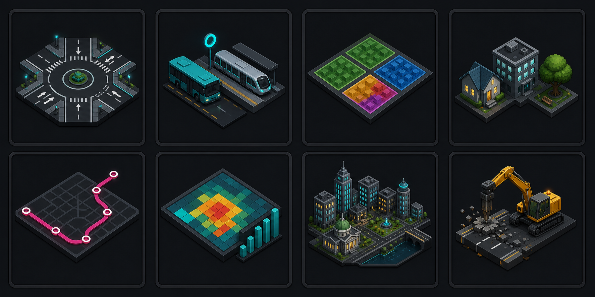

# Desktop Command Shelf UI Redesign — Design

**Date:** 2026-08-08  
**Status:** Approved direction; awaiting written-spec sign-off

## Summary

Caelum will replace its dense full-width HUD drawer with a desktop-only,
map-first **compact command shelf**. Four destinations — **Build · Lines · Data ·
City** — open focused panels anchored above the shelf. **Select** and
**Demolish** remain visible tool modes, while object inspection becomes
contextual instead of appearing as a second navigation concept.

The visual language remains the approved **Signal Console** direction: dark
technical surfaces, restrained cyan and amber signals, magenta transit lines,
precise data typography, and substantially less glow and tiny uppercase copy.
Large command choices use the approved generated 2.5D artwork; small navigation
controls continue to use crisp SVG glyphs plus visible labels.

This is a presentation/runtime-UI redesign. The Rust simulation, gameplay
intents, snapshot schema, WASM/Tauri gameplay hosts, and canvas-authoritative
gameplay state do not change.



## Current evidence and problem

The current shell is structurally crowded, not merely under-styled:

- `src/styles.css` sets `body { min-width: 1100px; }`, while the Tauri window is
  explicitly resizable down to `1024 × 768`. At that supported minimum, topbar
  labels and values collide.
- `createUiState()` opens the Brief drawer by default. The drawer can consume up
  to 40% of the viewport, so a new sandbox starts with the map obstructed.
- The bottom bar shows six permanent categories, a conditional Inspect category,
  two global tools, an active-tool chip, and an always-present Cancel control.
- Routes and Manage divide one player object by lifecycle: creation is under
  Routes, listing is under Manage, and editing reuses the route editor under
  Manage.
- Inspect means both an armed map tool and a contextual navigation destination.
- Recoverable feedback appears in several competing locations: a rejection
  banner, a road-mutation notice, route-editor inline feedback, and fatal shell
  errors.
- Brief gives inactive sandbox-only campaign fields (Goal, Note, Wave) the same
  visual weight as actionable gameplay state.
- The stylesheet has no desktop breakpoint despite supporting a 1024–1440px
  resizable native window.

Existing code already provides useful foundations: Rust-derived snapshots,
local UI state owned by the runtime, pure panel components, cursor previews,
typed rejections, route warnings, keyboard shortcuts, drawer inertness, and
candidate-first host behavior. The redesign keeps these contracts and changes
how they are organized and presented.

## Goals

1. Keep the map unobstructed on launch and during ordinary play.
2. Reduce permanent navigation from six-plus destinations to four coherent ones.
3. Put creation and management of transit lines in one workspace.
4. Make the armed map action, target validity, cost, and recovery path obvious.
5. Establish one predictable layer for palettes, contextual inspection, and
   recoverable outcomes.
6. Make the supported `1024 × 768` native minimum fully operable without
   overlap or horizontal scrolling.
7. Preserve Caelum's dark operations identity while improving readability,
   hierarchy, focus, and motion restraint.
8. Use generated command artwork where it materially improves recognition,
   while retaining visible labels and accessible interaction states.

## Non-goals

- No mobile or tablet layout and no mobile release preparation.
- No new gameplay rules, tools, buildings, overlays, route semantics, costs, or
  simulation metrics.
- No Rust, WASM, Tauri-command, snapshot-schema, or save-format changes.
- No campaign or growth-wave UI expansion. Those core systems are scheduled for
  reduction; the redesign stops foregrounding their inactive fields.
- No city-library, save, load, rename, or delete UI. Durable storage is separate
  work and is not currently wired into the shell.
- No general-purpose design-system framework, command registry, plugin system,
  event bus, manager class, or dependency-injection layer.
- No configurable keyboard shortcuts.
- No complete keyboard/screen-reader representation of the tile map. Panel and
  shell controls remain keyboard accessible; pointer gameplay on the canvas is
  unchanged in this redesign.

## Approved product direction

### Platform

Desktop only. The intended native Tauri release remains primary, with the
browser retained for development, UI verification, and Playwright.

Supported layout targets:

| Viewport | Purpose |
|---|---|
| `1024 × 768` | Native minimum and compact-shell acceptance |
| `1280 × 800` | Default Tauri window and primary design target |
| `1440 × 900` | Wide desktop acceptance |

### Layout: compact command shelf

The selected layout is the compact bottom command shelf:

- A slim shelf remains fixed above the window inset.
- Clicking a destination opens a focused, non-modal panel immediately above its
  trigger region.
- Panels are content-sized rather than full-width drawers.
- The map remains visible and interactive outside the open panel.
- Clicking the active destination again or pressing Escape closes the panel,
  except while a route draft pins Lines until Save or Cancel.
- Selecting a leaf command arms the tool and collapses the panel, returning
  attention to the map.

Panel sizing is content-specific rather than universal:

- Build: approximately `560 × 280px` at the primary viewport.
- Lines: up to approximately `760 × 360px`, because the route editor and line
  list genuinely need more room.
- Data and City: approximately `420–520px` wide and content-height bounded.
- Inspect: a compact right-aligned contextual card.

Every panel uses `max-width: calc(100vw - 32px)` and a bounded height with one
internal scroll area when content exceeds the available space. There is never a
second nested scroll region inside a panel.

### Visual language: Signal Console

The approved direction retains the current dark control-room identity but
reduces its noise:

- Deep shell: `#050a0c`
- Primary surface: `#0d171b`
- Sunk surface: `#071013`
- Primary text: `#e7f2f4`
- Muted text: no darker than the accessible mid-gray used for its surface
- Active/focus signal: cyan `#3fe0c5`
- Warning/simulation signal: amber `#ffb627`
- Transit line accent: magenta `#ff4d8a`
- Destructive state: red `#ff5b5b`

Color is semantic and never the only indicator. Active, warning, route, and
destructive states also carry text, shape, or icon changes.

Typography keeps the existing family character:

- Bricolage Grotesque (or the existing display stack) for headings, destinations,
  and player-facing labels.
- JetBrains Mono (or the existing mono stack) for numeric data, keyboard hints,
  compact status, and technical identifiers.
- Uppercase with wide tracking is restricted to small eyebrow/status labels.
- Buttons and important labels are no smaller than 12px; ordinary instructional
  copy targets 13–14px; numeric readouts use tabular figures.

Glow is limited to a faint local signal highlight. Panels, borders, and buttons
derive hierarchy from contrast and spacing rather than scan lines, repeated
ornament, or pervasive shadows.

## Command-plate artwork

The approved concept sheet contains eight related subjects:

1. Roads
2. Transit
3. Zones
4. Buildings
5. Lines
6. Data
7. City
8. Demolish

Production assets are introduced only where the implementation renders them.
The first required set is the four Build root plates (Roads, Transit, Zones,
Buildings). The concept sheet stays in documentation as the visual source of
truth; implementation crops or exports required subjects into individual
`256 × 256` WebP assets under `src/assets/command-plates/`.

Artwork rules:

- Display only as a large palette illustration around `96–128px`; never shrink
  the bitmap into a small shelf glyph.
- Keep a visible text label next to or below every image.
- Use `alt=""` and `aria-hidden="true"` for a plate when its adjacent label
  carries the complete command name.
- Let CSS own hover, pressed, selected, focus, disabled, and danger states.
- Do not bake state rings, focus indicators, costs, shortcut hints, or text into
  the bitmap.
- Use imported Vite assets so both browser and Tauri bundles package the same
  files. No runtime network request is introduced.
- Do not ship unused concept crops.

Small shelf glyphs remain local inline SVG with consistent geometry and stroke
weight. Every glyph is paired with a visible destination/tool label.

## Information architecture

### Persistent shelf

| Shelf item | Responsibility | Replaces |
|---|---|---|
| Build | Everything the player places or paints | Build + Area |
| Lines | Create, inspect, edit, pause, recolor, and delete service lines | Routes + Manage |
| Data | Map overlays and network performance detail | Data |
| City | Current sandbox identity and concise city overview | Brief |

The right side of the shelf contains tool modes rather than destinations:

- **Select** — player-facing name for the existing internal `inspect` tool.
- **Demolish** — player-facing destructive mode for the existing `remove` tool.
- **Active mode** — a compact readout such as `ROAD · TWO-WAY` or
  `BUILDING · CLINIC`.

The always-disabled `Cancel · Esc` button is removed. Cancellation appears where
it is actionable: inside route editors and transient workflows, plus an Escape
hint in the active panel/status region.

### Build

Build opens with four illustrated command plates:

| Group | Current actions shown after selection |
|---|---|
| Roads | Two-way, one-way, divided road, compact roundabout, standard roundabout |
| Transit | Track, bus stop, bus terminal, metro station |
| Zones | Residential, commercial, industrial, office, civic, park paints |
| Buildings | Current placeable residential, commercial, industrial, office, civic, and park buildings, grouped visually by area kind |

The Buildings detail may scroll once if required at the minimum viewport, but it
does not introduce another category level. Every leaf uses the existing
`BuildItemAction`/runtime setter path. The artwork changes recognition, not
gameplay semantics.

### Lines

Lines reunites the current Routes and Manage workflows:

- Primary actions: `New bus line` and `New metro line`.
- Starting or editing a line keeps Lines open and replaces the list with the
  focused route editor.
- While a route draft exists, Lines owns the interaction: it stays open, its
  trigger cannot collapse it, and other destination/Select/Demolish controls
  expose `aria-disabled="true"` and do not activate. Conflicting map-tool
  shortcuts also do nothing. The editor explains that Save or Cancel exits line
  editing.
- A successful Save or Cancel returns to the Lines list, keeps Lines open, and
  returns the map tool to Select. A rejected Save stays in the focused editor.
- Existing lines remain visible in the same workspace with name, color, status,
  mode, and stop count.
- Selecting a line opens the existing route-editor experience in place.
- Rename, recolor, pause/resume, repair guidance, and delete stay beside that
  line instead of moving the player to another destination.
- Route draft warnings, preview pending state, save/reload, and revision safety
  remain selector/runtime-driven.

The player sees one mental object — a line — across its creation and management
lifecycle. This UI regrouping does not change route state or Rust intent shapes.

### Data

Data exposes the current actionable overlays: coverage, crowding, demand, and
lateness. Growth is intentionally omitted instead of rebuilding UI for the
campaign/growth subsystem scheduled for deletion. This redesign does not remove
the underlying snapshot field or renderer because that core reduction remains
separate work.

Overlay selection remains a toggle and remains visible through both the panel's
selected state and the map legend/status. An empty or unavailable overlay state
uses text explaining why rather than a blank panel.

### City

City replaces Brief with useful current sandbox context:

- Sandbox title/template
- Simulation running/paused state
- Concise current city/network summary
- Any current city identity already available from the runtime

It does not render placeholder campaign Objective, Note, Wave, or win/loss rows
for an open-ended sandbox. It does not add persistence actions before a real
store adapter is wired.

### Contextual inspection

Inspect is no longer a destination or permanent conditional shelf item.

- Select is the default tool.
- Clicking a supported object opens a right-aligned contextual card.
- Clicking empty map closes the contextual card.
- Switching to a placement or Demolish tool clears incompatible selection using
  the existing runtime transition rules.
- The contextual card continues to show platform occupancy, line assignments,
  and existing actions from selector-derived state.

## Interaction rules

### Initial state

- Active tool: internal `inspect`, presented as Select.
- Active command destination: `null`.
- No panel is open.
- The map is unobstructed.
- City information is available on demand; the UI never opens City/Brief
  automatically.

### Destination toggling

- When no route draft exists, clicking a closed destination opens that panel,
  clicking the open destination closes it, and clicking another destination
  swaps directly to that panel.
- A route draft is the one explicit exception: Lines remains open and owns the
  destination until Save or Cancel. Disabled destination/tool controls remain
  visible so the shelf does not reflow.
- Opening a destination does not mutate gameplay state.
- Opening, swapping, or closing a destination preserves the currently armed map
  tool. Only a leaf command, Select, Demolish, or the pinned route workflow
  changes that tool.
- Choosing Select or Demolish closes an open command panel and clears any open
  Build group before applying the existing tool transition rules, except while
  a route draft has pinned Lines.
- Panels are non-modal; focus is not trapped.
- Opening or swapping a panel focuses its labelled `tabindex="-1"` region; the
  first Tab then reaches its first actionable control. This rule also applies
  when a global shortcut opens a panel.
- Closing by Escape returns focus to the shelf trigger that opened the panel.

### Leaf selection

- Selecting a placement leaf arms the existing tool/building/area action.
- The panel closes after a complete leaf selection.
- Focus moves to the programmatically focusable canvas host so global gameplay
  shortcuts remain immediately available.
- The active-mode readout and cursor preview immediately carry the selection.
- Reopening Build starts at the four-plate root. No open group is persisted
  across app launches or city changes.

### Escape priority

Escape acts only on the topmost active interaction:

1. During a drag: cancel the current gesture and keep its tool armed.
2. With a route draft active: invoke the route editor's existing Cancel action
   semantics, return to the Lines list, and set the map tool to Select.
3. With any other command panel open: close only the panel.
4. With any non-Select placement configuration or Demolish armed: return to
   Select.
5. In idle Select: no-op.

Escape never jumps to City/Brief and never silently changes an unrelated
destination.

Existing route undo/redo/delete shortcuts remain. The text-input guard moves
ahead of global Escape handling so locally consumed rename cancellation wins.
Existing Build/Road/Track/Demolish/Select/road-preset shortcuts remain unless a
specific conflict is found during implementation; player-facing labels and
tests are updated from Inspect/Remove to Select/Demolish without changing the
internal tool identifiers.

### Text editing and focus return

- Enter commits an inline rename; blur preserves the existing commit-on-blur
  behavior.
- Escape inside a rename input restores the last committed value, blurs the
  input, and stops propagation so the global Escape hierarchy does not also
  cancel a route draft or close Lines.
- Other text inputs, textareas, and contenteditable controls consume Escape only
  when they define an explicit local cancel action. Otherwise Escape follows
  the global hierarchy after ordinary input editing is preserved.
- Save or Cancel from the route editor focuses the labelled Lines list region.
- A Build leaf focuses the canvas host; closing a generic panel focuses its
  shelf trigger. No focus is left in an unmounted panel.

## Layout and responsive desktop behavior

The root shell removes the hard `1100px` body minimum. It must lay out correctly
from 1024px upward.

### Topbar

At `1024–1199px`, the topbar shows:

- compact Caelum brand
- Money
- Time
- one Network health summary, expressed as a compact grouping of the existing
  Late and Unserved values rather than a new derived score
- Pause and 1×/2×/4× controls

At `1200px+`, Population and Average wait may appear as secondary readouts. Late
and Unserved contribute to the Network health summary and remain available in
Data. The topbar never hides overflowed content behind another readout.

### Shelf and panels

- Shelf controls are at least 44px high with at least 8px separation between
  distinct destructive/primary clusters.
- Build · Lines · Data · City remain visible at all supported widths.
- Select and Demolish are spatially separated from destinations and from each
  other; Demolish uses explicit danger styling.
- The map/canvas reserves the shelf footprint so playable tiles are not hidden
  or intercepted.
- Panels anchor above the shelf and never cover the topbar.
- At 1024px, labels remain visible; no icon-only fallback is introduced.

No mobile breakpoint, hamburger navigation, touch-specific bottom navigation,
or portrait behavior is designed.

## Feedback and error hierarchy

The UI uses four levels, ordered from local to blocking:

1. **Cursor/canvas** — exact footprint, validity, cost, authored road preview,
   skipped tiles, and gesture outcome before commit.
2. **Active panel** — configuration guidance, route warnings, preview pending,
   form/field recovery, and panel-specific failures.
3. **Outcome strip** — one transient region above the shelf for rejected actions
   and material road impacts. It replaces the separate rejection banner and
   standalone road-mutation notice.
4. **Fatal shell error** — blocking shell state with one clear recovery action.

Recoverable feedback uses existing typed runtime data:

- `RuntimeSnapshot.rejection`
- `shell.roadMutationPreview`
- `ui.roadMutationPreviewError`
- route-editor selector state

The runtime/selectors derive one UI-facing action-feedback view. Svelte does not
parse error messages or create gameplay truth. A successful subsequent dispatch
continues to clear stale recoverable rejection state. Fatal `backendError`
remains separate.

When sources coexist, the selector uses this deterministic precedence:

1. A gameplay rejection not already owned by the active route editor
2. A road-preview host error
3. A road-preview rejection
4. A material road impact/cost notice

Route-preview pending, warnings, host errors, and rejections stay local to the
focused route editor and never duplicate into the global strip. Hover preview
publication or invalidation never clears an independent gameplay rejection;
Dismiss clears only the visible dismissible rejection, while preview feedback
clears through its existing hover/tool invalidation lifecycle.

The outcome strip uses text plus a semantic icon/tone, does not steal focus, and
includes Dismiss or the specific recovery action when one exists. New
rejections are announced through a polite live region; continuous pointer-hover
preview updates are not repeatedly announced. The strip does not auto-dismiss
an error before the player can act on it.

## Motion and interaction polish

- Panel enter: 160–200ms opacity plus small vertical transform, ease-out.
- Panel exit: approximately 120–150ms, ease-in.
- Hover/pressed/focus state changes: 120–180ms color/opacity only.
- No layout dimension animation, long page transition, scan-line animation, or
  decorative repeated entrance stagger.
- `prefers-reduced-motion: reduce` removes transforms and nonessential pulses.
- Simulation state changes never wait on UI animation.

## Accessibility

- Shelf remains a labelled `nav`; every destination has visible icon and text,
  `aria-expanded`, and `aria-controls`.
- An open command panel is a labelled non-modal region, not a focus-trapping
  dialog.
- Closed panels are not in tab order or accessibility tree; prefer conditional
  rendering, otherwise retain `inert` plus `aria-hidden`.
- Command plates are real buttons with visible labels, 44px-or-larger hit areas,
  pressed/focus/disabled semantics, and arrow-key movement within the four-item
  root grid. Tab order follows visual order.
- Focus rings are 2–3px cyan with sufficient separation from the component
  border and are never removed.
- Status is not communicated by color alone.
- Generated artwork is decorative when the adjacent label names the command.
- Canvas host gains a concise accessible name/description and a
  `tabindex="-1"` programmatic focus target so a completed leaf selection can
  return focus to gameplay and preserve global keyboard shortcuts without
  adding a non-operable stop to ordinary Tab order. Full keyboard tile
  navigation remains outside this scope.

## Architecture and state

### Ownership

The existing ownership model remains:

```text
Svelte intent
  → RuntimeController UI method or gameplay dispatch
  → runtime commit of local UiState or Rust-derived GameState
  → RuntimeSnapshot selectors
  → Svelte shell + canvas render
```

Rust remains authoritative for gameplay, costs, route validity, previews,
simulation, and mutations. TypeScript owns only shell/navigation state, ordered
route-draft presentation, rendering, and host transport.

### UI state target

Replace the current category model with a presentation-focused shape:

```ts
type CommandDestination = "build" | "lines" | "data" | "city";
type BuildGroup = "roads" | "transit" | "zones" | "buildings";

interface UiState {
  // existing gameplay-adjacent UI fields remain
  activeCommandDestination: CommandDestination | null;
  activeBuildGroup: BuildGroup | null;
  // remove activeHudCategory and the old ten-way buildCategory state
}
```

Selection (`selectedId`/`selectedNodeKind`) controls whether the contextual
inspection card exists. Inspect is not encoded in `CommandDestination`.

Runtime methods remain concrete and small:

- `setCommandDestination(destination | null)` replaces `setHudCategory`.
- `setBuildGroup(group | null)` replaces the old Build category navigation.
- Existing `setTool`, `setBuilding`, `setArea`, road/roundabout arming, line
  editing, overlay, inspection, and mutation methods remain authoritative for
  gameplay effects. Their old drawer-closing effects are replaced by the
  command-destination transitions in this design.

No generic command dispatcher or registry is added.

### Lines transition contract

The runtime enforces `routeDraft !== null` →
`activeCommandDestination === "lines"`; Svelte does not repair this invariant.

| Event | Destination | Map tool | Lines content |
|---|---|---|---|
| New bus/metro line | Lines, pinned | Matching existing route tool | New draft editor |
| Edit existing line | Lines, pinned | Matching existing route tool | Edit draft editor |
| Save succeeds | Lines, open | Select (`inspect`) | Line list |
| Save rejects | Lines, pinned | Matching route tool | Same editor with local recovery |
| Reload succeeds | Lines, pinned | Matching route tool | Refreshed editor |
| Cancel | Lines, open | Select (`inspect`) | Line list |
| Other destination/tool while drafting | No change | No change | Editor explains Save/Cancel gate |

This explicitly changes the current shell side effect where `setTool` closes
the old drawer; it does not change draft data, route intent shapes, validation,
revision checks, or Rust behavior.

### Components

Target component shape:

```text
src/components/
  Topbar.svelte                         compact/wide telemetry groups
  GameCanvas.svelte                     existing canvas host
  ActionFeedback.svelte                 unified recoverable outcome strip
  hud/
    CommandShelf.svelte                 four destinations + tool modes
    CommandPanel.svelte                 positions/renders active destination
    panels/
      BuildPanel.svelte                 four-plate root + leaf views
      LinesPanel.svelte                 create/list/edit in one workspace
      RouteEditor.svelte                existing focused route editor
      DataPanel.svelte                  overlays + detailed metrics
      CityPanel.svelte                  useful sandbox/city summary
      InspectPanel.svelte               existing contextual inspection content
```

Replace and delete obsolete components in the same implementation:

- `BottomHud.svelte`
- `HudDrawer.svelte`
- `AreaPanel.svelte`
- `RoutesPanel.svelte`
- `ManagePanel.svelte`
- `BriefPanel.svelte`
- `RoadMutationNotice.svelte`

`LinesPanel` may keep `RouteEditor` as a focused child, but no speculative
manager/list abstraction is added unless the resulting component shows real
duplication or an independent reason to change.

`App.svelte` continues to compose the runtime snapshot and explicit callbacks.
The redesign does not add context providers, stores, service locators, or a
second shell state owner.

### Selectors and data contracts

- Replace `ShellHudState` with a small `ShellCommandState` containing active
  destination, active-mode label, badges genuinely used by the new shelf, and
  whether Select/Demolish are active.
- Replace `ShellBriefState` with the smaller `ShellCityState`; do not reserve
  unused campaign rows.
- Keep existing route list/editor selector shapes where they are consumed.
- Add a selector-derived action-feedback shape only for fields actually rendered
  by `ActionFeedback`.
- Remove old drawer/category fields, aliases, selectors, fixtures, and tests in
  the same change. There is no compatibility wrapper.

## Generated asset handling

The approved source sheet is committed only as a design reference:

`docs/superpowers/assets/2026-08-08-command-plates-concept-v1.png`

During implementation:

1. Crop only the four required Build subjects from the approved source.
2. Downscale with high-quality resampling to `256 × 256` WebP.
3. Save them under `src/assets/command-plates/` with semantic stable names.
4. Inspect each at both native size and the intended 96–128px CSS size.
5. Confirm subjects remain distinguishable without their color.
6. Import them from the Build presentation layer; do not add URLs to gameplay
   domain models or Rust snapshots.

If a crop fails the readability check, regenerate that one subject using the
approved prompt/palette rather than shipping a blurry or ambiguous crop.

## Testing and verification

### Runtime/unit

- Initial UI state is Select with no command destination open.
- Destination open/toggle/swap transitions are reference-safe.
- A route draft pins Lines; conflicting destination/tool intents are no-ops,
  and Save/Cancel transitions match the table above.
- Build group navigation changes only local UI state.
- Selecting a leaf arms the correct existing action, clears the Build group,
  and closes the panel.
- Map selection derives contextual inspection without an Inspect destination.
- Tool changes clear incompatible selection/panel state as specified.
- Escape priority is verified for drag, route draft, ordinary panel, placement,
  Demolish, and idle Select.
- Unified feedback derives the correct text/tone/recovery and source precedence
  from typed runtime rejection and road-preview states.

### Component/UI

- Topbar renders compact groups without overlapping at 1024px and wide groups at
  1200px+.
- CommandShelf renders exactly Build · Lines · Data · City and separate
  Select/Demolish controls with correct labels and ARIA state.
- Build root renders four command plates in visual/tab order; artwork is
  decorative and labels remain accessible.
- Each Build group exposes exactly its current authoritative actions.
- Lines exposes new-line actions, current line list, management actions, and the
  existing editor in one destination.
- Lines disables conflicting shelf/tool activation while a draft is active and
  explains the Save/Cancel gate.
- Data exposes coverage, crowding, demand, and lateness—not Growth—and keeps
  selected/empty/error states clear.
- City omits inactive campaign/growth placeholders in sandbox mode.
- Inspect card opens/closes from selection state and retains platform actions.
- ActionFeedback is the sole recoverable global outcome region.
- Panel-entry focus, focus return, rename-input Escape, global Escape, disabled
  controls, and reduced motion are covered.

Tests migrate from old component names and delete obsolete drawer-specific
assertions with the implementation they specified. Do not add screenshot mirror
matrices or coverage-only files.

### Playwright

Run representative flows at `1024 × 768`, `1280 × 800`, and `1440 × 900`:

1. Launch: map unobstructed, no default panel, no overlap/horizontal scroll.
2. Build → Roads → road preset → drag and commit.
3. Build → Zones → paint an area.
4. Build → Transit/Buildings → place one current item.
5. Lines → create, verify the draft gate, save, reopen,
   rename/recolor/pause, edit, and delete.
6. Select a stop/station → contextual inspection → empty click closes.
7. Trigger one representative gameplay rejection and road impact → one outcome
   strip, no duplicate notice.
8. Exercise route/input/global Escape priority and return focus to the correct
   shelf or panel control.

Prefer stable behavioral assertions and bounding-box/no-overflow checks over
pixel-perfect screenshot snapshots. A final browser visual pass still compares
the running implementation against the approved companion screens and command
art at all three viewports.

### Standard repository verification

- `bun run check`
- `bun run lint`
- `bun run format:check`
- `bun run test`
- `bun run build`
- targeted and full `bun run test:e2e`

Rust verification is required only if implementation unexpectedly touches Rust;
the approved design does not require such changes.

## Acceptance criteria

The redesign is complete when:

- Caelum launches into an unobstructed Select/map state.
- The supported native minimum `1024 × 768` has no clipped or overlapping
  controls and no horizontal scroll.
- Permanent destinations are exactly Build · Lines · Data · City.
- Build and Area are one placement workflow; Routes and Manage are one Lines
  workflow.
- Active route drafts pin Lines until Save or Cancel, then return to the Lines
  list in Select mode.
- Inspect is contextual and presented as the Select tool, not duplicate
  navigation.
- Demolish is visible, labelled, and spatially/semantically destructive.
- The four approved Build command plates are shipped as optimized local assets
  with visible labels and independent CSS states.
- Leaf commands return focus to the map without leaving a large panel open.
- Tool, validity, cost, and recovery are shown at the closest useful location.
- Recoverable global feedback appears in one outcome strip; fatal host failure
  remains separately blocking.
- Data exposes only coverage, crowding, demand, and lateness; the replacement UI
  does not preserve Growth.
- Escape follows the approved priority and never opens City/Brief.
- Keyboard focus, ARIA state, 44px targets, and reduced motion work across shell
  controls.
- Existing gameplay behavior and the shared Rust-authoritative host contract are
  unchanged.

## Risks and controls

- **Lines panel becomes too large.** Keep RouteEditor as a focused child and
  bound the workspace size; extract further only if actual duplication or an
  independent responsibility appears.
- **Artwork loses meaning when small.** Use only at 96–128px, keep visible labels,
  validate grayscale silhouette, and regenerate individual failures.
- **Compact topbar hides useful metrics.** Always retain Money, Time, and Network
  health; put full detail in Data and add only measured wide readouts.
- **UI refactor accidentally changes gameplay.** Reuse existing runtime setters,
  typed previews, and Rust intents; add no new gameplay path.
- **Old and new shells coexist.** Treat this as a breaking development change:
  replace components, state, selectors, fixtures, styles, and tests together,
  with no aliases or compatibility wrapper.
